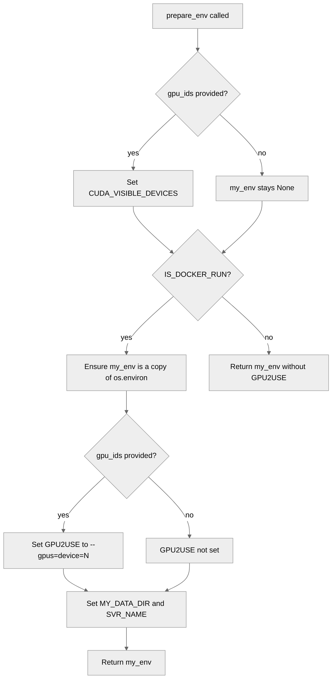

# 4513: Fix -gpu flag for nvflare poc start in Docker mode (#4445)

{'state': 'MERGED', 'headRefOid': '7294296d3eed7be71f7c52ae1419e365090d0809', 'mergeCommit': {'oid': '2f4e2acd767b8d06f65c3bab1c85a2543fc4044a'}, 'mergedAt': '2026-05-04T19:55:24Z'}

## Body
Fixes #4445

### Description

`nvflare poc start -gpu 0` was producing the Docker argument `--gpus=0`, which Docker interprets as a *GPU count* ("give me zero GPUs") rather than a device selector. Spawned client containers therefore launched with no GPU access — `nvidia-smi` and `torch.cuda.is_available()` both failed inside them.

`prepare_env()` in `nvflare/tool/poc/poc_commands.py` is now updated to emit the `--gpus="device=N"` form, matching the format already documented by example in the `docker_cln_sh` template comments at [`nvflare/lighter/templates/master_template.yml:709`](https://github.com/NVIDIA/NVFlare/blob/main/nvflare/lighter/templates/master_template.yml#L709). Single-GPU (`-gpu 0`), multi-GPU (`-gpu 0 1`), and "all" (`-gpu -1`, resolved upstream by `get_gpu_ids()` to a concrete device list) all flow through the same code path. The non-Docker process-launch path and the no-`-gpu`-flag path are unchanged.

**Before:** `GPU2USE=--gpus=0` → `docker run --gpus=0 …` → containers run on the host CPU only.
**After:** `GPU2USE=--gpus="device=0"` → `docker run --gpus="device=0" …` → GPU 0 bound into the container.

Four unit tests added in `tests/unit_test/lighter/poc_commands_test.py` covering: Docker + single GPU, Docker + multi-GPU, Docker + no GPU, non-Docker + GPU.

### Types of changes
- [x] Non-breaking change (fix or new feature that would not break existing functionality).
- [ ] Breaking change (fix or new feature that would cause existing functionality to change).
- [x] New tests added to cover the changes.
- [x] Quick tests passed locally by running `./runtest.sh`.
- [ ] In-line docstrings updated.
- [ ] Documentation updated.

## timeline-comments 4364535996 by greptile-apps[bot]; https://github.com/NVIDIA/NVFlare/pull/4513#issuecomment-4364535996; ; 
<h3>Greptile Summary</h3>

This PR fixes an incorrect `--gpus=N` Docker flag (interpreted as a GPU count, yielding zero devices) to the correct `--gpus="device=N"` form (device selector), bringing `prepare_env()` in line with the existing `docker_cln_sh` template documentation. Four unit tests are added and properly isolate against inherited environment variables via `monkeypatch.delenv`.

<h3>Confidence Score: 5/5</h3>

This PR is safe to merge — the fix is correct, minimal, and well-tested.

Single-line targeted fix with no side effects; four new unit tests cover all relevant code paths; previously raised review concerns (bash quoting, env isolation) have been addressed by the author.

No files require special attention.

<h3>Important Files Changed</h3>


| Filename | Overview |
|----------|----------|
| nvflare/tool/poc/poc_commands.py | Single-line fix: GPU2USE env var now emits `--gpus="device=N"` (device selector) instead of `--gpus=N` (count limit); logic is correct and matches the project's template comment. |
| tests/unit_test/lighter/poc_commands_test.py | Four new tests cover Docker+single-GPU, Docker+multi-GPU, Docker+no-GPU, and non-Docker+GPU paths; env isolation handled correctly with monkeypatch.delenv where needed. |

</details>


<h3>Flowchart</h3>



<!-- greptile_other_comments_section -->

<sub>Reviews (3): Last reviewed commit: ["Merge branch &#39;main&#39; into fix/poc-gpu-doc..."](https://github.com/nvidia/nvflare/commit/7294296d3eed7be71f7c52ae1419e365090d0809) | [Re-trigger Greptile](https://app.greptile.com/api/retrigger?id=30567679)</sub>


## timeline-comments 4364606273 by MohanKrishnaGR; https://github.com/NVIDIA/NVFlare/pull/4513#issuecomment-4364606273; ; 
cc @chesterxgchen @YuanTingHsieh — this addresses #4445


## timeline-comments 4364652831 by chesterxgchen; https://github.com/NVIDIA/NVFlare/pull/4513#issuecomment-4364652831; ; 
@MohanKrishnaGR  thanks for contributing, we are in the middle the docker support enhancement changes, so the POC docker support might change in 2.8.0 release. just FYI. 


## timeline-comments 4373783928 by YuanTingHsieh; https://github.com/NVIDIA/NVFlare/pull/4513#issuecomment-4373783928; ; 
/build


## reviews 4215411298 by greptile-apps[bot]; https://github.com/NVIDIA/NVFlare/pull/4513#pullrequestreview-4215411298; COMMENTED; 


## reviews 4215425480 by MohanKrishnaGR; https://github.com/NVIDIA/NVFlare/pull/4513#pullrequestreview-4215425480; COMMENTED; 


## reviews 4215431294 by MohanKrishnaGR; https://github.com/NVIDIA/NVFlare/pull/4513#pullrequestreview-4215431294; COMMENTED; 


## reviews 4215431585 by greptile-apps[bot]; https://github.com/NVIDIA/NVFlare/pull/4513#pullrequestreview-4215431585; COMMENTED; 


## reviews 4215452989 by MohanKrishnaGR; https://github.com/NVIDIA/NVFlare/pull/4513#pullrequestreview-4215452989; COMMENTED; 
Self-reviewed both files; greptile feedback addressed (test isolation in code, embedded-quotes decision explained in the inline thread). CI parked on workflow approval. Ready for maintainer review when convenient — happy to iterate on any feedback.


## reviews 4222767545 by YuanTingHsieh; https://github.com/NVIDIA/NVFlare/pull/4513#pullrequestreview-4222767545; APPROVED; 


## inline-comments 3177099159 by greptile-apps[bot]; https://github.com/NVIDIA/NVFlare/pull/4513#discussion_r3177099159; ; tests/unit_test/lighter/poc_commands_test.py
<a href="#"></a> **Test may fail if `GPU2USE` is in the real environment**

`prepare_env` does `os.environ.copy()` when `gpu_ids` is empty but `IS_DOCKER_RUN` is `True`. If the CI/test host already exports `GPU2USE`, the assertion `"GPU2USE" not in my_env` will fail. The other three tests are fine because they explicitly set `GPU2USE` on the returned env, but this one relies on the variable being absent in the inherited environment. Mock `os.environ` for reliable isolation.


## inline-comments 3177099171 by greptile-apps[bot]; https://github.com/NVIDIA/NVFlare/pull/4513#discussion_r3177099171; ; nvflare/tool/poc/poc_commands.py
<a href="#"></a> **Literal double-quote characters in env var vs. shell quoting**

The env var value is `--gpus="device=0"` — with literal `"` characters. Inside `docker.sh`, the variable is expanded unquoted (`$GPU2USE`), and bash does **not** perform quote-removal on characters that originate from variable expansion. Docker's Go argument parser therefore receives `--gpus="device=0"` including the `"` characters as part of the value string.

This matches the pattern in the `docker_cln_sh` template comment (`GPU2USE='--gpus="device=0,2"'`), so it may work in practice. The safer, unambiguous alternative avoids embedded quotes:

```python
my_env["GPU2USE"] = f"--gpus=device={my_env['CUDA_VISIBLE_DEVICES']}"
```


## inline-comments 3177117031 by MohanKrishnaGR; https://github.com/NVIDIA/NVFlare/pull/4513#discussion_r3177117031; ; tests/unit_test/lighter/poc_commands_test.py
Fixed in fad75241. Both test_prepare_env_docker_no_gpu and test_prepare_env_non_docker_with_gpu now use monkeypatch.delenv(..., raising=False) to isolate the assertions from the runner's environment — GPU2USE for the first, plus SVR_NAME for the second (same root cause, just unflagged in your review). The other two tests assert specific values that prepare_env() writes into the returned dict, so they're unaffected by inherited env vars per your analysis.


## inline-comments 3177123768 by MohanKrishnaGR; https://github.com/NVIDIA/NVFlare/pull/4513#discussion_r3177123768; ; nvflare/tool/poc/poc_commands.py
Thanks @greptile-apps — your analysis of bash quote-handling is correct: bash does not re-tokenize quotes from variable expansion, so `--gpus="device=0"` reaches Docker's CSV parser as a single argv with literal `"` characters, which the parser then strips. Both forms (with and without inner quotes) work equivalently for `device=N` selection.

I went with the quoted form deliberately to stay consistent with the existing documented pattern in the project's own template — the `docker_cln_sh` block in `nvflare/lighter/templates/master_template.yml:709` already shows `GPU2USE='--gpus="device=0,2"'` as the canonical form for users who want to set this manually. Producing the same string from `prepare_env()` keeps the runtime behavior aligned with the example users see in their generated `docker.sh`.

Happy to switch to the simpler `--gpus=device=N` form if reviewers prefer it — it would also be reasonable to update the template comment in the same PR for consistency, but I'd rather leave that as a separate decision for the maintainers.


## inline-comments 3177124160 by greptile-apps[bot]; https://github.com/NVIDIA/NVFlare/pull/4513#discussion_r3177124160; ; nvflare/tool/poc/poc_commands.py
That's a solid rationale. Consistency with the `docker_cln_sh` template comment is a legitimate reason to prefer the quoted form — users who compare the generated `docker.sh` against the documented example will see the same string, which reduces confusion.

The comment stands resolved. If the template comment is ever updated in a separate PR to use the bare `device=N` form, the generated string in `prepare_env()` should be updated to match at the same time, but that's a future concern and doesn't affect correctness here.

Tip: You can customize Greptile's behavior for this repo with [`.greptile/rules.md` and `.greptile/config.json`](https://www.greptile.com/docs/code-review/custom-standards).
