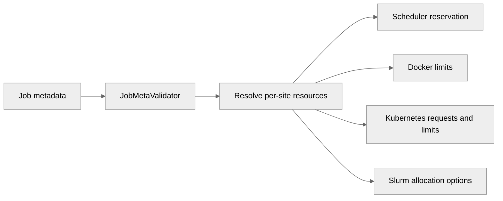

# 5092: Add portable CPU and memory job resources

{'state': 'MERGED', 'headRefOid': '5873f80a70f256f3ed05289479b1329552bc3a2a', 'mergeCommit': {'oid': '0d25aa9a6c420028c2411d251e7f22fa44bd7a11'}, 'mergedAt': '2026-08-12T22:43:29Z'}

## Body
## Summary

- add portable `num_of_cpus` and host `memory` requirements alongside `num_of_gpus`
- add `resource_spec["@default"]` with shallow per-site overrides
- use the same resolved requirements for scheduling, dispatch, cancellation, and launcher enforcement
- translate the portable fields to Docker, Kubernetes, and Slurm while preserving legacy resource specifications

## Backend mappings

| Field | Docker | Kubernetes | Slurm |
|---|---|---|---|
| `num_of_gpus` | GPU device requests | `nvidia.com/gpu` request and limit | `--gres` |
| `num_of_cpus` | `nano_cpus` | CPU request and limit | `--cpus-per-task` |
| `memory` | `mem_limit` in bytes | memory request and limit | `--mem` in MiB |

GPU memory and other backend-specific topology or policy remain outside the portable contract.

## Validation

- `557 passed` across the focused scheduler, validator, utility, Docker, Kubernetes, and Slurm tests
- `./runtest.sh -s`
- `git diff --check`

Closes #5083


## timeline-comments 5259055463 by greptile-apps[bot]; https://github.com/NVIDIA/NVFlare/pull/5092#issuecomment-5259055463; ; 
<h3>Greptile Summary</h3>

The PR adds portable CPU and host-memory requirements, default resource inheritance, backend translations, and validation intended to keep launcher GPU allocations aligned with scheduler reservations.
- Resolves portable resources consistently for scheduling and launcher enforcement.
- Maps CPU and memory requirements to Docker, Kubernetes, and Slurm.
- Adds conflict checks and focused tests for portable and legacy GPU specifications.

<h3>Confidence Score: 4/5</h3>

The PR is not yet safe to merge because the previously reported mixed flat-and-nested GPU specification can still launch GPUs without a corresponding scheduler reservation.

A legacy site block containing a flat num_of_gpus sibling and nested Docker or Kubernetes settings still passes validation, resolves to no scheduler GPU requirement, and lets the launcher consume its nested GPU quantity.

**Files Needing Attention:** nvflare/utils/job_launcher_utils.py

<h3>Important Files Changed</h3>


| Filename | Overview |
|----------|----------|
| nvflare/utils/job_launcher_utils.py | Adds portable-resource resolution and conflict validation, but the previously reported flat-sibling legacy GPU bypass remains accepted. |
| nvflare/app_common/job_schedulers/job_scheduler.py | Uses resolved resource-manager requirements consistently for admission, dispatch, and cancellation. |
| nvflare/private/fed/server/job_meta_validator.py | Integrates portable-value and launcher-conflict validation into job submission. |
| nvflare/app_opt/job_launcher/docker_launcher.py | Translates portable GPU, CPU, and memory requirements into Docker container settings. |
| nvflare/app_opt/job_launcher/k8s_launcher.py | Translates portable resources into equal Kubernetes requests and limits. |
| nvflare/app_opt/job_launcher/slurm/launcher.py | Maps portable CPU and memory requirements to Slurm job resources while retaining topology handling. |


<h3>Flowchart</h3>



<!-- greptile_other_comments_section -->

<sub>Reviews (8): Last reviewed commit: ["Merge branch &#39;main&#39; into feat/portable-j..."](https://github.com/nvidia/nvflare/commit/5873f80a70f256f3ed05289479b1329552bc3a2a) | [Re-trigger Greptile](https://app.greptile.com/api/retrigger?id=52372093)</sub>


## timeline-comments 5259093429 by codecov-commenter; https://github.com/NVIDIA/NVFlare/pull/5092#issuecomment-5259093429; ; 
## [Codecov](https://app.codecov.io/gh/NVIDIA/NVFlare/pull/5092?dropdown=coverage&src=pr&el=h1&utm_medium=referral&utm_source=github&utm_content=comment&utm_campaign=pr+comments&utm_term=NVIDIA) Report
:white_check_mark: All modified and coverable lines are covered by tests.
:white_check_mark: Project coverage is 65.62%. Comparing base ([`3b96bff`](https://app.codecov.io/gh/NVIDIA/NVFlare/commit/3b96bffbb4cef7beb62d8c6e79fca7e3227d91e2?dropdown=coverage&el=desc&utm_medium=referral&utm_source=github&utm_content=comment&utm_campaign=pr+comments&utm_term=NVIDIA)) to head ([`5873f80`](https://app.codecov.io/gh/NVIDIA/NVFlare/commit/5873f80a70f256f3ed05289479b1329552bc3a2a?dropdown=coverage&el=desc&utm_medium=referral&utm_source=github&utm_content=comment&utm_campaign=pr+comments&utm_term=NVIDIA)).
:warning: Report is 4 commits behind head on main.

<details><summary>Additional details and impacted files</summary>


```diff
@@            Coverage Diff             @@
##             main    #5092      +/-   ##
==========================================
+ Coverage   65.57%   65.62%   +0.04%     
==========================================
  Files        1040     1040              
  Lines      106531   106656     +125     
==========================================
+ Hits        69860    69990     +130     
+ Misses      36671    36666       -5     
```

| [Flag](https://app.codecov.io/gh/NVIDIA/NVFlare/pull/5092/flags?src=pr&el=flags&utm_medium=referral&utm_source=github&utm_content=comment&utm_campaign=pr+comments&utm_term=NVIDIA) | Coverage Δ | |
|---|---|---|
| [unit-tests](https://app.codecov.io/gh/NVIDIA/NVFlare/pull/5092/flags?src=pr&el=flag&utm_medium=referral&utm_source=github&utm_content=comment&utm_campaign=pr+comments&utm_term=NVIDIA) | `65.62% <100.00%> (+0.04%)` | :arrow_up: |

Flags with carried forward coverage won't be shown. [Click here](https://docs.codecov.io/docs/carryforward-flags?utm_medium=referral&utm_source=github&utm_content=comment&utm_campaign=pr+comments&utm_term=NVIDIA#carryforward-flags-in-the-pull-request-comment) to find out more.
</details>

[:umbrella: View full report in Codecov by Harness](https://app.codecov.io/gh/NVIDIA/NVFlare/pull/5092?dropdown=coverage&src=pr&el=continue&utm_medium=referral&utm_source=github&utm_content=comment&utm_campaign=pr+comments&utm_term=NVIDIA).   
:loudspeaker: Have feedback on the report? [Share it here](https://about.codecov.io/codecov-pr-comment-feedback/?utm_medium=referral&utm_source=github&utm_content=comment&utm_campaign=pr+comments&utm_term=NVIDIA).
<details><summary> :rocket: New features to boost your workflow: </summary>

- :snowflake: [Test Analytics](https://docs.codecov.com/docs/test-analytics): Detect flaky tests, report on failures, and find test suite problems.
- :package: [JS Bundle Analysis](https://docs.codecov.com/docs/javascript-bundle-analysis): Save yourself from yourself by tracking and limiting bundle sizes in JS merges.
</details>


## timeline-comments 5259662424 by pcnudde; https://github.com/NVIDIA/NVFlare/pull/5092#issuecomment-5259662424; ; 
@greptileai Please re-evaluate the remaining 4/5 summary against the current head.

The summary treats a flat `num_of_gpus` beside a mode key such as `docker` as a portable request. Existing NVFlare semantics intentionally treat any site block containing a mode key as the legacy nested format; flat sibling fields are ignored. This predates this PR and is explicitly covered by `test_launch_num_of_gpus_mixed_with_mode_keys_ignored`.

Therefore, in the cited mixed example the NVFlare resource manager receives no GPU requirement and Docker receives the nested launcher-native GPU value. That is legacy nested launcher behavior, not a portable/native conflict introduced by this PR. Rejecting mixed shapes would be a separate backward-incompatible validation change, contrary to this PR's explicit preservation of nested resource specifications without `@default`.

Both Greptile inline threads are resolved and the Greptile check passes. Please refresh the summary and confidence score with this compatibility boundary in mind.


## reviews 4910901823 by greptile-apps[bot]; https://github.com/NVIDIA/NVFlare/pull/5092#pullrequestreview-4910901823; COMMENTED; 


## reviews 4911040067 by pcnudde; https://github.com/NVIDIA/NVFlare/pull/5092#pullrequestreview-4911040067; COMMENTED; 


## reviews 4911124833 by greptile-apps[bot]; https://github.com/NVIDIA/NVFlare/pull/5092#pullrequestreview-4911124833; COMMENTED; 


## reviews 4911604683 by YuanTingHsieh; https://github.com/NVIDIA/NVFlare/pull/5092#pullrequestreview-4911604683; COMMENTED; 
Left two comments on portable-value validation and GPU-memory compatibility documentation.


## reviews 4920654296 by pcnudde; https://github.com/NVIDIA/NVFlare/pull/5092#pullrequestreview-4920654296; COMMENTED; 


## reviews 4920655852 by pcnudde; https://github.com/NVIDIA/NVFlare/pull/5092#pullrequestreview-4920655852; COMMENTED; 


## reviews 4920681439 by greptile-apps[bot]; https://github.com/NVIDIA/NVFlare/pull/5092#pullrequestreview-4920681439; COMMENTED; 


## reviews 4921179880 by pcnudde; https://github.com/NVIDIA/NVFlare/pull/5092#pullrequestreview-4921179880; COMMENTED; 


## reviews 4921410511 by YuanTingHsieh; https://github.com/NVIDIA/NVFlare/pull/5092#pullrequestreview-4921410511; COMMENTED; 
Found one remaining backward-compatibility issue in zero-GPU resource-manager projection.


## reviews 4921482564 by pcnudde; https://github.com/NVIDIA/NVFlare/pull/5092#pullrequestreview-4921482564; COMMENTED; 


## reviews 4921490701 by YuanTingHsieh; https://github.com/NVIDIA/NVFlare/pull/5092#pullrequestreview-4921490701; APPROVED; 


## inline-comments 3761844856 by greptile-apps[bot]; https://github.com/NVIDIA/NVFlare/pull/5092#discussion_r3761844856; ; nvflare/utils/job_launcher_utils.py
<a href="#"></a> <a href="#"></a> **GPU allocation bypasses reservation**

When a job specifies a smaller portable `num_of_gpus` and a larger Docker or Kubernetes launcher-specific value, conflict validation accepts both, the scheduler reserves only the portable count, and the launcher requests the larger count. This breaks shared GPU accounting and allows competing jobs to be admitted against GPUs already consumed by the first job.

**How this was verified:** The submitted values were traced through conflict validation, portable-only scheduler reservation, and the launcher-specific Docker and Kubernetes GPU allocation paths.

**Knowledge Base Used:**
- [Server Job Execution Flow](https://app.greptile.com/nvidia-public-github/-/custom-context/knowledge-base/nvidia/nvflare/-/docs/server-job-execution-flow.md)
- [Job Launchers and the `nvflare deploy` CLI](https://app.greptile.com/nvidia-public-github/-/custom-context/knowledge-base/nvidia/nvflare/-/docs/job-launchers-and-deploy-tool.md)


## inline-comments 3761969392 by pcnudde; https://github.com/NVIDIA/NVFlare/pull/5092#discussion_r3761969392; ; nvflare/utils/job_launcher_utils.py
Fixed in `048c8bd31`. Job admission now rejects portable `num_of_gpus` combined with Docker `num_of_gpus` or `device_requests`, and with Kubernetes `num_of_gpus`, so launcher allocation cannot exceed the scheduler-reserved portable count. Slurm topology remains allowed because its existing launcher validation requires `num_of_gpus == nodes * gpus_per_node`. Added helper coverage for default conflicts and matching Slurm topology, plus an end-to-end `JobMetaValidator` test for the site-level K8s conflict. Validation: 562 focused tests passed and `./runtest.sh -s` passed.


## inline-comments 3762036552 by greptile-apps[bot]; https://github.com/NVIDIA/NVFlare/pull/5092#discussion_r3762036552; ; nvflare/utils/job_launcher_utils.py
<a href="#"></a> **Mixed GPU specs bypass validation**

When a site block combines a flat portable GPU request with a nested launcher request, `get_portable_resource_spec` discards the flat field, so conflict validation accepts the metadata while the scheduler reserves the flat quantity and Docker or Kubernetes requests the nested quantity. For example, a portable count of 2 alongside a nested launcher count of 8 reserves two GPUs but launches against eight, breaking shared GPU accounting.

**Knowledge Base Used:**
- [Server Job Execution Flow](https://app.greptile.com/nvidia-public-github/-/custom-context/knowledge-base/nvidia/nvflare/-/docs/server-job-execution-flow.md)
- [Job Launchers and the `nvflare deploy` CLI](https://app.greptile.com/nvidia-public-github/-/custom-context/knowledge-base/nvidia/nvflare/-/docs/job-launchers-and-deploy-tool.md)


## inline-comments 3762453709 by YuanTingHsieh; https://github.com/NVIDIA/NVFlare/pull/5092#discussion_r3762453709; ; nvflare/utils/job_launcher_utils.py
Could we distinguish an absent field from an explicitly supplied `null` here? The current `.get()` / `is not None` checks accept `null` for all three portable fields even though their types are part of the contract. The resolved spec then retains the key: Docker can fail while multiplying/converting CPU or memory, and Kubernetes can emit invalid resource quantities. Please validate whenever the key is present and add `null` cases for both `@default` and site overrides.


## inline-comments 3762453712 by YuanTingHsieh; https://github.com/NVIDIA/NVFlare/pull/5092#discussion_r3762453712; ; docs/user_guide/core_concepts/job.rst
Should we explicitly name the existing `mem_per_gpu_in_GiB` field and show it in a per-site block alongside `@default`? It remains a valid `GPUResourceManager` VRAM requirement and the resolver preserves it, but readers may confuse portable host `memory` with GPU memory or try putting `mem_per_gpu_in_GiB` under `@default`, where validation rejects it. A small combined example—and ideally a compatibility test using this real field rather than only a generic custom resource—would make the boundary clear.

But that is only useful if GPUResourceManager is configured


## inline-comments 3769912839 by pcnudde; https://github.com/NVIDIA/NVFlare/pull/5092#discussion_r3769912839; ; nvflare/utils/job_launcher_utils.py
Fixed in 7a5e34cc6. Validation now checks field presence instead of treating None as absence, so an explicit null is rejected for all three portable fields. Added null coverage for each field in both @default and site overrides. Validation: 573 affected tests and the full style gate passed.


## inline-comments 3769914159 by pcnudde; https://github.com/NVIDIA/NVFlare/pull/5092#discussion_r3769914159; ; docs/user_guide/core_concepts/job.rst
Fixed in 7a5e34cc6. The resource example now shows mem_per_gpu_in_GiB in a per-site block and explains that memory is portable host memory, while mem_per_gpu_in_GiB is a site-specific VRAM requirement used only when GPUResourceManager is configured and is not allowed under @default. The compatibility test now uses mem_per_gpu_in_GiB and verifies it reaches resource-manager requirements alongside the portable GPU default. Validation: 573 affected tests and the full style gate passed.


## inline-comments 3769936737 by greptile-apps[bot]; https://github.com/NVIDIA/NVFlare/pull/5092#discussion_r3769936737; ; nvflare/utils/job_launcher_utils.py
<a href="#"></a> **Nested GPU quantities evade validation**

When a legacy site specification contains `process.num_of_gpus` and a different `docker.num_of_gpus` or `k8s.num_of_gpus`, `get_portable_resource_spec` returns no portable GPU field, so this validation accepts the mismatch. The scheduler then reserves the process quantity while the launcher requests its own quantity, allowing GPU use to exceed the reservation.

**Knowledge Base Used:**
- [Server Job Execution Flow](https://app.greptile.com/nvidia-public-github/-/custom-context/knowledge-base/nvidia/nvflare/-/docs/server-job-execution-flow.md)
- [Job Launchers and the `nvflare deploy` CLI](https://app.greptile.com/nvidia-public-github/-/custom-context/knowledge-base/nvidia/nvflare/-/docs/job-launchers-and-deploy-tool.md)


## inline-comments 3770379011 by pcnudde; https://github.com/NVIDIA/NVFlare/pull/5092#discussion_r3770379011; ; nvflare/utils/job_launcher_utils.py
Fixed in `877c21881`. Legacy nested specs now require the GPU count reserved through `process.num_of_gpus` to agree with every effective launcher request: Docker and Kubernetes `num_of_gpus` must match, Slurm `nodes * gpus_per_node` must match, and Docker `device_requests` is rejected because its GPU count cannot be safely inferred for admission. Launcher-only legacy specs and the established behavior for flat siblings beside mode blocks remain unchanged. Coverage includes matching and mismatched counts for Docker, Kubernetes, and Slurm; Docker `device_requests`; a `launcher_spec` override; backward-compatibility cases; and end-to-end job metadata validation. Validation after merging current `main`: 583 affected tests passed and the full style gate passed.


## inline-comments 3770586580 by YuanTingHsieh; https://github.com/NVIDIA/NVFlare/pull/5092#discussion_r3770586580; ; nvflare/utils/job_launcher_utils.py
**[P1] Normalize the legacy zero-GPU pair atomically**

Could we avoid removing only `num_of_gpus` here? Existing CPU-only jobs—including the feature-election generator—emit `{"num_of_gpus": 0, "mem_per_gpu_in_GiB": 0}`. This projection leaves `{"mem_per_gpu_in_GiB": 0}`, and `GPUResourceManager` rejects any non-empty requirement missing its GPU-count key, so those jobs can no longer be scheduled.

For this PR, the least-risk fix seems to be normalizing the standard zero-count/zero-VRAM pair to `{}` together (while preserving other custom-resource shapes) and adding a scheduler regression test using that legacy pair with `GPUResourceManager`. `GPUResourceManager`'s broader zero-count behavior—currently not reserving `{}` consistently—can be cleaned up separately without expanding this PR's allocation/consumer behavior.


## inline-comments 3770645949 by pcnudde; https://github.com/NVIDIA/NVFlare/pull/5092#discussion_r3770645949; ; nvflare/utils/job_launcher_utils.py
Fixed in `07c7d8f32`. `get_resource_manager_spec` now removes `mem_per_gpu_in_GiB` together with `num_of_gpus` when both resolve to zero, while preserving unrelated custom resource requirements. Added a projection test that retains a custom `license` requirement and an end-to-end scheduler regression using the legacy zero-GPU/zero-VRAM pair with a zero-capacity `GPUResourceManager`. The broader `GPUResourceManager` zero-count behavior remains unchanged and out of scope, as suggested. Validation: 585 affected tests passed, the projection matrix passed, the full style gate passed, and `git diff --check` passed.
