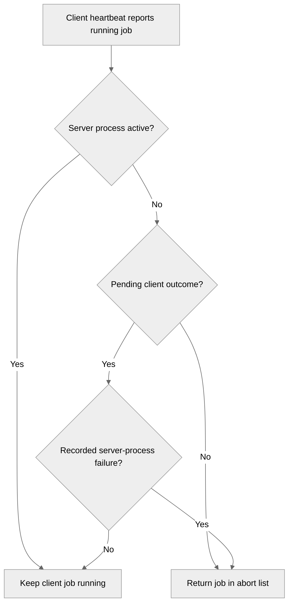

# 5116: Superseded: Clean up clients after server job failure

{'state': 'CLOSED', 'headRefOid': '8e6b3a44e8b76ad097ce2bc848c8ef4e1636c06b', 'mergeCommit': None, 'mergedAt': None}

## Body
Superseded by #5117 after sanitizing the source branch name.

## timeline-comments 5284002782 by greptile-apps[bot]; https://github.com/NVIDIA/NVFlare/pull/5116#issuecomment-5284002782; ; 
<h3>Greptile Summary</h3>

This PR updates heartbeat reconciliation so pending client outcomes protect normally completed jobs but no longer retain client jobs after a recorded server-process failure.

- Excludes jobs in `exception_run_processes` from the pending-outcome retention set.
- Adds regression coverage for active, normally completed, and failed server-job states.

<h3>Confidence Score: 5/5</h3>

The PR appears safe to merge, with the new cleanup behavior matching the documented server-process and client-outcome lifecycle.

Active server processes still protect client jobs, normal completion retains the pending-outcome barrier, and only jobs with a recorded failure after process removal become eligible for heartbeat cleanup.

<h3>Important Files Changed</h3>


| Filename | Overview |
|----------|----------|
| nvflare/private/fed/server/fed_server.py | Refines client-job reconciliation to remove the outcome barrier only for jobs whose server process has failed. |
| tests/unit_test/private/fed/server/fed_server_test.py | Adds focused coverage showing active and normally completed jobs remain protected while failed jobs are cleaned up. |


<h3>Flowchart</h3>



<!-- greptile_other_comments_section -->

<sub>Reviews (1): Last reviewed commit: ["Clean up clients after server job failur..."](https://github.com/nvidia/nvflare/commit/8e6b3a44e8b76ad097ce2bc848c8ef4e1636c06b) | [Re-trigger Greptile](https://app.greptile.com/api/retrigger?id=53045132)</sub>


## timeline-comments 5284194241 by codecov-commenter; https://github.com/NVIDIA/NVFlare/pull/5116#issuecomment-5284194241; ; 
## [Codecov](https://app.codecov.io/gh/NVIDIA/NVFlare/pull/5116?dropdown=coverage&src=pr&el=h1&utm_medium=referral&utm_source=github&utm_content=comment&utm_campaign=pr+comments&utm_term=NVIDIA) Report
:white_check_mark: All modified and coverable lines are covered by tests.
:white_check_mark: Project coverage is 65.66%. Comparing base ([`19f629b`](https://app.codecov.io/gh/NVIDIA/NVFlare/commit/19f629ba7abe451bdf7f7b5cf94b468b1a43a8a7?dropdown=coverage&el=desc&utm_medium=referral&utm_source=github&utm_content=comment&utm_campaign=pr+comments&utm_term=NVIDIA)) to head ([`8e6b3a4`](https://app.codecov.io/gh/NVIDIA/NVFlare/commit/8e6b3a44e8b76ad097ce2bc848c8ef4e1636c06b?dropdown=coverage&el=desc&utm_medium=referral&utm_source=github&utm_content=comment&utm_campaign=pr+comments&utm_term=NVIDIA)).
:warning: Report is 1 commits behind head on main.

<details><summary>Additional details and impacted files</summary>


```diff
@@            Coverage Diff             @@
##             main    #5116      +/-   ##
==========================================
+ Coverage   65.62%   65.66%   +0.03%     
==========================================
  Files        1040     1040              
  Lines      106733   106733              
==========================================
+ Hits        70048    70084      +36     
+ Misses      36685    36649      -36     
```

| [Flag](https://app.codecov.io/gh/NVIDIA/NVFlare/pull/5116/flags?src=pr&el=flags&utm_medium=referral&utm_source=github&utm_content=comment&utm_campaign=pr+comments&utm_term=NVIDIA) | Coverage Δ | |
|---|---|---|
| [unit-tests](https://app.codecov.io/gh/NVIDIA/NVFlare/pull/5116/flags?src=pr&el=flag&utm_medium=referral&utm_source=github&utm_content=comment&utm_campaign=pr+comments&utm_term=NVIDIA) | `65.66% <100.00%> (+0.03%)` | :arrow_up: |

Flags with carried forward coverage won't be shown. [Click here](https://docs.codecov.io/docs/carryforward-flags?utm_medium=referral&utm_source=github&utm_content=comment&utm_campaign=pr+comments&utm_term=NVIDIA#carryforward-flags-in-the-pull-request-comment) to find out more.
</details>

[:umbrella: View full report in Codecov by Harness](https://app.codecov.io/gh/NVIDIA/NVFlare/pull/5116?dropdown=coverage&src=pr&el=continue&utm_medium=referral&utm_source=github&utm_content=comment&utm_campaign=pr+comments&utm_term=NVIDIA).   
:loudspeaker: Have feedback on the report? [Share it here](https://about.codecov.io/codecov-pr-comment-feedback/?utm_medium=referral&utm_source=github&utm_content=comment&utm_campaign=pr+comments&utm_term=NVIDIA).
<details><summary> :rocket: New features to boost your workflow: </summary>

- :snowflake: [Test Analytics](https://docs.codecov.com/docs/test-analytics): Detect flaky tests, report on failures, and find test suite problems.
- :package: [JS Bundle Analysis](https://docs.codecov.com/docs/javascript-bundle-analysis): Save yourself from yourself by tracking and limiting bundle sizes in JS merges.
</details>
