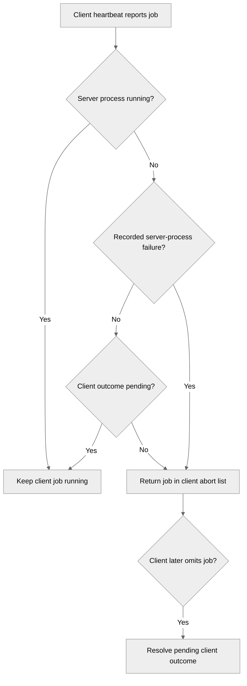

# 5117: Clean up clients after server job failure

{'state': 'MERGED', 'headRefOid': '757dc276eba7eed5c07f4a8fdcafe55f369e35f7', 'mergeCommit': {'oid': '21253dddc479ec256d6ad518d03c346fe177f971'}, 'mergedAt': '2026-08-13T18:52:00Z'}

## Body
Fixes #5115.

### Description

Client heartbeat reconciliation now distinguishes jobs awaiting normal client terminal outcomes from jobs whose server process has already failed.

Pending client outcomes continue to protect normally completed server jobs from premature client cleanup. Once the server records a terminal server-process failure and removes that process from the active set, surviving client jobs are returned in the heartbeat cleanup list.

### Root cause

Heartbeat reconciliation treated every job awaiting a client terminal outcome as if it were still active on the server. That outcome barrier is required for normal completion, but it also masked orphaned client jobs after an abnormal server-process exit.

### Impact

Launcher-managed client jobs are cleaned up after a known server-process failure instead of remaining active until delayed timeout or external scheduler termination. Active server jobs and normally completed jobs awaiting client outcomes retain their existing behavior.

### Types of changes

- [x] Non-breaking bug fix
- [x] New regression tests

### Validation

- 190 focused server, client, Kubernetes, and Slurm lifecycle tests passed.
- `./runtest.sh -s` passed.
- `git diff --check` passed.
- Live external-scheduler validation was not performed.

## timeline-comments 5284025073 by greptile-apps[bot]; https://github.com/NVIDIA/NVFlare/pull/5117#issuecomment-5284025073; ; 
<h3>Greptile Summary</h3>

Client heartbeat reconciliation now allows cleanup of client jobs after a recorded server-process failure while preserving the outcome barrier for normal completion.
- Excludes failed server jobs from the set protecting active client jobs from abort.
- Retains failed jobs in missing-client outcome reconciliation without failing the run again.
- Adds regression coverage for running, normally completed, and server-failed lifecycle states.

<h3>Confidence Score: 5/5</h3>

The PR appears safe to merge.

No blocking failure remains.

<h3>Important Files Changed</h3>


| Filename | Overview |
|----------|----------|
| nvflare/private/fed/server/fed_server.py | Separates abnormal server-process failures from normal pending-outcome jobs during heartbeat cleanup while preserving outcome reconciliation. |
| tests/unit_test/private/fed/server/fed_server_test.py | Adds focused regression cases covering running, pending-outcome, and failed server-job states. |


<h3>Flowchart</h3>



<!-- greptile_other_comments_section -->

<sub>Reviews (5): Last reviewed commit: ["Merge branch &#39;main&#39; into feat/client-cle..."](https://github.com/nvidia/nvflare/commit/757dc276eba7eed5c07f4a8fdcafe55f369e35f7) | [Re-trigger Greptile](https://app.greptile.com/api/retrigger?id=53045811)</sub>


## timeline-comments 5284672720 by codecov-commenter; https://github.com/NVIDIA/NVFlare/pull/5117#issuecomment-5284672720; ; 
## [Codecov](https://app.codecov.io/gh/NVIDIA/NVFlare/pull/5117?dropdown=coverage&src=pr&el=h1&utm_medium=referral&utm_source=github&utm_content=comment&utm_campaign=pr+comments&utm_term=NVIDIA) Report
:white_check_mark: All modified and coverable lines are covered by tests.
:white_check_mark: Project coverage is 65.47%. Comparing base ([`efc47d4`](https://app.codecov.io/gh/NVIDIA/NVFlare/commit/efc47d470b688f0ab5578ff99be3d9c7269db291?dropdown=coverage&el=desc&utm_medium=referral&utm_source=github&utm_content=comment&utm_campaign=pr+comments&utm_term=NVIDIA)) to head ([`757dc27`](https://app.codecov.io/gh/NVIDIA/NVFlare/commit/757dc276eba7eed5c07f4a8fdcafe55f369e35f7?dropdown=coverage&el=desc&utm_medium=referral&utm_source=github&utm_content=comment&utm_campaign=pr+comments&utm_term=NVIDIA)).
:warning: Report is 1 commits behind head on main.

<details><summary>Additional details and impacted files</summary>


```diff
@@            Coverage Diff             @@
##             main    #5117      +/-   ##
==========================================
- Coverage   65.47%   65.47%   -0.01%     
==========================================
  Files        1012     1012              
  Lines      103098   103098              
==========================================
- Hits        67508    67500       -8     
- Misses      35590    35598       +8     
```

| [Flag](https://app.codecov.io/gh/NVIDIA/NVFlare/pull/5117/flags?src=pr&el=flags&utm_medium=referral&utm_source=github&utm_content=comment&utm_campaign=pr+comments&utm_term=NVIDIA) | Coverage Δ | |
|---|---|---|
| [unit-tests](https://app.codecov.io/gh/NVIDIA/NVFlare/pull/5117/flags?src=pr&el=flag&utm_medium=referral&utm_source=github&utm_content=comment&utm_campaign=pr+comments&utm_term=NVIDIA) | `65.47% <100.00%> (-0.01%)` | :arrow_down: |

Flags with carried forward coverage won't be shown. [Click here](https://docs.codecov.io/docs/carryforward-flags?utm_medium=referral&utm_source=github&utm_content=comment&utm_campaign=pr+comments&utm_term=NVIDIA#carryforward-flags-in-the-pull-request-comment) to find out more.
</details>

[:umbrella: View full report in Codecov by Harness](https://app.codecov.io/gh/NVIDIA/NVFlare/pull/5117?dropdown=coverage&src=pr&el=continue&utm_medium=referral&utm_source=github&utm_content=comment&utm_campaign=pr+comments&utm_term=NVIDIA).   
:loudspeaker: Have feedback on the report? [Share it here](https://about.codecov.io/codecov-pr-comment-feedback/?utm_medium=referral&utm_source=github&utm_content=comment&utm_campaign=pr+comments&utm_term=NVIDIA).
<details><summary> :rocket: New features to boost your workflow: </summary>

- :snowflake: [Test Analytics](https://docs.codecov.com/docs/test-analytics): Detect flaky tests, report on failures, and find test suite problems.
- :package: [JS Bundle Analysis](https://docs.codecov.com/docs/javascript-bundle-analysis): Save yourself from yourself by tracking and limiting bundle sizes in JS merges.
</details>


## reviews 4929728363 by greptile-apps[bot]; https://github.com/NVIDIA/NVFlare/pull/5117#pullrequestreview-4929728363; COMMENTED; 


## reviews 4930054115 by pcnudde; https://github.com/NVIDIA/NVFlare/pull/5117#pullrequestreview-4930054115; COMMENTED; 


## reviews 4930103350 by YuanTingHsieh; https://github.com/NVIDIA/NVFlare/pull/5117#pullrequestreview-4930103350; COMMENTED; 
Found one remaining lifecycle issue in heartbeat reconciliation.


## reviews 4930384567 by pcnudde; https://github.com/NVIDIA/NVFlare/pull/5117#pullrequestreview-4930384567; COMMENTED; 


## reviews 4930482421 by YuanTingHsieh; https://github.com/NVIDIA/NVFlare/pull/5117#pullrequestreview-4930482421; APPROVED; 


## inline-comments 3777544295 by greptile-apps[bot]; https://github.com/NVIDIA/NVFlare/pull/5117#discussion_r3777544295; ; nvflare/private/fed/server/fed_server.py
<a href="#"></a> **Unsafe exception-state iteration**

If heartbeat reconciliation overlaps server completion, failure handling, or run-status processing, `difference()` iterates `exception_run_processes` while those paths resize the same dictionary, causing `RuntimeError: dictionary changed size during iteration` and failing the heartbeat instead of returning the client cleanup list.

**Knowledge Base Used:** [Server Job Execution Flow](https://app.greptile.com/nvidia-public-github/-/custom-context/knowledge-base/nvidia/nvflare/-/docs/server-job-execution-flow.md)


## inline-comments 3777811624 by pcnudde; https://github.com/NVIDIA/NVFlare/pull/5117#discussion_r3777811624; ; nvflare/private/fed/server/fed_server.py
Fixed in 74171bab4. Reconciliation now iterates the stable outcome_jobs snapshot and performs only per-job membership checks against exception_run_processes, so it no longer iterates the mutable exception dictionary. The three server-running, awaiting-client-outcome, and server-failed regression cases pass, as do the full style checks.


## inline-comments 3777851797 by YuanTingHsieh; https://github.com/NVIDIA/NVFlare/pull/5117#discussion_r3777851797; ; nvflare/private/fed/server/fed_server.py
**[P2] Preserve missing-outcome reconciliation for failed jobs**

`server_jobs` is used both as the client cleanup allowlist and as the set examined below for missing client outcomes. Filtering failed jobs here correctly triggers client cleanup, but it also excludes them from `jobs_on_server_but_not_on_client`. If the client terminates the job but its one-shot terminal-outcome report fails, subsequent heartbeats omit the job and `_resolve_missing_client_outcome()` is never called, so finalization waits for the default 900-second timeout.

Please use separate sets for cleanup eligibility and pending-outcome reconciliation. For an already-failed job, the missing-outcome path should resolve the pending client without overwriting the recorded server failure.


## inline-comments 3778069068 by pcnudde; https://github.com/NVIDIA/NVFlare/pull/5117#discussion_r3778069068; ; nvflare/private/fed/server/fed_server.py
Fixed in 215f0568f. Missing-outcome reconciliation now considers all pending outcome jobs, while the resolver leaves an existing server-side failure unchanged. The lifecycle state-matrix test now covers the failed-job/missing-client-report path. Validation: 422 server unit tests passed, ./runtest.sh -s passed, and git diff --check passed.
