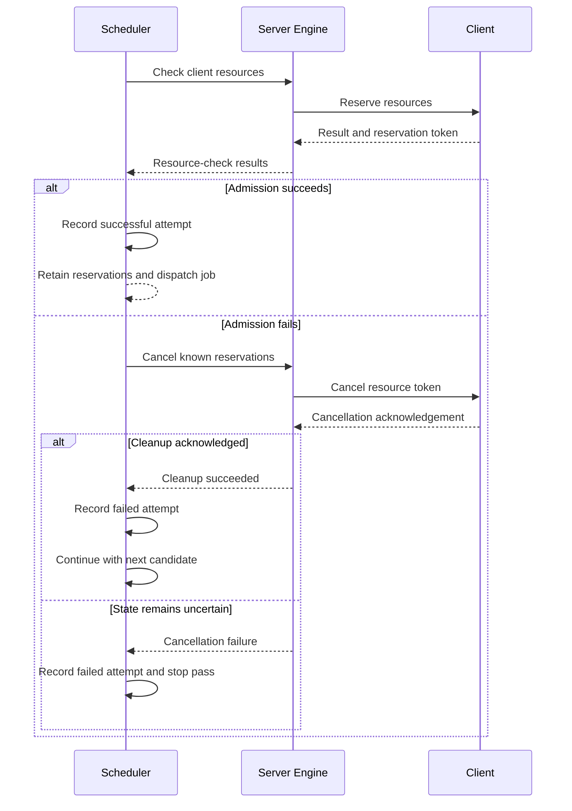

# 5191: Handle unexpected job admission failures

{'state': 'OPEN', 'createdAt': '2026-08-21T23:29:07Z', 'updatedAt': '2026-08-26T23:20:32Z', 'headRefOid': '27ecde2ab85b38734072b90128dc5dc2e8390882', 'baseRefOid': '9a4e30a9d3a26a9514d00d43322661d21b7c09b8', 'closedAt': None, 'mergedAt': None}

## Body
## Summary

- cancel successful resource reservations when job admission exits unexpectedly
- record unexpected admission failures in schedule history so retry backoff and maximum-attempt handling remain effective
- continue scanning later candidates after cleanup succeeds
- stop the scheduler pass when resource results are unavailable or cancellation fails, because reservation state cannot be proven safe
- replace the scheduler's bare exception handlers with `except Exception`

## Root cause

`DefaultJobScheduler.schedule_job()` caught exceptions around the complete candidate scan. If `_try_job()` raised after resource reservation, the exception bypassed normal cancellation and scheduling bookkeeping, then aborted the scan before later candidates were considered.

## Implementation

`_try_job()` now owns the reservation lifecycle after resource-check results are returned. Reservations are retained only when the job is admitted successfully; all other exits run cancellation from a `finally` block. Empty results for non-empty client resource requests are treated as unsafe because reservation tokens may have been lost with missing replies.

`_do_schedule_job()` handles unexpected exceptions at the individual-candidate boundary, logs the traceback, records a retryable failed attempt, and proceeds to the next candidate after successful cleanup. Errors that leave reservation state uncertain still abort the pass after bookkeeping.

## Validation

- `30 passed`: `tests/unit_test/app_common/job_schedulers/job_scheduler_test.py`
- Black check across `nvflare examples tests dev_tools`
- isort check across `nvflare examples tests dev_tools`
- Flake8 across `nvflare examples tests dev_tools`: 0 errors
- agent skill checks: 0 findings

## timeline-comments 5376514935 by codecov-commenter; https://github.com/NVIDIA/NVFlare/pull/5191#issuecomment-5376514935; ; 
## [Codecov](https://app.codecov.io/gh/NVIDIA/NVFlare/pull/5191?dropdown=coverage&src=pr&el=h1&utm_medium=referral&utm_source=github&utm_content=comment&utm_campaign=pr+comments&utm_term=NVIDIA) Report
:x: Patch coverage is `92.80000%` with `9 lines` in your changes missing coverage. Please review.
:white_check_mark: Project coverage is 66.49%. Comparing base ([`9a4e30a`](https://app.codecov.io/gh/NVIDIA/NVFlare/commit/9a4e30a9d3a26a9514d00d43322661d21b7c09b8?dropdown=coverage&el=desc&utm_medium=referral&utm_source=github&utm_content=comment&utm_campaign=pr+comments&utm_term=NVIDIA)) to head ([`27ecde2`](https://app.codecov.io/gh/NVIDIA/NVFlare/commit/27ecde2ab85b38734072b90128dc5dc2e8390882?dropdown=coverage&el=desc&utm_medium=referral&utm_source=github&utm_content=comment&utm_campaign=pr+comments&utm_term=NVIDIA)).
:warning: Report is 1 commits behind head on main.

| [Files with missing lines](https://app.codecov.io/gh/NVIDIA/NVFlare/pull/5191?dropdown=coverage&src=pr&el=tree&utm_medium=referral&utm_source=github&utm_content=comment&utm_campaign=pr+comments&utm_term=NVIDIA) | Patch % | Lines |
|---|---|---|
| [nvflare/app\_common/job\_schedulers/job\_scheduler.py](https://app.codecov.io/gh/NVIDIA/NVFlare/pull/5191?src=pr&el=tree&filepath=nvflare%2Fapp_common%2Fjob_schedulers%2Fjob_scheduler.py&utm_medium=referral&utm_source=github&utm_content=comment&utm_campaign=pr+comments&utm_term=NVIDIA#diff-bnZmbGFyZS9hcHBfY29tbW9uL2pvYl9zY2hlZHVsZXJzL2pvYl9zY2hlZHVsZXIucHk=) | 93.06% | [7 Missing :warning: ](https://app.codecov.io/gh/NVIDIA/NVFlare/pull/5191?src=pr&el=tree&utm_medium=referral&utm_source=github&utm_content=comment&utm_campaign=pr+comments&utm_term=NVIDIA) |
| [nvflare/private/fed/server/server\_engine.py](https://app.codecov.io/gh/NVIDIA/NVFlare/pull/5191?src=pr&el=tree&filepath=nvflare%2Fprivate%2Ffed%2Fserver%2Fserver_engine.py&utm_medium=referral&utm_source=github&utm_content=comment&utm_campaign=pr+comments&utm_term=NVIDIA#diff-bnZmbGFyZS9wcml2YXRlL2ZlZC9zZXJ2ZXIvc2VydmVyX2VuZ2luZS5weQ==) | 91.66% | [2 Missing :warning: ](https://app.codecov.io/gh/NVIDIA/NVFlare/pull/5191?src=pr&el=tree&utm_medium=referral&utm_source=github&utm_content=comment&utm_campaign=pr+comments&utm_term=NVIDIA) |

<details><summary>Additional details and impacted files</summary>


```diff
@@            Coverage Diff             @@
##             main    #5191      +/-   ##
==========================================
+ Coverage   66.43%   66.49%   +0.05%     
==========================================
  Files        1016     1016              
  Lines      105069   105149      +80     
==========================================
+ Hits        69806    69914     +108     
+ Misses      35263    35235      -28     
```

| [Flag](https://app.codecov.io/gh/NVIDIA/NVFlare/pull/5191/flags?src=pr&el=flags&utm_medium=referral&utm_source=github&utm_content=comment&utm_campaign=pr+comments&utm_term=NVIDIA) | Coverage Δ | |
|---|---|---|
| [unit-tests](https://app.codecov.io/gh/NVIDIA/NVFlare/pull/5191/flags?src=pr&el=flag&utm_medium=referral&utm_source=github&utm_content=comment&utm_campaign=pr+comments&utm_term=NVIDIA) | `66.49% <92.80%> (+0.05%)` | :arrow_up: |

Flags with carried forward coverage won't be shown. [Click here](https://docs.codecov.io/docs/carryforward-flags?utm_medium=referral&utm_source=github&utm_content=comment&utm_campaign=pr+comments&utm_term=NVIDIA#carryforward-flags-in-the-pull-request-comment) to find out more.
</details>

[:umbrella: View full report in Codecov by Harness](https://app.codecov.io/gh/NVIDIA/NVFlare/pull/5191?dropdown=coverage&src=pr&el=continue&utm_medium=referral&utm_source=github&utm_content=comment&utm_campaign=pr+comments&utm_term=NVIDIA).   
:loudspeaker: Have feedback on the report? [Share it here](https://about.codecov.io/codecov-pr-comment-feedback/?utm_medium=referral&utm_source=github&utm_content=comment&utm_campaign=pr+comments&utm_term=NVIDIA).
<details><summary> :rocket: New features to boost your workflow: </summary>

- :snowflake: [Test Analytics](https://docs.codecov.com/docs/test-analytics): Detect flaky tests, report on failures, and find test suite problems.
- :package: [JS Bundle Analysis](https://docs.codecov.com/docs/javascript-bundle-analysis): Save yourself from yourself by tracking and limiting bundle sizes in JS merges.
</details>


## timeline-comments 5402317760 by greptile-apps[bot]; https://github.com/NVIDIA/NVFlare/pull/5191#issuecomment-5402317760; ; 
<h3>Greptile Summary</h3>

This PR makes job admission failures reservation-safe and preserves retry bookkeeping.
- Moves post-check reservation ownership and cleanup into `_try_job`.
- Records unexpected per-candidate failures and continues scanning when cleanup succeeds.
- Stops the scheduler pass when resource or cancellation state is uncertain.
- Validates client cancellation acknowledgements and adds focused scheduler and engine tests.

<h3>Confidence Score: 5/5</h3>

The PR appears safe to merge.

No blocking failure remains.

<h3>Important Files Changed</h3>


| Filename | Overview |
|----------|----------|
| nvflare/app_common/job_schedulers/job_scheduler.py | Adds reservation-lifecycle cleanup, candidate-level failure bookkeeping, and safe continuation or pass-abort behavior. |
| nvflare/private/fed/server/server_engine.py | Validates cancellation responses for every known reservation before reporting cleanup success. |
| nvflare/apis/server_engine_spec.py | Documents the newly enforced cancellation-failure contract. |
| tests/unit_test/app_common/job_schedulers/job_scheduler_test.py | Covers cleanup, retry accounting, partial and empty resource results, cancellation failures, and later-candidate continuation. |
| tests/unit_test/private/fed/server/server_engine_test.py | Covers successful, missing, malformed, and failed cancellation acknowledgements. |


<h3>Sequence Diagram</h3>



<!-- greptile_other_comments_section -->

<sub>Reviews (5): Last reviewed commit: ["Merge branch &#39;main&#39; into feat/job-schedu..."](https://github.com/nvidia/nvflare/commit/27ecde2ab85b38734072b90128dc5dc2e8390882) | [Re-trigger Greptile](https://app.greptile.com/api/retrigger?id=56438552)</sub>


## timeline-comments 5432240101 by pcnudde; https://github.com/NVIDIA/NVFlare/pull/5191#issuecomment-5432240101; ; 
The valuable core of this PR is that cleanup now always runs: the `finally`-centralized cancellation in `_try_job`, the post-admission cleanup via `_cancel_dispatch_resources`, and the bare `except` fixes. Please keep all of that. But I don't think the hard-fail half — raising on unacknowledged cancels and aborting the whole scheduling pass — is the right trade, and I'd like it changed to verify-and-log.

**Why the abort is disproportionate:**
- The failure it guards against self-heals: all built-in resource managers inherit `AutoCleanResourceManager`'s expiry (default 30s), so an unacked cancel leaks a reservation for at most ~30s. Nothing is running against that reservation; it's a hold taken while asking "can you fit this job?".
- The abort protects nothing in practice: `JobRunner` re-runs `schedule_job` ~1s later, so later candidates get checked against the (still-live, <=30s) reservation on the very next pass anyway.
- Meanwhile the triggers are routine and some are deterministic: a client disconnecting between check and cancel can *never* ack (`reservation_sites` is populated before the `if client:` guard, so no request is even built); a client that passes the 15s check window can reliably miss the 10s cancel-ack default; a lost reply after a successful client-side cancel also raises. Each occurrence stalls the entire queue for that pass and burns the affected job's `SCHEDULE_COUNT`; a client down for a few minutes drives a perfectly schedulable job to `FINISHED_CANT_SCHEDULE` with a misleading "failed to cancel resources" history.

**Requested changes:**
1. `cancel_client_resources`: keep the reply verification, but log the per-site errors (error level) instead of raising. Reuse `check_client_replies()` from `admin.py` for the verification — it already does missing/timeout/return-code checks — plus the new `get_return_code()` body check. Revert the `Raises:` addition to `ServerEngineSpec` (nothing enforces it and other implementations don't honor it).
2. Drop `_UnsafeAdmissionError` and the completeness raises in `_try_job` (missing sites / empty results are a normal client-disconnect race the old code handled; the non-dict check can stay as a logged skip). Failed admission of one job should `continue` to the next candidate, as before.
3. If we want a stronger guarantee against leaks for custom resource managers, the right place is `ResourceManagerSpec` — document/require reservation expiry there rather than compensating in the scheduler.
4. Independent fixes to keep regardless: guard the second `_update_schedule_history` call in the except handler (a deterministic history failure currently escapes and defeats backoff entirely); preserve the original exception when wrapping (the current `from` chaining hides the root-cause admission error from logs and history); drop the dead `attempt_recorded` flag and the redundant `rc == SCHEDULE_RESULT_OK` conjunct.

This keeps every leak observable (loud logs on unacked cancels) without letting one slow or departed client stop scheduling for the whole queue. Most of the new tests would shift from asserting scan-abort to asserting log-plus-continue.


## reviews 5013165053 by copilot-pull-request-reviewer[bot]; https://github.com/NVIDIA/NVFlare/pull/5191#pullrequestreview-5013165053; COMMENTED; 
## Pull request overview

This PR hardens `DefaultJobScheduler` job admission so that unexpected exceptions during candidate evaluation don’t leak resource reservations, don’t break retry/backoff bookkeeping, and (when safe) don’t prevent later candidates from being considered.

**Changes:**
- Move resource-reservation lifecycle ownership into `_try_job()` using `finally`-based cleanup, keeping reservations only on successful admission.
- Add per-candidate unexpected-exception handling in `_do_schedule_job()` to record retryable failures in schedule history and proceed to later candidates when safe.
- Extend unit tests to verify reservation cancellation + continued scanning after an unexpected admission failure, and that max schedule count handling still works.

### Reviewed changes

Copilot reviewed 2 out of 2 changed files in this pull request and generated 1 comment.

| File | Description |
| ---- | ----------- |
| `nvflare/app_common/job_schedulers/job_scheduler.py` | Adds safe cleanup/abort semantics around resource admission failures and improves exception handling granularity. |
| `tests/unit_test/app_common/job_schedulers/job_scheduler_test.py` | Adds regression tests ensuring unexpected admission errors cancel reservations, record history, and honor retry limits. |


---

💡 <a href="/NVIDIA/NVFlare/new/main?filename=.github/skills/code-review/SKILL.md" class="Link--inTextBlock" target="_blank" rel="noopener noreferrer">Add a `code-review` agent skill</a> or configure MCP servers for context-aware, tailored reviews. <a href="https://docs.github.com/en/copilot/how-tos/use-copilot-agents/request-a-code-review/use-code-review#mcp-servers-and-agent-skills" class="Link--inTextBlock" target="_blank" rel="noopener noreferrer">Learn more in the docs.</a>


## reviews 5013238861 by YuanTingHsieh; https://github.com/NVIDIA/NVFlare/pull/5191#pullrequestreview-5013238861; COMMENTED; 


## reviews 5013254783 by YuanTingHsieh; https://github.com/NVIDIA/NVFlare/pull/5191#pullrequestreview-5013254783; COMMENTED; 


## reviews 5024560674 by IsaacYangSLA; https://github.com/NVIDIA/NVFlare/pull/5191#pullrequestreview-5024560674; COMMENTED; 
I found three resource-lifecycle gaps that can leave reservation state unknown or leak a successful reservation. The submitted 30 scheduler tests and targeted Black/Flake8 checks pass, but the cases described inline are not covered.


## reviews 5024768664 by YuanTingHsieh; https://github.com/NVIDIA/NVFlare/pull/5191#pullrequestreview-5024768664; COMMENTED; 


## reviews 5024769118 by YuanTingHsieh; https://github.com/NVIDIA/NVFlare/pull/5191#pullrequestreview-5024769118; COMMENTED; 


## reviews 5024769771 by YuanTingHsieh; https://github.com/NVIDIA/NVFlare/pull/5191#pullrequestreview-5024769771; COMMENTED; 


## inline-comments 3847978122 by Copilot; https://github.com/NVIDIA/NVFlare/pull/5191#discussion_r3847978122; ; nvflare/app_common/job_schedulers/job_scheduler.py
`engine.check_client_resources()` can legitimately return an empty dict when requests were sent but no replies were received (see `send_requests` returning `[]` on timeout / missing targets). In that situation, reservation state may be unknown (a site could have reserved resources but the token never arrived), so continuing the scheduler pass is unsafe. Consider treating “expected results but got none” as an unsafe admission error instead of a normal `NO_RESOURCE` return.


## inline-comments 3848037041 by YuanTingHsieh; https://github.com/NVIDIA/NVFlare/pull/5191#discussion_r3848037041; ; nvflare/app_common/job_schedulers/job_scheduler.py
Addressed in `44eb8f2ea`. When `resource_reqs` is non-empty, an empty result now raises `_UnsafeAdmissionError`, so the failed attempt is recorded and the scheduler pass stops. Empty results remain a normal no-resource result only when no client resource checks were expected. I also added coverage for empty results, resource-check exceptions, and cancellation failures; all 29 focused scheduler tests pass.


## inline-comments 3848052090 by YuanTingHsieh; https://github.com/NVIDIA/NVFlare/pull/5191#discussion_r3848052090; ; nvflare/app_common/job_schedulers/job_scheduler.py
Added dedicated regression coverage in `859c95e5d`: one test verifies that empty results with expected client replies stop the candidate scan, and a contrasting test verifies that empty results remain safe when no client resource checks were issued. The focused scheduler suite now passes all 30 tests.


## inline-comments 3857734857 by IsaacYangSLA; https://github.com/NVIDIA/NVFlare/pull/5191#discussion_r3857734857; ; nvflare/app_common/job_schedulers/job_scheduler.py
**P1 — Verify cancellation acknowledgements before continuing.** This treats cleanup as successful unless `_cancel_resources()` raises, but the production `ServerEngine.cancel_client_resources()` discards `_send_admin_requests()` replies. A timeout or a client-side `EXECUTION_EXCEPTION` therefore returns normally, and the scheduler continues even though reservation state is unknown. Please propagate and validate cancellation results, raising `_UnsafeAdmissionError` for missing or non-OK acknowledgements.


## inline-comments 3857734861 by IsaacYangSLA; https://github.com/NVIDIA/NVFlare/pull/5191#discussion_r3857734861; ; nvflare/app_common/job_schedulers/job_scheduler.py
**P1 — Treat partial resource-check results as unsafe too.** This only rejects an entirely empty result. If `resource_reqs` contains `site1` and `site2` but the result contains only a successful `site1`, a job with `min_sites=1` is admitted even though `site2` may have an untracked reservation. I reproduced that path. Please compare expected and returned site sets and stop the pass whenever an expected result is missing.


## inline-comments 3857734865 by IsaacYangSLA; https://github.com/NVIDIA/NVFlare/pull/5191#discussion_r3857734865; ; nvflare/app_common/job_schedulers/job_scheduler.py
**P2 — Retain cleanup ownership through post-admission bookkeeping.** Setting `keep_resources` here ends the cleanup guard before `_do_schedule_job()` updates schedule history and returns the ready job. If that later processing raises, the outer handler returns no job while the successful reservation remains active; I reproduced it with malformed schedule-history metadata. Please keep cleanup ownership until the ready job is successfully returned, or cancel the returned dispatch reservations when post-admission processing fails.


## inline-comments 3857918432 by YuanTingHsieh; https://github.com/NVIDIA/NVFlare/pull/5191#discussion_r3857918432; ; nvflare/app_common/job_schedulers/job_scheduler.py
Addressed in `585c3db7d`. `_do_schedule_job()` now retains ownership of a successful dispatch through logging and schedule-history bookkeeping. If post-admission processing raises, it reconstructs cancellation inputs from the returned `DispatchInfo`, cancels those reservations, records the failed attempt, and continues only after cleanup succeeds; an uncertain cleanup stops the pass. Added a regression where the first history update raises, the first token is cancelled, and a later candidate schedules with a new token.


## inline-comments 3857918809 by YuanTingHsieh; https://github.com/NVIDIA/NVFlare/pull/5191#discussion_r3857918809; ; nvflare/app_common/job_schedulers/job_scheduler.py
Addressed in `585c3db7d`. The scheduler now compares the exact expected and returned site sets before evaluating admission. Missing or unexpected sites raise `_UnsafeAdmissionError`; known successful reservations are cancelled by the existing `finally` guard, and the pass stops because reservations at missing sites cannot be proven clean. Added a two-site partial-reply regression that verifies known cleanup, retry bookkeeping, and that the later candidate is not examined.


## inline-comments 3857919327 by YuanTingHsieh; https://github.com/NVIDIA/NVFlare/pull/5191#discussion_r3857919327; ; nvflare/app_common/job_schedulers/job_scheduler.py
Addressed in `585c3db7d`. `ServerEngine.cancel_client_resources()` now requires a positive acknowledgement for every site with a reservation token and raises on missing/time-out replies, non-OK message return codes, malformed acknowledgement bodies, and non-OK cancellation return codes (including `EXECUTION_EXCEPTION`). The scheduler already converts that cleanup failure into `_UnsafeAdmissionError`, so the candidate scan stops. Added production-level success and parameterized failure tests; the combined focused suites pass all 69 tests.


## Files
nvflare/apis/server_engine_spec.py
nvflare/app_common/job_schedulers/job_scheduler.py
nvflare/private/fed/server/server_engine.py
tests/unit_test/app_common/job_schedulers/job_scheduler_test.py
tests/unit_test/private/fed/server/server_engine_test.py