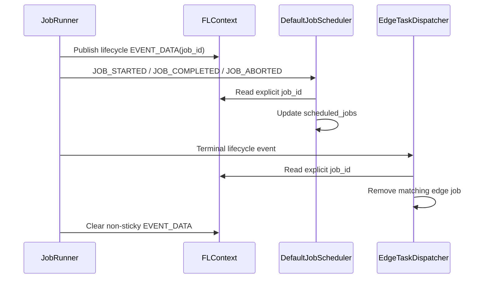

# 5216: Fix concurrent job lifecycle accounting

{'state': 'MERGED', 'headRefOid': '2dce0c45ca2ac6a343c4a5e45acef7eb22a2643c', 'mergeCommit': {'oid': 'e12060619633968bba0f2bb061a39b23153e13cc'}, 'mergedAt': '2026-08-26T22:33:56Z'}

## Body
## Summary

- publish the originating job ID as non-sticky data on server job lifecycle events
- make `DefaultJobScheduler` prefer the explicit event job ID while preserving the existing sticky-ID fallback
- add regression coverage for sticky context changes and start/completion/abort publication

## Problem

Concurrent job launch and completion processing can replace the sticky `CURRENT_JOB_ID` before a lifecycle event handler reads it. The scheduler can then account a start, completion, or abort against the wrong job, leaving stale entries in `scheduled_jobs`. Once those entries reach `max_jobs`, valid admissions can be blocked even though execution capacity is available.

## Validation

- `72 passed` in the focused scheduler and JobRunner unit-test suites
- Black, isort, and Flake8 passed for all four changed files
- `git diff --check` passed
- a 100-job, one-server/two-client validation with `max_jobs=20` completed all jobs successfully, with each job scheduled exactly once and no stale-accounting serial tail

Fixes #5215


## timeline-comments 5429246224 by greptile-apps[bot]; https://github.com/NVIDIA/NVFlare/pull/5216#issuecomment-5429246224; ; 
<h3>Greptile Summary</h3>

The PR makes concurrent lifecycle accounting use an event-scoped originating job ID while retaining compatibility with publishers that only provide the sticky context ID.
- Adds a shared helper that prefers the explicit lifecycle event job ID.
- Publishes explicit IDs for start, completion, and abort events.
- Updates scheduler and edge-dispatch cleanup to consume the explicit ID.
- Passes the explicit ID into workspace archival and adds regression coverage for concurrent context changes.

<h3>Confidence Score: 5/5</h3>

The PR appears safe to merge.

No blocking failure remains.

<h3>Important Files Changed</h3>


| Filename | Overview |
|----------|----------|
| nvflare/apis/utils/job_utils.py | Adds a compatibility helper that prefers an event-scoped job ID and falls back to the existing sticky context property. |
| nvflare/app_common/job_schedulers/job_scheduler.py | Uses the originating lifecycle event ID for concurrent-job start and terminal accounting. |
| nvflare/edge/widgets/etd.py | Removes the edge job identified by terminal event data rather than a potentially replaced sticky ID. |
| nvflare/private/fed/server/job_runner.py | Publishes explicit lifecycle job IDs and passes the completed job ID directly to workspace archival. |
| tests/unit_test/app_common/job_schedulers/job_scheduler_test.py | Covers explicit event-ID preference and backward-compatible sticky-ID fallback. |
| tests/unit_test/edge/widgets/etd_test.py | Verifies terminal edge cleanup prefers the event-scoped job ID. |
| tests/unit_test/private/fed/server/job_runner_test.py | Verifies lifecycle publication, scheduler delivery, and cleanup of non-sticky event data. |


<h3>Sequence Diagram</h3>



<!-- greptile_other_comments_section -->

<sub>Reviews (5): Last reviewed commit: ["Merge branch &#39;main&#39; into feat/scheduler-..."](https://github.com/nvidia/nvflare/commit/2dce0c45ca2ac6a343c4a5e45acef7eb22a2643c) | [Re-trigger Greptile](https://app.greptile.com/api/retrigger?id=57184797)</sub>


## timeline-comments 5429382320 by codecov-commenter; https://github.com/NVIDIA/NVFlare/pull/5216#issuecomment-5429382320; ; 
## [Codecov](https://app.codecov.io/gh/NVIDIA/NVFlare/pull/5216?dropdown=coverage&src=pr&el=h1&utm_medium=referral&utm_source=github&utm_content=comment&utm_campaign=pr+comments&utm_term=NVIDIA) Report
:x: Patch coverage is `96.00000%` with `1 line` in your changes missing coverage. Please review.
:white_check_mark: Project coverage is 66.50%. Comparing base ([`2886880`](https://app.codecov.io/gh/NVIDIA/NVFlare/commit/28868809e679d1e168c45e0dd910a6322a78b71c?dropdown=coverage&el=desc&utm_medium=referral&utm_source=github&utm_content=comment&utm_campaign=pr+comments&utm_term=NVIDIA)) to head ([`2dce0c4`](https://app.codecov.io/gh/NVIDIA/NVFlare/commit/2dce0c45ca2ac6a343c4a5e45acef7eb22a2643c?dropdown=coverage&el=desc&utm_medium=referral&utm_source=github&utm_content=comment&utm_campaign=pr+comments&utm_term=NVIDIA)).
:warning: Report is 1 commits behind head on main.

| [Files with missing lines](https://app.codecov.io/gh/NVIDIA/NVFlare/pull/5216?dropdown=coverage&src=pr&el=tree&utm_medium=referral&utm_source=github&utm_content=comment&utm_campaign=pr+comments&utm_term=NVIDIA) | Patch % | Lines |
|---|---|---|
| [nvflare/private/fed/server/job\_runner.py](https://app.codecov.io/gh/NVIDIA/NVFlare/pull/5216?src=pr&el=tree&filepath=nvflare%2Fprivate%2Ffed%2Fserver%2Fjob_runner.py&utm_medium=referral&utm_source=github&utm_content=comment&utm_campaign=pr+comments&utm_term=NVIDIA#diff-bnZmbGFyZS9wcml2YXRlL2ZlZC9zZXJ2ZXIvam9iX3J1bm5lci5weQ==) | 90.00% | [1 Missing :warning: ](https://app.codecov.io/gh/NVIDIA/NVFlare/pull/5216?src=pr&el=tree&utm_medium=referral&utm_source=github&utm_content=comment&utm_campaign=pr+comments&utm_term=NVIDIA) |

<details><summary>Additional details and impacted files</summary>


```diff
@@            Coverage Diff             @@
##             main    #5216      +/-   ##
==========================================
+ Coverage   66.47%   66.50%   +0.02%     
==========================================
  Files        1016     1016              
  Lines      105119   105132      +13     
==========================================
+ Hits        69873    69913      +40     
+ Misses      35246    35219      -27     
```

| [Flag](https://app.codecov.io/gh/NVIDIA/NVFlare/pull/5216/flags?src=pr&el=flags&utm_medium=referral&utm_source=github&utm_content=comment&utm_campaign=pr+comments&utm_term=NVIDIA) | Coverage Δ | |
|---|---|---|
| [unit-tests](https://app.codecov.io/gh/NVIDIA/NVFlare/pull/5216/flags?src=pr&el=flag&utm_medium=referral&utm_source=github&utm_content=comment&utm_campaign=pr+comments&utm_term=NVIDIA) | `66.50% <96.00%> (+0.02%)` | :arrow_up: |

Flags with carried forward coverage won't be shown. [Click here](https://docs.codecov.io/docs/carryforward-flags?utm_medium=referral&utm_source=github&utm_content=comment&utm_campaign=pr+comments&utm_term=NVIDIA#carryforward-flags-in-the-pull-request-comment) to find out more.
</details>

[:umbrella: View full report in Codecov by Harness](https://app.codecov.io/gh/NVIDIA/NVFlare/pull/5216?dropdown=coverage&src=pr&el=continue&utm_medium=referral&utm_source=github&utm_content=comment&utm_campaign=pr+comments&utm_term=NVIDIA).   
:loudspeaker: Have feedback on the report? [Share it here](https://about.codecov.io/codecov-pr-comment-feedback/?utm_medium=referral&utm_source=github&utm_content=comment&utm_campaign=pr+comments&utm_term=NVIDIA).
<details><summary> :rocket: New features to boost your workflow: </summary>

- :snowflake: [Test Analytics](https://docs.codecov.com/docs/test-analytics): Detect flaky tests, report on failures, and find test suite problems.
- :package: [JS Bundle Analysis](https://docs.codecov.com/docs/javascript-bundle-analysis): Save yourself from yourself by tracking and limiting bundle sizes in JS merges.
</details>


## timeline-comments 5431794888 by YuanTingHsieh; https://github.com/NVIDIA/NVFlare/pull/5216#issuecomment-5431794888; ; 
Follow-up audit (non-blocking for this PR): the explicit lifecycle event job ID and workspace fixes here correctly address the reported race. A separate cleanup should remove or convert the five server-parent sticky CURRENT_JOB_ID writes as one coordinated change, while retaining sticky job identity inside single-job child processes. It should also audit the default-sticky JOB_RUN_NUMBER alias and the legacy ambient-ID fallback in _save_workspace. JobMetricsCollector needs related concurrency hardening: use the explicit lifecycle job ID, key duration state by job ID, and avoid mutating a shared tags dictionary. Concurrent-context regression coverage should verify that one job operation cannot leak identity or timing state into another; the lifecycle helper fallback can remain temporarily for compatibility with external publishers.


## reviews 5035546840 by YuanTingHsieh; https://github.com/NVIDIA/NVFlare/pull/5216#pullrequestreview-5035546840; APPROVED; 

