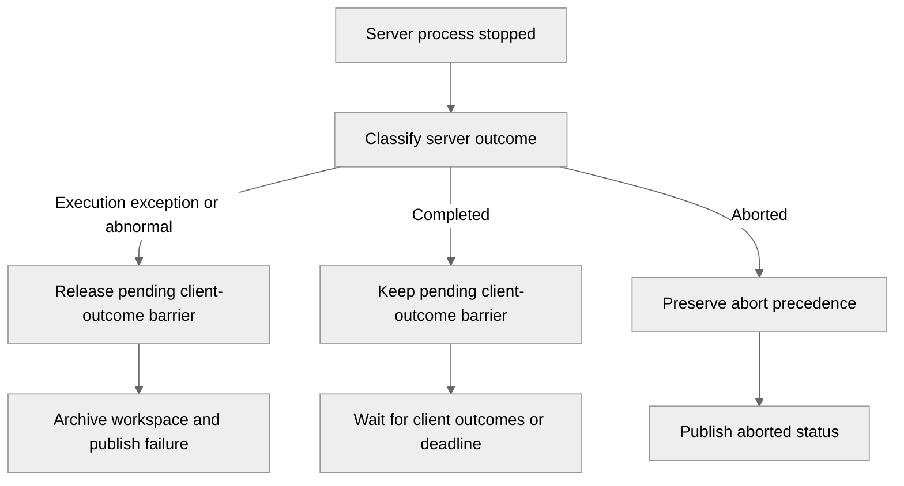

# 5221: Finalize failed jobs with missing client outcomes

{'state': 'MERGED', 'headRefOid': 'c4b154259e87377dca7e3fb9b150d7216186839d', 'mergeCommit': {'oid': '535373a0824f90ca6b758fd2dc781b9f2f9064b9'}, 'mergedAt': '2026-08-27T00:04:22Z'}

## Body
## Summary

- release pending client outcomes when a stopped server job already has an authoritative non-`ABORTED` failure
- preserve the existing outcome barrier for normal completion and launcher `ABORTED` precedence
- add focused regression coverage for a server execution failure with a pending client outcome

## Root cause

The completion loop checked the pending-client outcome barrier before evaluating an already-recorded server-process failure. A client that became unreachable could therefore keep a known failed job in `RUNNING` until the normal outcome or heartbeat timeout expired.

## Validation

- `176 passed` across focused server/client lifecycle tests
- `./runtest.sh -s`
- `git diff --check`

Fixes #5220.


## timeline-comments 5431411698 by greptile-apps[bot]; https://github.com/NVIDIA/NVFlare/pull/5221#issuecomment-5431411698; ; 
<h3>Greptile Summary</h3>

The PR finalizes stopped jobs promptly when the server has an authoritative non-aborted failure, while retaining the client-outcome barrier for normal completion and aborted-launcher precedence.

- Extracts server-process status classification into a shared helper.
- Clears pending client outcomes only for execution-exception or abnormal server outcomes.
- Prevents late failure notifications from recreating state for finalized jobs.
- Adds focused lifecycle regression tests for server failures and clean unknown return codes.

<h3>Confidence Score: 5/5</h3>

The PR appears safe to merge.

No blocking failure remains.

<h3>Important Files Changed</h3>


| Filename | Overview |
|----------|----------|
| nvflare/private/fed/server/job_runner.py | Centralizes terminal-status classification, releases pending outcomes for authoritative server failures, and safely ignores failure notifications for finalized jobs. |
| tests/unit_test/private/fed/server/job_runner_test.py | Adds regression coverage for failure-barrier release, clean unknown-return-code waiting, and late failure notification handling. |


<h3>Flowchart</h3>



<!-- greptile_other_comments_section -->

<sub>Reviews (4): Last reviewed commit: ["test: update failed job workspace assert..."](https://github.com/nvidia/nvflare/commit/c4b154259e87377dca7e3fb9b150d7216186839d) | [Re-trigger Greptile](https://app.greptile.com/api/retrigger?id=57268628)</sub>


## timeline-comments 5431537294 by codecov-commenter; https://github.com/NVIDIA/NVFlare/pull/5221#issuecomment-5431537294; ; 
## [Codecov](https://app.codecov.io/gh/NVIDIA/NVFlare/pull/5221?dropdown=coverage&src=pr&el=h1&utm_medium=referral&utm_source=github&utm_content=comment&utm_campaign=pr+comments&utm_term=NVIDIA) Report
:x: Patch coverage is `91.66667%` with `4 lines` in your changes missing coverage. Please review.
:white_check_mark: Project coverage is 66.50%. Comparing base ([`e120606`](https://app.codecov.io/gh/NVIDIA/NVFlare/commit/e12060619633968bba0f2bb061a39b23153e13cc?dropdown=coverage&el=desc&utm_medium=referral&utm_source=github&utm_content=comment&utm_campaign=pr+comments&utm_term=NVIDIA)) to head ([`c4b1542`](https://app.codecov.io/gh/NVIDIA/NVFlare/commit/c4b154259e87377dca7e3fb9b150d7216186839d?dropdown=coverage&el=desc&utm_medium=referral&utm_source=github&utm_content=comment&utm_campaign=pr+comments&utm_term=NVIDIA)).

| [Files with missing lines](https://app.codecov.io/gh/NVIDIA/NVFlare/pull/5221?dropdown=coverage&src=pr&el=tree&utm_medium=referral&utm_source=github&utm_content=comment&utm_campaign=pr+comments&utm_term=NVIDIA) | Patch % | Lines |
|---|---|---|
| [nvflare/private/fed/server/job\_runner.py](https://app.codecov.io/gh/NVIDIA/NVFlare/pull/5221?src=pr&el=tree&filepath=nvflare%2Fprivate%2Ffed%2Fserver%2Fjob_runner.py&utm_medium=referral&utm_source=github&utm_content=comment&utm_campaign=pr+comments&utm_term=NVIDIA#diff-bnZmbGFyZS9wcml2YXRlL2ZlZC9zZXJ2ZXIvam9iX3J1bm5lci5weQ==) | 91.66% | [4 Missing :warning: ](https://app.codecov.io/gh/NVIDIA/NVFlare/pull/5221?src=pr&el=tree&utm_medium=referral&utm_source=github&utm_content=comment&utm_campaign=pr+comments&utm_term=NVIDIA) |

<details><summary>Additional details and impacted files</summary>


```diff
@@            Coverage Diff             @@
##             main    #5221      +/-   ##
==========================================
- Coverage   66.50%   66.50%   -0.01%     
==========================================
  Files        1016     1016              
  Lines      105132   105149      +17     
==========================================
+ Hits        69920    69929       +9     
- Misses      35212    35220       +8     
```

| [Flag](https://app.codecov.io/gh/NVIDIA/NVFlare/pull/5221/flags?src=pr&el=flags&utm_medium=referral&utm_source=github&utm_content=comment&utm_campaign=pr+comments&utm_term=NVIDIA) | Coverage Δ | |
|---|---|---|
| [unit-tests](https://app.codecov.io/gh/NVIDIA/NVFlare/pull/5221/flags?src=pr&el=flag&utm_medium=referral&utm_source=github&utm_content=comment&utm_campaign=pr+comments&utm_term=NVIDIA) | `66.50% <91.66%> (-0.01%)` | :arrow_down: |

Flags with carried forward coverage won't be shown. [Click here](https://docs.codecov.io/docs/carryforward-flags?utm_medium=referral&utm_source=github&utm_content=comment&utm_campaign=pr+comments&utm_term=NVIDIA#carryforward-flags-in-the-pull-request-comment) to find out more.
</details>

[:umbrella: View full report in Codecov by Harness](https://app.codecov.io/gh/NVIDIA/NVFlare/pull/5221?dropdown=coverage&src=pr&el=continue&utm_medium=referral&utm_source=github&utm_content=comment&utm_campaign=pr+comments&utm_term=NVIDIA).   
:loudspeaker: Have feedback on the report? [Share it here](https://about.codecov.io/codecov-pr-comment-feedback/?utm_medium=referral&utm_source=github&utm_content=comment&utm_campaign=pr+comments&utm_term=NVIDIA).
<details><summary> :rocket: New features to boost your workflow: </summary>

- :snowflake: [Test Analytics](https://docs.codecov.com/docs/test-analytics): Detect flaky tests, report on failures, and find test suite problems.
- :package: [JS Bundle Analysis](https://docs.codecov.com/docs/javascript-bundle-analysis): Save yourself from yourself by tracking and limiting bundle sizes in JS merges.
</details>


## reviews 5035285390 by greptile-apps[bot]; https://github.com/NVIDIA/NVFlare/pull/5221#pullrequestreview-5035285390; COMMENTED; 


## reviews 5035548533 by chesterxgchen; https://github.com/NVIDIA/NVFlare/pull/5221#pullrequestreview-5035548533; DISMISSED; 


## reviews 5036055068 by YuanTingHsieh; https://github.com/NVIDIA/NVFlare/pull/5221#pullrequestreview-5036055068; APPROVED; 


## inline-comments 3866924035 by greptile-apps[bot]; https://github.com/NVIDIA/NVFlare/pull/5221#discussion_r3866924035; ; nvflare/private/fed/server/job_runner.py
<a href="#"></a> **Barrier predicate misclassifies completion**

If the launcher or return-code file reports a nonzero, non-`ABORTED` code outside the explicitly recognized failure codes while `PROCESS_FINISHED` is clean, this predicate clears the pending client outcomes even though `_get_finished_job_status()` classifies the job as `FINISHED_COMPLETED`, causing the job to finalize without waiting for client failures and later outcome reports to be ignored.

**Knowledge Base Used:**
- [Server runtime and scheduling](https://app.greptile.com/nvidia-public-github/-/custom-context/knowledge-base/nvidia/nvflare/-/docs/server-runtime.md)
- [Federated job lifecycle](https://app.greptile.com/nvidia-public-github/-/custom-context/knowledge-base/nvidia/nvflare/-/docs/job-lifecycle.md)
