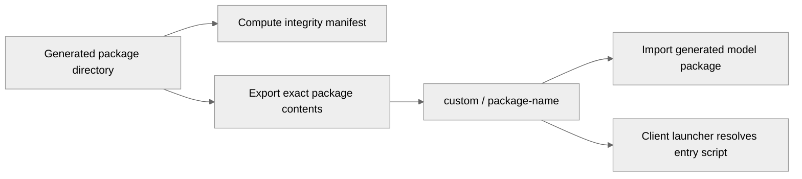

# 5226: [Research] Add AgenticFL workflow as a research example

{'state': 'OPEN', 'createdAt': '2026-08-28T13:27:24Z', 'updatedAt': '2026-09-09T14:51:10Z', 'headRefOid': '7f840afe72aebfe193c9eb9b0577f9701891ec2b', 'baseRefOid': 'e5287949097a9b4a260fc6a9b07117adbf13f473', 'closedAt': None, 'mergedAt': None}

## Body
### Description

This PR adds AgenticFL as a self-contained NVFlare research example. The workflow uses a Codex agent backend to negotiate the task, assess privacy-safe client metadata, generate client-local data adapters and task-specific training code, validate generated artifacts, and launch FedAvg through the NVFlare Client API.

The example includes:

- fixed `job_data.py` and `job_train.py` entry points for the showcased workflow;
- structured agent, data-contract, NVFlare runtime, prompt, logging, and utility modules;
- fail-closed client admission and generated-code validation with no deterministic backend fallback;
- a loopback local VLM for existing raw-image inspection, spatial-label visual review, rendering, and automatic orientation repair;
- no acquisition-quality review;
- reference preparation from available cohort data rather than distributed or synthetic reference images;
- a 39-site retinal cohort guide and dataset-source documentation;
- focused tests for data boundaries, job wiring, research scope, reference preparation, and visual-QC contracts.

The recorded end-to-end experiment queried 39 retinal sites, admitted 18 sites to client-local extraction, retained 10 sites and 26,549 records for training, and completed 100 FedAvg rounds with 10/10 client updates in every round. The README reports the latest client-mean metrics and training curve. It also explains expected run-to-run variation from agent-generated model and augmentation strategies while the principal FL settings remain fixed.

### Validation

- `PYTHONPATH=research/agentic-fl python -m unittest discover -s research/agentic-fl/tests -v` — 25 tests passed.
- The complete 39-site data phase and 10-client, 100-round GPU training workflow completed end to end.
- Every client produced 100 finite metric records and the final global model was persisted.

### Types of changes

- [x] Non-breaking change (fix or new feature that would not break existing functionality).
- [ ] Breaking change (fix or new feature that would cause existing functionality to change).
- [x] New tests added to cover the changes.
- [ ] Quick tests passed locally by running `./runtest.sh`.
- [x] In-line docstrings updated.
- [x] Documentation updated.

## timeline-comments 5453154338 by greptile-apps[bot]; https://github.com/NVIDIA/NVFlare/pull/5226#issuecomment-5453154338; ; 
<!-- greptile_summary -->

<h2><a href="https://app.greptile.com/api/retrigger?id=57903364"><picture><source media="(prefers-color-scheme: dark)" srcset="https://greptile-static-assets.s3.amazonaws.com/badges/RetriggerDark.svg?v=1"><source media="(prefers-color-scheme: light)" srcset="https://greptile-static-assets.s3.amazonaws.com/badges/Retrigger.svg?v=1"></picture></a><a href="https://app.greptile.com/nvidia-public-github/-/pull-requests/nvidia/nvflare/5226"><picture><source media="(prefers-color-scheme: dark)" srcset="https://greptile-static-assets.s3.amazonaws.com/badges/ViewInGreptileDark.svg?v=1"><source media="(prefers-color-scheme: light)" srcset="https://greptile-static-assets.s3.amazonaws.com/badges/ViewInGreptile.svg?v=1"></picture></a>Confidence Score: 5/5</h2>

The changes since the previous review appear safe to merge, with the package-integrity finding fully fixed and no new actionable failures identified.

<details><summary><h3>Summary</h3></summary>

- Package directories containing `__init__.py` are now copied into an explicitly named custom-app destination instead of exporting their parent directory.
- A focused regression test verifies that the integrity root is the exact source passed to `FedJob`.
- The previously reported integrity mismatch is fully addressed by the current package layout.
</details>

<details><summary><h3>Diagram</h3></summary>


</details>


## timeline-comments 5453267035 by codecov-commenter; https://github.com/NVIDIA/NVFlare/pull/5226#issuecomment-5453267035; ; 
## [Codecov](https://app.codecov.io/gh/NVIDIA/NVFlare/pull/5226?dropdown=coverage&src=pr&el=h1&utm_medium=referral&utm_source=github&utm_content=comment&utm_campaign=pr+comments&utm_term=NVIDIA) Report
:white_check_mark: All modified and coverable lines are covered by tests.
:white_check_mark: Project coverage is 66.59%. Comparing base ([`e528794`](https://app.codecov.io/gh/NVIDIA/NVFlare/commit/e5287949097a9b4a260fc6a9b07117adbf13f473?dropdown=coverage&el=desc&utm_medium=referral&utm_source=github&utm_content=comment&utm_campaign=pr+comments&utm_term=NVIDIA)) to head ([`7f840af`](https://app.codecov.io/gh/NVIDIA/NVFlare/commit/7f840afe72aebfe193c9eb9b0577f9701891ec2b?dropdown=coverage&el=desc&utm_medium=referral&utm_source=github&utm_content=comment&utm_campaign=pr+comments&utm_term=NVIDIA)).
:warning: Report is 6 commits behind head on main.

<details><summary>Additional details and impacted files</summary>


```diff
@@            Coverage Diff             @@
##             main    #5226      +/-   ##
==========================================
+ Coverage   66.50%   66.59%   +0.09%     
==========================================
  Files        1016     1018       +2     
  Lines      105198   105456     +258     
==========================================
+ Hits        69957    70233     +276     
+ Misses      35241    35223      -18     
```

| [Flag](https://app.codecov.io/gh/NVIDIA/NVFlare/pull/5226/flags?src=pr&el=flags&utm_medium=referral&utm_source=github&utm_content=comment&utm_campaign=pr+comments&utm_term=NVIDIA) | Coverage Δ | |
|---|---|---|
| [unit-tests](https://app.codecov.io/gh/NVIDIA/NVFlare/pull/5226/flags?src=pr&el=flag&utm_medium=referral&utm_source=github&utm_content=comment&utm_campaign=pr+comments&utm_term=NVIDIA) | `66.59% <ø> (+0.09%)` | :arrow_up: |

Flags with carried forward coverage won't be shown. [Click here](https://docs.codecov.io/docs/carryforward-flags?utm_medium=referral&utm_source=github&utm_content=comment&utm_campaign=pr+comments&utm_term=NVIDIA#carryforward-flags-in-the-pull-request-comment) to find out more.
</details>

[:umbrella: View full report in Codecov by Harness](https://app.codecov.io/gh/NVIDIA/NVFlare/pull/5226?dropdown=coverage&src=pr&el=continue&utm_medium=referral&utm_source=github&utm_content=comment&utm_campaign=pr+comments&utm_term=NVIDIA).   
:loudspeaker: Have feedback on the report? [Share it here](https://about.codecov.io/codecov-pr-comment-feedback/?utm_medium=referral&utm_source=github&utm_content=comment&utm_campaign=pr+comments&utm_term=NVIDIA).
<details><summary> :rocket: New features to boost your workflow: </summary>

- :snowflake: [Test Analytics](https://docs.codecov.com/docs/test-analytics): Detect flaky tests, report on failures, and find test suite problems.
- :package: [JS Bundle Analysis](https://docs.codecov.com/docs/javascript-bundle-analysis): Save yourself from yourself by tracking and limiting bundle sizes in JS merges.
</details>


## reviews 5051529040 by github-advanced-security[bot]; https://github.com/NVIDIA/NVFlare/pull/5226#pullrequestreview-5051529040; COMMENTED; 


## reviews 5051550489 by copilot-pull-request-reviewer[bot]; https://github.com/NVIDIA/NVFlare/pull/5226#pullrequestreview-5051550489; COMMENTED; 
## Pull request overview

This PR adds **AgenticFL** as a self-contained research example under `research/agentic-fl`, demonstrating a Codex-driven, privacy-bounded two-phase workflow (data readiness + generated-training) that runs via NVFlare’s public Recipe/SimEnv APIs and exports/executes a FedAvg job.

**Changes:**
- Adds the AgenticFL package (`agenticfl/`) with job entry points, FLARE message/runtime helpers, data contracts/QC utilities, prompts, and a live-runtime preflight.
- Adds reference-preparation tooling (`prepare_ref.sh`, `scripts/prepare_references.py`, `task_example/`) plus cohort metadata/docs under `meta/` and `docs/`.
- Adds focused unit tests under `research/agentic-fl/tests` and links the example from `research/README.md`.

### Reviewed changes

Copilot reviewed 48 out of 52 changed files in this pull request and generated 3 comments.

<details>
<summary>Show a summary per file</summary>

| File | Description |
| ---- | ----------- |
| research/README.md | Adds AgenticFL entry to research index. |
| research/agentic-fl/README.md | Primary documentation for the AgenticFL workflow, setup, and run instructions. |
| research/agentic-fl/requirements.txt | Research example dependency list. |
| research/agentic-fl/pyproject.toml | Packaging metadata + optional dependency groups for the AgenticFL module. |
| research/agentic-fl/.gitignore | Ignores run artifacts, prepared data, and reference outputs for this example. |
| research/agentic-fl/ACKNOWLEDGEMENTS.md | Provenance and scope notes for the research contribution. |
| research/agentic-fl/prepare_ref.sh | Shell entry point to build digest-bound local reference bundle. |
| research/agentic-fl/scripts/prepare_references.py | Builds canonical task references from existing prepared records. |
| research/agentic-fl/task_example/README.md | Explains expected shapes for locally prepared visual-review references. |
| research/agentic-fl/meta/site-meta.example.json | Example 39-site registry for the retinal cohort. |
| research/agentic-fl/meta/reference-sources.example.json | Example config selecting local prepared records for references. |
| research/agentic-fl/docs/data-download.md | Public source index for the 39-site retinal cohort (no redistribution). |
| research/agentic-fl/docs/architecture.md | High-level architecture/trust-boundary/promotion-gate overview. |
| research/agentic-fl/tests/test_data_boundary.py | Tests privacy/redaction and client-id/path boundary rules. |
| research/agentic-fl/tests/test_job.py | Tests job wiring, session ID shaping, simulator env selection, and export artifacts. |
| research/agentic-fl/tests/test_reference_preparation.py | Tests reference bundle preparation from prepared records. |
| research/agentic-fl/tests/test_research_scope.py | Tests “codex-only” scope, backend restrictions, and non-goals enforcement. |
| research/agentic-fl/tests/test_visual_qc.py | Tests visual-QC contract behavior and orientation repair gate. |
| research/agentic-fl/agenticfl/__init__.py | Declares AgenticFL research package. |
| research/agentic-fl/agenticfl/job_data.py | Data-phase job construction, export, and runnable entry point. |
| research/agentic-fl/agenticfl/agents/preflight.py | Live infrastructure preflight (Codex + loopback VLM + storage checks). |
| research/agentic-fl/agenticfl/agents/training_reference.py | Defines how the agent should select NVFlare examples as training references. |
| research/agentic-fl/agenticfl/data/__init__.py | Data subsystem package init. |
| research/agentic-fl/agenticfl/data/qc.py | Shared visual-QC decision logic for training admission checks. |
| research/agentic-fl/agenticfl/data/contracts/__init__.py | Contract registry and helpers. |
| research/agentic-fl/agenticfl/data/contracts/base.py | Core contract utilities + generated-contract helpers. |
| research/agentic-fl/agenticfl/data/contracts/classification.py | Canonical classification prepared-data contract + materialization. |
| research/agentic-fl/agenticfl/data/contracts/segmentation.py | Canonical segmentation prepared-data contract + QC artifact rendering. |
| research/agentic-fl/agenticfl/flare/__init__.py | FLARE helper package init. |
| research/agentic-fl/agenticfl/flare/channel.py | Shareable message helpers + round headers. |
| research/agentic-fl/agenticfl/flare/simulator.py | Public vs opt-in simulator compatibility mode selector. |
| research/agentic-fl/agenticfl/flare/simulator_compat.py | Opt-in ipv6/unix compatibility SimEnv using NVFlare private internals. |
| research/agentic-fl/agenticfl/flare/simulator_worker.py | Worker entry point for unix-domain simulator IPC mode. |
| research/agentic-fl/agenticfl/flare/training_preflight_runner.py | Subprocess runner for server-local training preflight simulation. |
| research/agentic-fl/agenticfl/flare/agenticfl_training_client_runtime.py | Client-local runtime prep/validation wrapper for generated trainers. |
| research/agentic-fl/agenticfl/utils/__init__.py | Utils package init. |
| research/agentic-fl/agenticfl/utils/io.py | Atomic JSON write + safe slug helpers. |
| research/agentic-fl/agenticfl/utils/logging.py | Flow logger for server/client trace artifacts and stable hashing. |
| research/agentic-fl/agenticfl/utils/training_metrics.py | Converts JSONL metrics into TensorBoard events + summary manifest. |
| research/agentic-fl/agenticfl/prompts/__init__.py | Prompt bundle loader and template rendering helpers. |
| research/agentic-fl/agenticfl/prompts/client.json | Client-side prompt templates and policy text for agents/guardrails/QC. |
</details>


---

💡 <a href="/NVIDIA/NVFlare/new/main?filename=.github/skills/code-review/SKILL.md" class="Link--inTextBlock" target="_blank" rel="noopener noreferrer">Add a `code-review` agent skill</a> or configure MCP servers for context-aware, tailored reviews. <a href="https://docs.github.com/en/copilot/how-tos/use-copilot-agents/request-a-code-review/use-code-review#mcp-servers-and-agent-skills" class="Link--inTextBlock" target="_blank" rel="noopener noreferrer">Learn more in the docs.</a>


## reviews 5051563440 by greptile-apps[bot]; https://github.com/NVIDIA/NVFlare/pull/5226#pullrequestreview-5051563440; COMMENTED; 


## reviews 5052192049 by ZiyueXu77; https://github.com/NVIDIA/NVFlare/pull/5226#pullrequestreview-5052192049; COMMENTED; 


## reviews 5052192314 by ZiyueXu77; https://github.com/NVIDIA/NVFlare/pull/5226#pullrequestreview-5052192314; COMMENTED; 


## reviews 5052192557 by ZiyueXu77; https://github.com/NVIDIA/NVFlare/pull/5226#pullrequestreview-5052192557; COMMENTED; 


## reviews 5052192844 by ZiyueXu77; https://github.com/NVIDIA/NVFlare/pull/5226#pullrequestreview-5052192844; COMMENTED; 


## reviews 5052193098 by ZiyueXu77; https://github.com/NVIDIA/NVFlare/pull/5226#pullrequestreview-5052193098; COMMENTED; 


## reviews 5082140555 by holgerroth; https://github.com/NVIDIA/NVFlare/pull/5226#pullrequestreview-5082140555; COMMENTED; 
Two findings from a review pass focused on the server-to-client trust boundary. Both sit on the generated-data-materializer path and compound each other, so I am flagging them together rather than separately.

These are the two highest-severity items from a longer list — happy to share the rest if useful.


## reviews 5102860560 by ZiyueXu77; https://github.com/NVIDIA/NVFlare/pull/5226#pullrequestreview-5102860560; COMMENTED; 


## reviews 5102861363 by ZiyueXu77; https://github.com/NVIDIA/NVFlare/pull/5226#pullrequestreview-5102861363; COMMENTED; 


## reviews 5148334724 by holgerroth; https://github.com/NVIDIA/NVFlare/pull/5226#pullrequestreview-5148334724; COMMENTED; 
Three findings from checking training validation and runtime argument handling at 9f3f55ae. All 30 included unit tests pass; focused local probes reproduced the issues below. The live Codex/VLM/GPU workflow was not run.


## reviews 5155472241 by ZiyueXu77; https://github.com/NVIDIA/NVFlare/pull/5226#pullrequestreview-5155472241; COMMENTED; 


## reviews 5155473079 by ZiyueXu77; https://github.com/NVIDIA/NVFlare/pull/5226#pullrequestreview-5155473079; COMMENTED; 


## reviews 5155474067 by ZiyueXu77; https://github.com/NVIDIA/NVFlare/pull/5226#pullrequestreview-5155474067; COMMENTED; 


## reviews 5155505713 by greptile-apps[bot]; https://github.com/NVIDIA/NVFlare/pull/5226#pullrequestreview-5155505713; COMMENTED; 


## reviews 5155817613 by ZiyueXu77; https://github.com/NVIDIA/NVFlare/pull/5226#pullrequestreview-5155817613; COMMENTED; 


## inline-comments 3880962594 by github-advanced-security[bot]; https://github.com/NVIDIA/NVFlare/pull/5226#discussion_r3880962594; ; research/agentic-fl/agenticfl/agents/local_adapter.py
## CodeQL / Inefficient regular expression

This part of the regular expression may cause exponential backtracking on strings starting with 'A-' and containing many repetitions of '--'.

[Show more details](https://github.com/NVIDIA/NVFlare/security/code-scanning/154)


## inline-comments 3880980859 by Copilot; https://github.com/NVIDIA/NVFlare/pull/5226#discussion_r3880980859; ; research/agentic-fl/agenticfl/data/contracts/classification.py
`label_value()` currently treats booleans as valid labels by coercing them to integers (True→1, False→0). This can let an adapter accidentally emit `true/false` and still pass contract parsing, but later validation (e.g., client runtime sample validation) explicitly rejects boolean labels. Treat bool as invalid to fail closed early and keep behavior consistent across the workflow.


## inline-comments 3880980929 by Copilot; https://github.com/NVIDIA/NVFlare/pull/5226#discussion_r3880980929; ; research/agentic-fl/agenticfl/flare/agenticfl_training_client_runtime.py
`_visual_qc_decision_passed()` accepts any string for `selected_transform` (and any `label_orientation.selected_transform`) as long as they match. This can incorrectly treat an unknown transform as a pass, diverging from `agenticfl.data.qc.visual_qc_decision_passed()` which restricts transforms to {as_is,hflip,vflip,rot180}. Add an explicit allow-list check (and fail closed if the expected transform is unknown).


## inline-comments 3880980983 by Copilot; https://github.com/NVIDIA/NVFlare/pull/5226#discussion_r3880980983; ; research/agentic-fl/scripts/prepare_references.py
`_write_mask_png()` copies the mask as-is after converting to `L`, but the surrounding task text describes segmentation references as *binary* masks. If a user selects a multi-class or non-binary mask, the prepared reference can silently become inconsistent with the segmentation contract and visual-QC expectations. Validate that the mask is binary with background encoded as 0, and normalize nonzero pixels to 255 when saving.


## inline-comments 3880991654 by greptile-apps[bot]; https://github.com/NVIDIA/NVFlare/pull/5226#discussion_r3880991654; ; research/agentic-fl/README.md
<a href="#"></a> **Tree lists missing file**

The repository layout advertises `findings.md` as containing review issues, acceptance criteria, and status, but that file is not included, leaving readers unable to access the promised documentation.

```suggestion

```

Note: If this suggestion doesn't match your team's coding style, reply to this and let me know. I'll remember it for next time!


## inline-comments 3881530244 by ZiyueXu77; https://github.com/NVIDIA/NVFlare/pull/5226#discussion_r3881530244; ; research/agentic-fl/agenticfl/agents/local_adapter.py
Fixed in 6a22e875. The ambiguous nested identifier regex is replaced by a linear token match plus a simple numeric-segment check. A regression test exercises a 20,000-hyphen identifier and verifies fail-safe redaction.


## inline-comments 3881530490 by ZiyueXu77; https://github.com/NVIDIA/NVFlare/pull/5226#discussion_r3881530490; ; research/agentic-fl/agenticfl/data/contracts/classification.py
Fixed in 6a22e875. Boolean labels now fail closed as invalid instead of being coerced to 0 or 1, with regression coverage for both boolean values and the supported integer forms.


## inline-comments 3881530720 by ZiyueXu77; https://github.com/NVIDIA/NVFlare/pull/5226#discussion_r3881530720; ; research/agentic-fl/agenticfl/flare/agenticfl_training_client_runtime.py
Fixed in 6a22e875. The client training launcher now reuses the shared visual_qc_decision_passed predicate, eliminating the divergent implementation and enforcing the canonical transform allow-list. The focused test also covers a matching but unknown transform.


## inline-comments 3881530952 by ZiyueXu77; https://github.com/NVIDIA/NVFlare/pull/5226#discussion_r3881530952; ; research/agentic-fl/scripts/prepare_references.py
Fixed in 6a22e875. Reference masks are now required to be binary, include background value 0 and nonzero foreground, and are normalized to values 0 and 255. Tests cover normalization and multi-class rejection.


## inline-comments 3881531151 by ZiyueXu77; https://github.com/NVIDIA/NVFlare/pull/5226#discussion_r3881531151; ; research/agentic-fl/README.md
Fixed in 6a22e875. findings.md is intentionally not part of the public research contribution, so the stale repository-tree entry has been removed from the README.


## inline-comments 3907601834 by holgerroth; https://github.com/NVIDIA/NVFlare/pull/5226#discussion_r3907601834; ; research/agentic-fl/agenticfl/data/extractor.py
The checksum here is effectively opt-in by the sender. `path` and `content` are mandatory — the line above raises when either is missing — but `sha256` is not: when the key is absent, `isinstance(expected_sha, str)` is `False` and the comparison is skipped entirely. The content is then written at L1365 and executed at L1397 via `subprocess.run([sys.executable, entry_path, ...])` inside the client boundary, with the raw dataset in reach.

`source_digest` from `_pack_generated_data_materializer` (`agenticfl/server.py:1536`) isn't verified client-side either — it only reaches the logs — so there is no path on which the client confirms that what it executes is what the server intended to send.

Suggest making `sha256` mandatory per entry and failing closed when it is absent, matching how `path`/`content` are already handled:

```python
if not isinstance(expected_sha, str) or not expected_sha:
    raise ValueError(f"generated materializer source file missing sha256 for {rel_path}")
if payload_digest(content) != expected_sha:
    raise ValueError(f"generated materializer source checksum mismatch for {rel_path}")
```


## inline-comments 3907601847 by holgerroth; https://github.com/NVIDIA/NVFlare/pull/5226#discussion_r3907601847; ; research/fedready/fedready/agents/__init__.py
This drops `source_files` before the guardrail review, so the guardrail that gates server-to-client code execution never sees the code it is admitting.

Path: `agenticfl/client.py:410` → `authorize_extraction` → `GuardrailAgent.inspect` → `_guardrail_review_payload` → `_guardrail_redact_value`, which substitutes `_generated_materializer_agent_summary` on the `agenticfl.generated_data_materializer.v1` node. The guardrail then reviews `{entry_script, source_digest, source_file_count, source_files_redacted: true}`, returns `allowed: true`, and `_run_generated_data_materializer` writes and executes the source it never read.

Summarising large nodes to keep the review payload manageable is reasonable for most of the tree, but it is inverted for the one node whose contents are executable — that is the node the guardrail most needs to read.

Taken together with the optional `sha256` in `data/extractor.py` (separate comment), the remaining gate on executing server-supplied Python on a client is a file count.


## inline-comments 3925307096 by ZiyueXu77; https://github.com/NVIDIA/NVFlare/pull/5226#discussion_r3925307096; ; research/agentic-fl/agenticfl/data/extractor.py
Good catch — fixed in `0380fbbc`. The client now requires a non-empty `sha256` for every source file and verifies it before writing any source. It also requires and recomputes `source_file_count` and the bundle `source_digest` over `entry_script` plus the ordered path/digest manifest. Source files are only written after all validation succeeds. `test_generated_materializer_rejects_unbound_source_before_execution` covers missing and mismatched file digests, missing and mismatched bundle digests, and count mismatch, and verifies that the materializer is neither written nor executed.


## inline-comments 3925307810 by ZiyueXu77; https://github.com/NVIDIA/NVFlare/pull/5226#discussion_r3925307810; ; research/fedready/fedready/agents/__init__.py
Agreed — fixed in `0380fbbc`. `_guardrail_redact_value` now preserves the complete `agenticfl.generated_data_materializer.v1` node for client guardrail review, including every `source_files[].content`; redaction behavior for the rest of the payload is unchanged. The guardrail prompt now explicitly requires reviewing each source body as untrusted code and denying behavior outside the declared local interface or privacy contract. `test_client_guardrail_receives_exact_generated_materializer_source` captures the review context and verifies that the exact executable source reaches the guardrail.


## inline-comments 3963412926 by holgerroth; https://github.com/NVIDIA/NVFlare/pull/5226#discussion_r3963412926; ; research/fedready/fedready/job_train.py
[P2] Compare the package digest with the artifact that passed preflight

This recomputes and overwrites `package_integrity` while retaining the existing `local_simulation` approval. Consequently, when a saved training spec is reused after its source files change, export accepts code that never passed that preflight. In a local probe, replacing `train.py` with `raise RuntimeError("modified after preflight")` still passed `validate_training_code_spec`, and the recorded digest was silently replaced. Please compare the current digest against the digest recorded when preflight completed and require another preflight if it differs. Recording the newly computed digest alone does not bind the simulation evidence to the exported code.


## inline-comments 3963412933 by holgerroth; https://github.com/NVIDIA/NVFlare/pull/5226#discussion_r3963412933; ; research/fedready/fedready/job_train.py
[P2] Validate metric contents before treating them as success evidence

A nonempty file is sufficient for `metric_artifact_available`, which feeds both `succeeded` and the local-preflight promotion gate. With the other completion markers present, a local probe returned `succeeded=True` for a metrics file containing either `not JSON` or `{"round": 0, "loss": NaN}`. Generated training code can therefore pass preflight without producing valid, finite metric records. Please parse and validate the records before accepting the artifact; malformed or nonfinite metrics should fail the gate rather than qualify solely by file size.


## inline-comments 3963412940 by holgerroth; https://github.com/NVIDIA/NVFlare/pull/5226#discussion_r3963412940; ; research/fedready/fedready/job_train.py
[P2] Preserve space-containing paths through TaskScriptRunner argument parsing

`shlex.quote` produces shell syntax, but this job uses the in-process `TaskScriptRunner`, whose `get_sys_argv()` calls `split_command_preserving_secret_refs(..., posix=False)` and preserves legacy whitespace splitting. For example, formatting `/tmp/my project/mock_data` here produces argv entries `"'/tmp/my"` and `"project/mock_data'"` instead of one dataset-root argument. Preflight derives an absolute mock-data path from the project workspace, so a checkout or project path containing spaces cannot start training. Please pass the path through a configuration/argument mechanism compatible with this runner, and cover the actual runner-to-launcher parsing in a regression test.


## inline-comments 3969392186 by ZiyueXu77; https://github.com/NVIDIA/NVFlare/pull/5226#discussion_r3969392186; ; research/fedready/fedready/job_train.py
Valid finding, fixed in `74cf5687`. `validate_training_code_spec` no longer overwrites the recorded package integrity. The required-simulation path now recomputes the deterministic package manifest and requires exact equality with the manifest recorded after preflight; any changed source requires another preflight. `test_training_package_must_match_local_preflight_digest` covers the reported reuse case.


## inline-comments 3969392835 by ZiyueXu77; https://github.com/NVIDIA/NVFlare/pull/5226#discussion_r3969392835; ; research/fedready/fedready/job_train.py
Valid finding, fixed in `74cf5687`. Simulator status now parses every nonblank JSONL record, requires an object with at least one numeric aggregate metric, and rejects non-finite round or metric values. Only validated artifacts feed `metric_artifact_available` and `succeeded`. `test_simulator_status_requires_valid_finite_metric_records` covers malformed JSON, `NaN`, and a valid finite record.


## inline-comments 3969393702 by ZiyueXu77; https://github.com/NVIDIA/NVFlare/pull/5226#discussion_r3969393702; ; research/fedready/fedready/job_train.py
Valid finding, fixed in `74cf5687`. The dataset root is now percent-encoded into a whitespace-free task-argument token and decoded by the client runtime launcher before local path resolution and forwarding to the generated trainer. The regression test runs the formatted arguments through the actual `TaskScriptRunner.get_sys_argv()` and launcher parsing with a space-containing preflight path.


## inline-comments 3969419301 by greptile-apps[bot]; https://github.com/NVIDIA/NVFlare/pull/5226#discussion_r3969419301; ; research/fedready/fedready/job_train.py
<a href="#"></a> **Integrity Check Misses Deployed Code**

The integrity manifest covers only `package_dir`, but packages containing `__init__.py` cause `_add_training_package` to export the entire parent directory. If a sibling module used during preflight is changed afterward, that change is not included in the recorded digest but is still deployed to clients. The integrity gate can therefore approve different training code from what the exported job runs.

**Knowledge Base Used:** [Preserve source roots during FedJob export](https://app.greptile.com/nvidia-public-github/-/custom-context/knowledge-base/nvidia/nvflare/-/reverts/incident-mitigation_5208-20260827-fix-fedjob-transitive-imports-19ddc17.md)


## inline-comments 3969669753 by ZiyueXu77; https://github.com/NVIDIA/NVFlare/pull/5226#discussion_r3969669753; ; research/fedready/fedready/job_train.py
Valid finding, fixed in `7f840afe`. For Python packages, `_add_training_package` now exports `package_dir` into `custom/<package_dir.name>` instead of exporting `package_dir.parent`. This preserves the package import root while excluding mutable sibling modules, so the tree covered by `package_integrity` is exactly the tree deployed to the server and clients. `test_training_package_export_uses_integrity_root` protects that contract.


## Files
research/README.md
research/fedready/.gitignore
research/fedready/ACKNOWLEDGEMENTS.md
research/fedready/README.md
research/fedready/docs/architecture.md
research/fedready/docs/assets/fedready_overview.png
research/fedready/docs/assets/tensorboard_glaucoma_100_rounds.png
research/fedready/docs/data-download.md
research/fedready/fedready/__init__.py
research/fedready/fedready/agents/__init__.py
research/fedready/fedready/agents/bridge.py
research/fedready/fedready/agents/local_adapter.py
research/fedready/fedready/agents/preflight.py
research/fedready/fedready/agents/training_reference.py
research/fedready/fedready/client.py
research/fedready/fedready/data/__init__.py
research/fedready/fedready/data/contracts/__init__.py
research/fedready/fedready/data/contracts/base.py
research/fedready/fedready/data/contracts/classification.py
research/fedready/fedready/data/contracts/segmentation.py
research/fedready/fedready/data/contracts/training.py
research/fedready/fedready/data/extractor.py
research/fedready/fedready/data/parser.py
research/fedready/fedready/data/qc.py
research/fedready/fedready/flare/__init__.py
research/fedready/fedready/flare/channel.py
research/fedready/fedready/flare/fedready_training_client_runtime.py
research/fedready/fedready/flare/training_preflight_runner.py
research/fedready/fedready/job_data.py
research/fedready/fedready/job_train.py
research/fedready/fedready/prompts/__init__.py
research/fedready/fedready/prompts/client.json
research/fedready/fedready/prompts/server.json
research/fedready/fedready/server.py
research/fedready/fedready/utils/__init__.py
research/fedready/fedready/utils/io.py
research/fedready/fedready/utils/logging.py
research/fedready/fedready/utils/training_metrics.py
research/fedready/meta/reference-sources.example.json
research/fedready/meta/site-meta.example.json
research/fedready/prepare_ref.sh
research/fedready/pyproject.toml
research/fedready/requirements.txt
research/fedready/scripts/prepare_references.py
research/fedready/task_example/README.md
research/fedready/tests/test_data_boundary.py
research/fedready/tests/test_job.py
research/fedready/tests/test_reference_preparation.py
research/fedready/tests/test_research_scope.py
research/fedready/tests/test_visual_qc.py