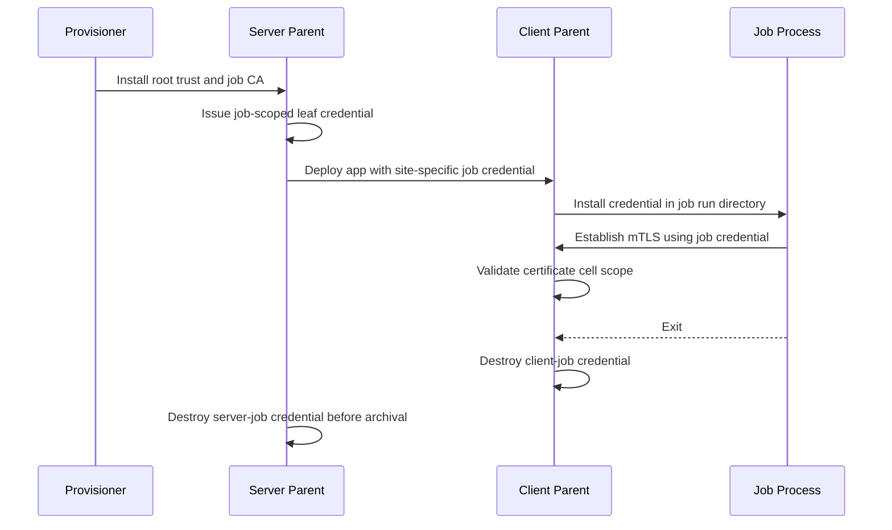

# 5263: per-job certificates for job processes

{'state': 'OPEN', 'createdAt': '2026-09-03T19:59:35Z', 'updatedAt': '2026-09-10T22:25:15Z', 'headRefOid': '2327d6c73f7e2475d2f0829da903654bf1c0ce40', 'baseRefOid': '83ec31a8e14bc41f788ec5a739327298173632b5', 'closedAt': None, 'mergedAt': None}

## Body
## Summary

Closes #5249 (parent overview: #5246).

Job processes (SJ/CJ) run on the site's long-lived certificate and private key, so any job-supplied code can read the site key and impersonate the site indefinitely. This PR gives every job process its own short-lived credential, makes it the only credential a secure job can run on, and keeps the site keys out of job processes.

- **Provisioning**: `CertBuilder` generates a job-signing intermediate CA (`job_ca.crt`/`job_ca.key`, `CA:TRUE pathlen:0`, root-signed marker URI SAN) into the server startup kit. On by default; `enable_job_ca: false` opts out. Persisted in `cert.json`, regenerated if expired. A customer-supplied root passed to `nvflare provision` is covered. The distributed `nvflare cert` / `nvflare package` flow is not (no root key at packaging time, so no job CA, so no secure jobs); it is addressed separately.
- **Issuance**: at job deploy the SP issues one leaf per participating site (`CN=<site>`, URI SANs naming the job and the cells it may claim, `notBefore` backdated for clock skew, validity `job_cert_valid_days` from the server's `fed_server.json` or `resources.json`, `--set`, or `NVFLARE_JOB_CERT_VALID_DAYS`, default 30 days, clamped to the CA). The SJ credential is written to the run dir after app deployment; each CJ credential is pushed in its site's deploy message over the existing authenticated CP-SP channel.
- **No fallback in secure mode**: a server kit without a job CA, or with a job CA about to expire, fails the job deploy with the reason in `job_deploy_detail`; the CP rejects a deploy request without a valid job credential; a job cell refuses to start without one; launchers refuse to launch a secure job that has no credential. Non-secure mode and the simulator use no certificates and are unaffected.
- **Job processes**: `ssl_cert`/`ssl_private_key` point at the job credential, so nothing in SJ/CJ refers to the site key. Job cells (and the Kubernetes bootstrap cell) use it for TLS and message-level crypto in both TLS roles, so cellnet's directory-based credential back-fill can never present a site certificate. The startup content-integrity check no longer requires the site key in job processes.
- **Site-scope rejection**: `IdentityVerifier.verify_common_name()` rejects any certificate carrying the job URI and any chain containing the job-CA marker URI, so neither a leaked job leaf key nor a stolen job CA key can register a site, log in as admin, or pass as the server.
- **Child links must be mTLS**: job-cert binding exists only on mTLS connections, so in secure mode the Docker and Slurm launchers refuse a clear-text parent connection (configure the client's internal listener with `stcp` / `mtls`; the shared-file transport is exempt). Kubernetes job pods already use the parent's external `stcp` listener with mTLS. A live test connects real job cells to a site parent's mTLS internal listener and verifies another job's certificate is rejected.
- **Credential lifetime**: the SP destroys the SJ credential before the run directory is archived to the job store, so `download_job` never contains it; the CP destroys the CJ credential as soon as the CJ process exits. The credential is dead at that point (no renewal, no reuse).
- **Certificate URIs, no private OIDs**: certificate attributes are https URI Subject Alternative Names under `https://nvidia.com/nvflare/v1/` (`job/<job id>` and `cell/<fqcn>` on job leaves, `ca/job` on the job CA; `nvflare/fuel/sec/cert_uri.py`). A private extension would need an OID under NVIDIA's enterprise arc, which cannot be allocated, and `2.25` OIDs break Go parsers; a domain-owned URI needs no registry. Readers match the root exactly, ignore other hosts, and fail closed on malformed URIs.
- **Cellnet stays job-free**: TLS drivers expose the authenticated peer certificate (`PEER_CERT`); `CellIdentityResolver` enforces one generic rule, a certificate carrying cell-scope URIs may only claim an FQCN equal to or under one of those cells, at the connection handshake and on the certificate cached for message-level crypto. Which cells a job credential lists is decided where it is issued: the job cell and the workspace-transfer bootstrap cell under the owning CP or server FQCN (which covers clients behind relays). `site-1.<job B>.ws_transfer_<job A>` is job B's cell and is rejected for job A's certificate. Live cross-process mTLS tests cover a server root, a site parent's internal listener, and the bootstrap cell.
- **Launchers never ship `*.key`** (including `job_ca.key`): Docker binds the startup kit file by file; Kubernetes drops keys from the startup Secret and delivers the job credential through the per-pod credential Secret (`NVFLARE_JOB_CERT`/`NVFLARE_JOB_KEY`), installed by the job process before its bootstrap cell starts, with `job_cert/` excluded from workspace bundles and result uploads; Slurm (apptainer/pyxis) binds a keyless staged copy of the kit. The in-process launcher and Slurm `sandbox: none` share the host filesystem and cannot isolate.
- Docs: design `docs/design/per_job_certs_design.md`; user guide `docs/user_guide/admin_guide/security/per_job_certificates.rst` (incl. openssl recipe for an externally issued job CA).

## Compatibility

Existing secure-mode projects must be re-provisioned (the root CA is reused; only `job_ca.*` is added to the server kit) before jobs will deploy. Server and clients must run the same release: an older client would run its job process on site certificates, which secure mode no longer allows. Non-secure mode and the simulator are unchanged.


## timeline-comments 5531417053 by greptile-apps[bot]; https://github.com/NVIDIA/NVFlare/pull/5263#issuecomment-5531417053; ; 
<!-- greptile_summary -->

<h2><a href="https://app.greptile.com/api/retrigger?id=60118682"><picture><source media="(prefers-color-scheme: dark)" srcset="https://greptile-static-assets.s3.amazonaws.com/badges/RetriggerDark.svg?v=1"><source media="(prefers-color-scheme: light)" srcset="https://greptile-static-assets.s3.amazonaws.com/badges/Retrigger.svg?v=1"></picture></a>Confidence Score: 5/5</h2>

The PR appears safe to merge.

<h3>Summary</h3>

- Adds provisioning and runtime issuance of a job-signing intermediate CA and job-scoped credentials.
- Enforces certificate identity and cell-scope restrictions across TLS and message-level authentication.
- Distributes job credentials through supported launchers while excluding site keys and archived credentials.
- Adds configuration, documentation, and tests for issuance, deployment, cleanup, and failure paths.

<h3>Diagram</h3>



<sub>Reviews (12) · Last reviewed commit: ["Merge remote-tracking branch &#39;upstream/m..."](https://github.com/nvidia/nvflare/commit/2327d6c73f7e2475d2f0829da903654bf1c0ce40)</sub>


## timeline-comments 5531664385 by codecov-commenter; https://github.com/NVIDIA/NVFlare/pull/5263#issuecomment-5531664385; ; 
## [Codecov](https://app.codecov.io/gh/NVIDIA/NVFlare/pull/5263?dropdown=coverage&src=pr&el=h1&utm_medium=referral&utm_source=github&utm_content=comment&utm_campaign=pr+comments&utm_term=NVIDIA) Report
:x: Patch coverage is `97.31707%` with `11 lines` in your changes missing coverage. Please review.
:white_check_mark: Project coverage is 67.17%. Comparing base ([`83ec31a`](https://app.codecov.io/gh/NVIDIA/NVFlare/commit/83ec31a8e14bc41f788ec5a739327298173632b5?dropdown=coverage&el=desc&utm_medium=referral&utm_source=github&utm_content=comment&utm_campaign=pr+comments&utm_term=NVIDIA)) to head ([`2327d6c`](https://app.codecov.io/gh/NVIDIA/NVFlare/commit/2327d6c73f7e2475d2f0829da903654bf1c0ce40?dropdown=coverage&el=desc&utm_medium=referral&utm_source=github&utm_content=comment&utm_campaign=pr+comments&utm_term=NVIDIA)).

| [Files with missing lines](https://app.codecov.io/gh/NVIDIA/NVFlare/pull/5263?dropdown=coverage&src=pr&el=tree&utm_medium=referral&utm_source=github&utm_content=comment&utm_campaign=pr+comments&utm_term=NVIDIA) | Patch % | Lines |
|---|---|---|
| [nvflare/lighter/impl/cert.py](https://app.codecov.io/gh/NVIDIA/NVFlare/pull/5263?src=pr&el=tree&filepath=nvflare%2Flighter%2Fimpl%2Fcert.py&utm_medium=referral&utm_source=github&utm_content=comment&utm_campaign=pr+comments&utm_term=NVIDIA#diff-bnZmbGFyZS9saWdodGVyL2ltcGwvY2VydC5weQ==) | 92.68% | [3 Missing :warning: ](https://app.codecov.io/gh/NVIDIA/NVFlare/pull/5263?src=pr&el=tree&utm_medium=referral&utm_source=github&utm_content=comment&utm_campaign=pr+comments&utm_term=NVIDIA) |
| [nvflare/private/fed/utils/job\_cert\_utils.py](https://app.codecov.io/gh/NVIDIA/NVFlare/pull/5263?src=pr&el=tree&filepath=nvflare%2Fprivate%2Ffed%2Futils%2Fjob_cert_utils.py&utm_medium=referral&utm_source=github&utm_content=comment&utm_campaign=pr+comments&utm_term=NVIDIA#diff-bnZmbGFyZS9wcml2YXRlL2ZlZC91dGlscy9qb2JfY2VydF91dGlscy5weQ==) | 98.41% | [2 Missing :warning: ](https://app.codecov.io/gh/NVIDIA/NVFlare/pull/5263?src=pr&el=tree&utm_medium=referral&utm_source=github&utm_content=comment&utm_campaign=pr+comments&utm_term=NVIDIA) |
| [nvflare/app\_opt/job\_launcher/docker\_launcher.py](https://app.codecov.io/gh/NVIDIA/NVFlare/pull/5263?src=pr&el=tree&filepath=nvflare%2Fapp_opt%2Fjob_launcher%2Fdocker_launcher.py&utm_medium=referral&utm_source=github&utm_content=comment&utm_campaign=pr+comments&utm_term=NVIDIA#diff-bnZmbGFyZS9hcHBfb3B0L2pvYl9sYXVuY2hlci9kb2NrZXJfbGF1bmNoZXIucHk=) | 88.88% | [1 Missing :warning: ](https://app.codecov.io/gh/NVIDIA/NVFlare/pull/5263?src=pr&el=tree&utm_medium=referral&utm_source=github&utm_content=comment&utm_campaign=pr+comments&utm_term=NVIDIA) |
| [nvflare/fuel/f3/drivers/aio\_conn.py](https://app.codecov.io/gh/NVIDIA/NVFlare/pull/5263?src=pr&el=tree&filepath=nvflare%2Ffuel%2Ff3%2Fdrivers%2Faio_conn.py&utm_medium=referral&utm_source=github&utm_content=comment&utm_campaign=pr+comments&utm_term=NVIDIA#diff-bnZmbGFyZS9mdWVsL2YzL2RyaXZlcnMvYWlvX2Nvbm4ucHk=) | 50.00% | [1 Missing :warning: ](https://app.codecov.io/gh/NVIDIA/NVFlare/pull/5263?src=pr&el=tree&utm_medium=referral&utm_source=github&utm_content=comment&utm_campaign=pr+comments&utm_term=NVIDIA) |
| [nvflare/fuel/f3/drivers/aio\_http\_driver.py](https://app.codecov.io/gh/NVIDIA/NVFlare/pull/5263?src=pr&el=tree&filepath=nvflare%2Ffuel%2Ff3%2Fdrivers%2Faio_http_driver.py&utm_medium=referral&utm_source=github&utm_content=comment&utm_campaign=pr+comments&utm_term=NVIDIA#diff-bnZmbGFyZS9mdWVsL2YzL2RyaXZlcnMvYWlvX2h0dHBfZHJpdmVyLnB5) | 50.00% | [1 Missing :warning: ](https://app.codecov.io/gh/NVIDIA/NVFlare/pull/5263?src=pr&el=tree&utm_medium=referral&utm_source=github&utm_content=comment&utm_campaign=pr+comments&utm_term=NVIDIA) |
| [nvflare/fuel/sec/cert\_uri.py](https://app.codecov.io/gh/NVIDIA/NVFlare/pull/5263?src=pr&el=tree&filepath=nvflare%2Ffuel%2Fsec%2Fcert_uri.py&utm_medium=referral&utm_source=github&utm_content=comment&utm_campaign=pr+comments&utm_term=NVIDIA#diff-bnZmbGFyZS9mdWVsL3NlYy9jZXJ0X3VyaS5weQ==) | 96.87% | [1 Missing :warning: ](https://app.codecov.io/gh/NVIDIA/NVFlare/pull/5263?src=pr&el=tree&utm_medium=referral&utm_source=github&utm_content=comment&utm_campaign=pr+comments&utm_term=NVIDIA) |
| [nvflare/lighter/utils.py](https://app.codecov.io/gh/NVIDIA/NVFlare/pull/5263?src=pr&el=tree&filepath=nvflare%2Flighter%2Futils.py&utm_medium=referral&utm_source=github&utm_content=comment&utm_campaign=pr+comments&utm_term=NVIDIA#diff-bnZmbGFyZS9saWdodGVyL3V0aWxzLnB5) | 93.75% | [1 Missing :warning: ](https://app.codecov.io/gh/NVIDIA/NVFlare/pull/5263?src=pr&el=tree&utm_medium=referral&utm_source=github&utm_content=comment&utm_campaign=pr+comments&utm_term=NVIDIA) |
| [nvflare/private/fed/server/job\_runner.py](https://app.codecov.io/gh/NVIDIA/NVFlare/pull/5263?src=pr&el=tree&filepath=nvflare%2Fprivate%2Ffed%2Fserver%2Fjob_runner.py&utm_medium=referral&utm_source=github&utm_content=comment&utm_campaign=pr+comments&utm_term=NVIDIA#diff-bnZmbGFyZS9wcml2YXRlL2ZlZC9zZXJ2ZXIvam9iX3J1bm5lci5weQ==) | 96.42% | [1 Missing :warning: ](https://app.codecov.io/gh/NVIDIA/NVFlare/pull/5263?src=pr&el=tree&utm_medium=referral&utm_source=github&utm_content=comment&utm_campaign=pr+comments&utm_term=NVIDIA) |

<details><summary>Additional details and impacted files</summary>


```diff
@@            Coverage Diff             @@
##             main    #5263      +/-   ##
==========================================
+ Coverage   66.87%   67.17%   +0.29%     
==========================================
  Files        1021     1023       +2     
  Lines      106100   106438     +338     
==========================================
+ Hits        70951    71496     +545     
+ Misses      35149    34942     -207     
```

| [Flag](https://app.codecov.io/gh/NVIDIA/NVFlare/pull/5263/flags?src=pr&el=flags&utm_medium=referral&utm_source=github&utm_content=comment&utm_campaign=pr+comments&utm_term=NVIDIA) | Coverage Δ | |
|---|---|---|
| [unit-tests](https://app.codecov.io/gh/NVIDIA/NVFlare/pull/5263/flags?src=pr&el=flag&utm_medium=referral&utm_source=github&utm_content=comment&utm_campaign=pr+comments&utm_term=NVIDIA) | `67.17% <97.31%> (+0.29%)` | :arrow_up: |

Flags with carried forward coverage won't be shown. [Click here](https://docs.codecov.io/docs/carryforward-flags?utm_medium=referral&utm_source=github&utm_content=comment&utm_campaign=pr+comments&utm_term=NVIDIA#carryforward-flags-in-the-pull-request-comment) to find out more.
</details>

[:umbrella: View full report in Codecov by Harness](https://app.codecov.io/gh/NVIDIA/NVFlare/pull/5263?dropdown=coverage&src=pr&el=continue&utm_medium=referral&utm_source=github&utm_content=comment&utm_campaign=pr+comments&utm_term=NVIDIA).   
:loudspeaker: Have feedback on the report? [Share it here](https://about.codecov.io/codecov-pr-comment-feedback/?utm_medium=referral&utm_source=github&utm_content=comment&utm_campaign=pr+comments&utm_term=NVIDIA).
<details><summary> :rocket: New features to boost your workflow: </summary>

- :snowflake: [Test Analytics](https://docs.codecov.com/docs/test-analytics): Detect flaky tests, report on failures, and find test suite problems.
- :package: [JS Bundle Analysis](https://docs.codecov.com/docs/javascript-bundle-analysis): Save yourself from yourself by tracking and limiting bundle sizes in JS merges.
</details>


## timeline-comments 5608018877 by nvidianz; https://github.com/NVIDIA/NVFlare/pull/5263#issuecomment-5608018877; ; 
This PR adds job_id handling in F3, which is the wrong layer. Here's how the network is currently structured:

SFM (including the transport drivers) is the bottom layer. It sends messages from endpoint to endpoint and has no concept of cells — it cannot forward messages between them.

Cellnet sits above SFM. It introduces FQCNs and knows how to relay messages between non-directly-connected cells using the FQCN hierarchy. It understands dot-separated FQCN components, but it has no concept of jobs. That's intentional — the client/server layer above Cellnet is responsible for incorporating job_id and constructing the correct FQCN so messages are properly relayed.

job_id belongs at that higher layer, not in Cellnet or below. Keeping this separation is important: Cellnet is a general-purpose communication layer that other applications can reuse. Leaking job concepts into it breaks that abstraction.


## timeline-comments 5609373614 by pcnudde; https://github.com/NVIDIA/NVFlare/pull/5263#issuecomment-5609373614; ; 
Agreed: job_id does not belong in F3. Proposal to fix the layering while keeping the check at the handshake, where it has to happen.

**What stays in F3, job-free**

- Drivers expose the peer certificate as a connection property next to `PEER_CN` (`PEER_CERT`, DER). No extension parsing in drivers; `PEER_JOB_ID` and the `*_peer_job_id` helpers in `net_utils` go away.
- Cellnet gets one generic rule, in its own vocabulary: a peer certificate may carry an "FQCN scope" extension listing the FQCN prefixes it is allowed to claim. `CellIdentityResolver.require_match` rejects a handshake, and `CredentialManager` a cached certificate, whose claimed FQCN is not equal to or under one of those prefixes. Implemented with the existing `FQCN.is_ancestor`; `belongs_to_job`, `job_aux_name` and `resolve_owner` are removed.

**What moves up to `nvflare/private/fed`**

- The issuer sets the scope when it mints a job credential: `[<cp_fqcn>.<job_id>, <cp_fqcn>.ws_transfer_<job_id>]` for a client, `[server.<job_id>, server.ws_transfer_<job_id>]` for the server. Using the registered CP FQCN covers clients behind relays without any owner-prefix logic in cellnet.
- The job-id extension (`...300.1`) stays an FL-layer concept, read only by `identity_utils` (site-scope rejection) and for log messages.
- The bootstrap cell name becomes a shared constant in the FL layer so the issuer and the K8s launcher agree on it.

**Extension**: new non-critical OID `1.3.6.1.4.1.5703.300.3`, UTF-8, newline-separated FQCN prefixes. Cellnet documents it as its own ("certificate FQCN scope"), with no reference to jobs.

**Tests**: the cellnet unit and live tests become scope tests without job vocabulary; the job-layer tests assert the issuer emits the right scope. Runtime behavior is unchanged, so the K8s/Docker/Slurm validation results stay valid.

Net effect: F3 knows that a certificate can be restricted to FQCN subtrees, nothing about jobs. The alternative is an authorizer callback that the FL layer installs per cell, which keeps cellnet free of any extension parsing but relies on every cell creator (SP, CP, relay, bootstrap) remembering to install it; I think that is the worse trade. If this works for you I will rework the PR accordingly.


## timeline-comments 5609458256 by pcnudde; https://github.com/NVIDIA/NVFlare/pull/5263#issuecomment-5609458256; ; 
@nvidianz See my proposal above. I also want to remove the custom OID that is used in the certificate. It should be fine, but I do not want to go through the registration steps if I can avoid it.


## timeline-comments 5609517808 by pcnudde; https://github.com/NVIDIA/NVFlare/pull/5263#issuecomment-5609517808; ; 
Amendment to the proposal above: no new OID. In fact, no private OIDs at all.

This PR will do the same and drop all three custom extensions:

| Purpose | Today | URI SAN | Read by |
|---|---|---|---|
| Job binding on the leaf | OID `300.1` | `https://nvidia.com/nvflare/v1/job/<job-id>` | FL layer (site-scope rejection, log messages) |
| Job-CA marker on the intermediate | OID `300.2` | `https://nvidia.com/nvflare/v1/ca/job` | FL layer (reject anything the job CA signed at site scope) |
| Cellnet FQCN scope | proposed `300.3` | `https://nvidia.com/nvflare/v1/cell/<fqcn-prefix>`, one per allowed prefix | cellnet (handshake and certificate cache) |

Reader rules, same as the SSO grants: exact scheme/host/prefix match, URIs on other hosts ignored, malformed URIs under the root rejected. FQCN characters are all URL-unreserved, so prefixes need no encoding, but they are percent-encoded anyway for a uniform fail-closed parser. The `https://nvidia.com/nvflare/` root becomes one shared constant for both branches.

The rest of the proposal stands: cellnet only learns that a certificate may restrict which FQCN subtrees it can claim, the FL layer decides the prefixes when it issues the credential, and F3 carries no job vocabulary. The external-CA recipe gets simpler too: `subjectAltName = URI:https://nvidia.com/nvflare/v1/ca/job` in an openssl config instead of a custom ASN.1 line.


## timeline-comments 5625666052 by nvidianz; https://github.com/NVIDIA/NVFlare/pull/5263#issuecomment-5625666052; ; 
Thanks. I agree that we should avoid private OIDs. I recommend using a standard field in the certificate subject DN instead of introducing NVFlare URI SAN semantics.

Of the standard DN fields, `OU` (`2.5.4.11`, organizationalUnitName) is the best fit because it is already supported by X.509 tooling, may occur more than once, and does not displace the existing `CN` identity. For example:

- `OU=nvflare-job:<job-id>`
- `OU=nvflare-job-ca`
- `OU=nvflare-cell-scope:<fqcn-prefix>` - repeated once for each allowed prefix

The reader should collect all `OU` attributes, recognize only these exact prefixes, reject malformed or conflicting values, and apply the existing FQCN ancestor check. The values are protected by the certificate signature; this does not rely on sender-controlled message headers. I would keep `CN` exclusively for the current site/cell identity.

For completeness, the common DN fields and their ASN.1 OIDs are:

| DN field | OID | Meaning |
|---|---|---|
| `CN` | `2.5.4.3` | Common Name |
| `C` | `2.5.4.6` | Country |
| `L` | `2.5.4.7` | Locality |
| `ST` | `2.5.4.8` | State or Province |
| `STREET` | `2.5.4.9` | Street Address |
| `O` | `2.5.4.10` | Organization |
| `OU` | `2.5.4.11` | Organizational Unit |
| `serialNumber` | `2.5.4.5` | Serial Number |
| `surname` | `2.5.4.4` | Surname |
| `givenName` | `2.5.4.42` | Given Name |
| `title` | `2.5.4.12` | Title |
| `postalCode` | `2.5.4.17` | Postal Code |
| `emailAddress` | `1.2.840.113549.1.9.1` | Email Address |
| `DC` | `0.9.2342.19200300.100.1.25` | Domain Component |
| `UID` | `0.9.2342.19200300.100.1.1` | User ID |

`serialNumber` or `UID` could represent one job identifier, but neither cleanly carries repeated FQCN scopes and the CA marker. `OU` gives us one consistent, standard, repeatable field for all three purposes without registering a private OID.


## timeline-comments 5626239973 by pcnudde; https://github.com/NVIDIA/NVFlare/pull/5263#issuecomment-5626239973; ; 
Thanks, agreed on dropping the private OIDs; that is what the current head does. I looked at moving the three values into repeated `OU` attributes and found two problems, one small and one structural.

**1. Issuer-name coupling.** A marker in the job CA's subject DN becomes part of every leaf's issuer name. The issuer today rebuilds the issuer name from the CA's CN; with `OU=nvflare-job-ca` on the CA, `verify_cert_chain` rejects the chain (`candidates exhausted`). Fixable by copying `ca_cert.subject` into each leaf, but it is coupling a SAN marker does not have, because extensions are not part of the name.

**2. The 64-character bound on `OU`.** X.520 caps `organizationalUnitName` at 64 (RFC 5280 Appendix A, `ub-organizational-unit-name`). Job ids are UUIDs, so the cell scopes do not fit:

| Value | Length |
|---|---|
| `nvflare-job:<uuid>` | 48 |
| `nvflare-cell-scope:site-1.ws_transfer_<uuid>` | 74 |
| `nvflare-cell-scope:relay-1.site-1.ws_transfer_<uuid>` | 82 |

`cryptography` does not enforce the bound on creation or validation and Go does not enforce it on parse, so it would work inside NVFlare today, but it violates the spec, and OpenSSL enforces the bound when building names, which is exactly the tooling the external-CA recipe relies on. The only way to stay under 64 is an owner-relative encoding (`OU=nvflare-owner:<cp_fqcn>` plus `OU=nvflare-cell:<child>`), which puts FQCN structure back into the reader; the flat list of allowed FQCNs is what keeps cellnet's check to "equal to or under one of these".

URI SANs have neither issue: no length cap, no effect on the issuer name, and SAN is the extension X.509 defines for carrying additional identities of the subject. Both encodings are protected by the signature, and a prefix convention inside `OU` is as much an NVFlare convention as a URI under our own domain; the reader rules you describe (exact prefixes only, reject malformed or conflicting values, existing FQCN ancestor check, `CN` untouched) are exactly what `nvflare/fuel/sec/cert_uri.py` and `cell_scopes` implement today.

I propose to keep the URI SANs. 


## reviews 5106283008 by greptile-apps[bot]; https://github.com/NVIDIA/NVFlare/pull/5263#pullrequestreview-5106283008; COMMENTED; 


## inline-comments 3928247634 by greptile-apps[bot]; https://github.com/NVIDIA/NVFlare/pull/5263#discussion_r3928247634; ; examples/advanced/collab/pt_async_cifar10/trainer.py
<a href="#"></a> **Empty partitions raise StopIteration**

If a logical client has an empty dataset partition, recreating the exhausted iterator and immediately calling `next()` again raises an unexplained `StopIteration`. Validate the loader first and raise a descriptive `ValueError` so the data-preparation problem is actionable.

```suggestion
        if not dataloader.dataset:
            raise ValueError(f"logical client {logical_name} has an empty dataset partition")

        data_iter = iter(dataloader)
        for _step in range(self.local_iters):
            try:
                inputs, labels = next(data_iter)
            except StopIteration:
                data_iter = iter(dataloader)
                inputs, labels = next(data_iter)
```

**Rule Used:** When data_loader might be empty during loss comput... ([source](https://app.greptile.com/nvidia-public-github/github/NVIDIA/nvflare/-/custom-context?memory=783565ac-d530-4d49-a8bc-55877cb0a0cd))

**Learned From**
[NVIDIA/NVFlare#4001](https://github.com/NVIDIA/NVFlare/pull/4001#discussion_r2714180688)


## Files
docs/design/job_launcher_and_job_handle.md
docs/design/no_shared_pvc_k8s_workspace_design.md
docs/design/per_job_certs_design.md
docs/index.rst
docs/troubleshooting/common_errors.rst
docs/user_guide/admin_guide/deployment/helm_chart.rst
docs/user_guide/admin_guide/deployment/slurm_job_launcher.rst
docs/user_guide/admin_guide/nvflare_security.rst
docs/user_guide/admin_guide/security/identity_security.rst
docs/user_guide/admin_guide/security/per_job_certificates.rst
docs/user_guide/nvflare_cli/deploy_command.rst
docs/user_guide/nvflare_cli/distributed_provisioning.rst
docs/user_guide/nvflare_cli/provision_command.rst
nvflare/apis/fl_constant.py
nvflare/apis/job_launcher_spec.py
nvflare/apis/workspace.py
nvflare/app_opt/job_launcher/docker_launcher.py
nvflare/app_opt/job_launcher/k8s_launcher.py
nvflare/app_opt/job_launcher/slurm/batch.py
nvflare/app_opt/job_launcher/slurm/launcher.py
nvflare/app_opt/job_launcher/slurm/manager.py
nvflare/app_opt/job_launcher/study_runtime.py
nvflare/app_opt/job_launcher/workspace_cell_transfer.py
nvflare/fuel/f3/cellnet/credential_manager.py
nvflare/fuel/f3/cellnet/identity.py
nvflare/fuel/f3/drivers/aio_conn.py
nvflare/fuel/f3/drivers/aio_grpc_driver.py
nvflare/fuel/f3/drivers/aio_http_driver.py
nvflare/fuel/f3/drivers/driver_params.py
nvflare/fuel/f3/drivers/grpc_driver.py
nvflare/fuel/f3/drivers/net_utils.py
nvflare/fuel/f3/drivers/socket_conn.py
nvflare/fuel/f3/sfm/conn_manager.py
nvflare/fuel/sec/cert_uri.py
nvflare/lighter/constants.py
nvflare/lighter/impl/cert.py
nvflare/lighter/utils.py
nvflare/private/defs.py
nvflare/private/fed/app/client/worker_process.py
nvflare/private/fed/app/fl_conf.py
nvflare/private/fed/app/server/runner_process.py
nvflare/private/fed/client/client_executor.py
nvflare/private/fed/client/fed_client_base.py
nvflare/private/fed/client/training_cmds.py
nvflare/private/fed/server/fed_server.py
nvflare/private/fed/server/job_runner.py
nvflare/private/fed/utils/fed_utils.py
nvflare/private/fed/utils/identity_utils.py
nvflare/private/fed/utils/job_cert_utils.py
tests/unit_test/app_opt/job_launcher/docker_launcher_test.py
tests/unit_test/app_opt/job_launcher/k8s_launcher_test.py
tests/unit_test/app_opt/job_launcher/slurm_launcher_test.py
tests/unit_test/app_opt/job_launcher/slurm_manager_test.py
tests/unit_test/app_opt/job_launcher/workspace_cell_transfer_test.py
tests/unit_test/app_opt/job_launcher/workspace_transfer_bootstrap_mtls_test.py
tests/unit_test/fuel/f3/cellnet/identity_binding_test.py
tests/unit_test/fuel/f3/cellnet/job_cert_binding_live_test.py
tests/unit_test/fuel/f3/drivers/grpc_driver_test.py
tests/unit_test/lighter/cert_builder_test.py
tests/unit_test/private/fed/app/fl_conf_test.py
tests/unit_test/private/fed/client/client_executor_test.py
tests/unit_test/private/fed/client/fed_client_base_test.py
tests/unit_test/private/fed/client/test_training_cmds_sig_verify.py
tests/unit_test/private/fed/server/fed_server_test.py
tests/unit_test/private/fed/server/job_runner_deploy_test.py
tests/unit_test/private/fed/server/job_runner_test.py
tests/unit_test/private/fed/test_fed_utils.py
tests/unit_test/private/fed/utils/fed_utils_test.py
tests/unit_test/private/fed/utils/identity_utils_test.py
tests/unit_test/private/fed/utils/job_cert_utils_test.py
tests/unit_test/tool/package/package_commands_test.py