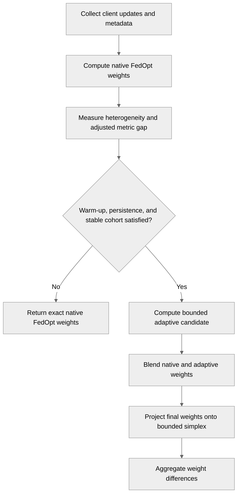

# 5273: Add heterogeneity-aware dynamic aggregation (#5209)

{'state': 'OPEN', 'createdAt': '2026-09-06T11:53:08Z', 'updatedAt': '2026-09-12T05:47:19Z', 'headRefOid': 'eb1edd9f17c3e0a3a0b1523094c1dd07a50d6f32', 'baseRefOid': '49968b2ede43dab779ab8f53e22688f1e8c2f0b8', 'closedAt': None, 'mergedAt': None}

## Body
## Summary

This draft PR implements an opt-in heterogeneity-aware dynamic client-weighting policy related to #5209.

The policy is presented as a generic aggregation policy rather than a FedOpt-specific algorithm. Two NVFlare adapters expose the same weighting logic:

- `AdaptiveHeterogeneityAggregator` for Shareable/DXO `WEIGHT_DIFF` workflows;
- `AdaptiveHeterogeneityModelAggregator` for the current unified FedAvg `ModelAggregator` workflow.

The FedOpt path remains an integration/reference smoke path. Adaptive weighting is gated on persistent distribution heterogeneity and client-performance disparity; when activation conditions are not satisfied, native local-step weighting is preserved.

## Maintainer-requested engineering updates

Following the maintainer comment, the branch now:

- separates actual training-example count from `NUM_STEPS_CURRENT_ROUND` optimizer steps;
- uses optimizer steps only for native NVFlare fallback weighting;
- uses explicit sample counts for adaptive representation and metric-reliability calculations;
- keeps per-site final weights server-side rather than placing them in global-model metadata;
- exposes constructor arguments as attributes so exported `FedJob` configuration preserves non-default settings;
- handles one-client and changing large-client cohorts without infeasible-bound crashes;
- uses unconstraining default weight bounds (`0.0`, `1.0`) while retaining optional configured bounds;
- falls back conservatively when configured bounds are infeasible for the active cohort;
- returns `ReturnCode.EMPTY_RESULT` for an empty Shareable/DXO aggregation round;
- returns an empty DIFF no-op for the analogous empty unified-FedAvg `ModelAggregator` round;
- removes `.github/workflows/adaptive-hetero-ci.yml`;
- removes stale checked-in development results that predated the current policy;
- adds focused job-export tests for Shareable/DXO and unified FedAvg serialization paths;
- makes the FedOpt SimEnv smoke verify adaptive activation end to end by reading the final persisted server checkpoint and failing unless `adaptive_blend_factor` is non-zero, with focused regression coverage for the checkpoint assertion path.

## Standard CIFAR-10 evaluation infrastructure

The branch contains a matched Dirichlet CIFAR-10 evaluation workflow under `research/adaptive-hetero-aggregation/cifar10_evaluation/` supporting FedAvg, FedOpt (optional full-participation reference), FedProx, SCAFFOLD, FedCE, and adaptive aggregation.

For a fixed `(alpha, seed)`, NVIDIA FLARE's Dirichlet splitter creates one common training assignment. Each site's assignment is deterministically split into 90% training and 10% held-out validation. Every compared method uses the same site train/validation subsets, server initialization seed, and per-site client RNG seed.

Matched FedAvg/FedOpt/FedProx/SCAFFOLD clients preserve their NVIDIA FLARE algorithm-specific training behavior while using held-out training validation instead of reading the CIFAR-10 test set during training. Adaptive and FedCE metrics use the same held-out validation source. The official CIFAR-10 test set is reserved for one common post-training evaluator.

## Provenance and activation evidence

The evaluation protocol is now `cifar10_dirichlet_trainval_test_v3`.

Every completed result row records canonical JSON configuration plus SHA-256 hashes for:

- common dataset/model/training/execution/evaluator configuration;
- method-specific configuration (`fedprox_mu`, `fedce_mode`, adaptive policy settings, etc.);
- the full nested experiment configuration;
- the experimental condition (`alpha`, participation rate, seed).

Campaign resume only skips rows whose protocol, common-config hash and method-config hash match the current campaign. The summarizer recomputes the hashes, rejects mixed configurations, and cross-checks nested method/condition/experiment payloads. The planned campaign matrix is tracked explicitly; failed conditions are retained as missing outcomes and reported transparently rather than imputed or silently dropped.

The unified adaptive aggregator also persists federation-level activation telemetry across valid rounds:

- aggregation rounds;
- active adaptive rounds;
- activation rate;
- mean active blend factor;
- maximum observed blend factor;
- cohort-change count.

These are federation-level diagnostics only; per-site final weights remain server-side. NVFlare persists the aggregate metadata in the final checkpoint, and the common evaluator extracts it. The main results table therefore shows adaptive activation rate alongside accuracy, making a fallback-heavy partial-participation run explicit rather than silently presenting it as actively adaptive.

## Repeated runs, confidence intervals, and partial participation

The default campaign covers FedAvg, FedProx, SCAFFOLD, FedCE and adaptive aggregation across:

- Dirichlet alpha `0.1` and `0.5`;
- seeds `7, 19, 31, 43, 57`;
- full participation and 75% participation;
- 8 clients, 50 rounds, 4 local epochs.

`summarize_results.py` reports two-sided 95% Student-t confidence intervals for global and worst-client accuracy and paired adaptive-minus-baseline intervals for common seeds. FedAvg, FedProx and FedCE completed the full five-seed matched matrix. SCAFFOLD coverage is incomplete because eight planned conditions encountered numerical divergence with NaN/Inf model differences; those outcomes are reported explicitly rather than imputed. Neutral and negative results are retained.

The FedCE partial-participation run is included for completeness with its documented limitation: current NVFlare FedCE assumes full participation. The adapted client handles a site's first participation after round 0 without fabricating a previous local model.

The campaign remains an explicit research workload rather than repository-wide CI, per maintainer request.

## Current evidence status

The matched Dirichlet CIFAR-10 campaign has now been executed. Of 100 planned conditions, 92 completed successfully; the eight missing conditions are SCAFFOLD runs that encountered numerical divergence (seven at `alpha=0.1` and one at `alpha=0.5`). No failed outcomes were imputed or replaced.

Under full participation, Adaptive activated in 47/50 rounds (94%) for every seed. At `alpha=0.5`, Adaptive achieved 82.47% global accuracy and 77.23% worst-client accuracy; relative to FedProx, paired improvements were +0.66 ± 0.27 percentage points globally and +1.83 ± 0.61 percentage points for worst-client accuracy. At `alpha=0.1`, Adaptive achieved 70.71% global accuracy, with a paired +1.69 ± 1.28 percentage-point difference versus FedProx.

Under randomly changing 75% participation, the cohort-stability safeguard prevented adaptive activation, so these runs are interpreted as conservative fallback under cohort churn rather than active adaptive reweighting. At `alpha=0.1`, FedCE was strongest (65.20% versus 61.71% for Adaptive). These limiting and negative results are retained unchanged.

Overall, the current evidence supports that Adaptive is competitive with FedAvg and FedCE and provides statistically resolved positive differences over FedProx in selected full-participation settings; it does not establish universal superiority.

The maintainer separately identified a public method write-up as a requirement for eventual `research/` acceptance. That publication item remains separate from this revision.

Relates to #5209.

## timeline-comments 5559052018 by greptile-apps[bot]; https://github.com/NVIDIA/NVFlare/pull/5273#issuecomment-5559052018; ; 
<h3>Greptile Summary</h3>

This PR adds an opt-in, heterogeneity-aware client-weighting policy for FedOpt and supporting research validation.
- Applies adaptive weighting only after warm-up, persistence, performance-gap, heterogeneity, and cohort-stability checks.
- Projects active final weights onto configured bounds while preserving exact FedOpt fallback weights when adaptation is inactive.
- Adds NVFlare and FedCE simulator smoke clients, synthetic and digits benchmarks, tests, documentation, and dedicated CI.
- Changes since the previous review address every prior finding: final-weight bounds, adaptive-path coverage, durable CI triggers, empty-loader validation, and current validation documentation.

<h3>Confidence Score: 5/5</h3>

The PR appears safe to merge, with no outstanding correctness or repository-rule violations identified.

All previous findings were resolved, and the current code addresses their underlying concerns without introducing a new actionable failure.

<h3>Important Files Changed</h3>


| Filename | Overview |
|----------|----------|
| research/adaptive-hetero-aggregation/src/adaptive_hetero/policy.py | Implements stateful adaptive weighting and now projects active post-blend weights onto the configured bounded simplex. |
| research/adaptive-hetero-aggregation/src/adaptive_hetero/nvflare_aggregator.py | Integrates adaptive policy metadata and weighting with NVFlare's standard weight-difference aggregation contract. |
| research/adaptive-hetero-aggregation/digits_benchmark.py | Adds deterministic held cohorts and an activation assertion for partial-participation validation. |
| research/adaptive-hetero-aggregation/nvflare_smoke/client.py | Adds explicit rejection of empty validation loaders before calculating loss and accuracy. |
| .github/workflows/adaptive-hetero-ci.yml | Adds durable main-branch and pull-request triggers and exercises the adaptive path under partial participation. |
| research/adaptive-hetero-aggregation/README.md | Documents the policy, safeguards, metadata contract, completed validation, privacy considerations, and remaining limitations. |


<h3>Flowchart</h3>



<!-- greptile_other_comments_section -->

<sub>Reviews (2): Last reviewed commit: ["Update adaptive heterogeneity validation..."](https://github.com/nvidia/nvflare/commit/32a5e715198e455f05bed36fc61d2488db5f9dde) | [Re-trigger Greptile](https://app.greptile.com/api/retrigger?id=60940481)</sub>


## timeline-comments 5590933772 by codecov-commenter; https://github.com/NVIDIA/NVFlare/pull/5273#issuecomment-5590933772; ; 
## [Codecov](https://app.codecov.io/gh/NVIDIA/NVFlare/pull/5273?dropdown=coverage&src=pr&el=h1&utm_medium=referral&utm_source=github&utm_content=comment&utm_campaign=pr+comments&utm_term=NVIDIA) Report
:white_check_mark: All modified and coverable lines are covered by tests.
:white_check_mark: Project coverage is 66.60%. Comparing base ([`49968b2`](https://app.codecov.io/gh/NVIDIA/NVFlare/commit/49968b2ede43dab779ab8f53e22688f1e8c2f0b8?dropdown=coverage&el=desc&utm_medium=referral&utm_source=github&utm_content=comment&utm_campaign=pr+comments&utm_term=NVIDIA)) to head ([`32a5e71`](https://app.codecov.io/gh/NVIDIA/NVFlare/commit/32a5e715198e455f05bed36fc61d2488db5f9dde?dropdown=coverage&el=desc&utm_medium=referral&utm_source=github&utm_content=comment&utm_campaign=pr+comments&utm_term=NVIDIA)).
:warning: Report is 1 commits behind head on main.

<details><summary>Additional details and impacted files</summary>


```diff
@@            Coverage Diff             @@
##             main    #5273      +/-   ##
==========================================
+ Coverage   66.58%   66.60%   +0.01%     
==========================================
  Files        1018     1018              
  Lines      105456   105456              
==========================================
+ Hits        70222    70234      +12     
+ Misses      35234    35222      -12     
```

| [Flag](https://app.codecov.io/gh/NVIDIA/NVFlare/pull/5273/flags?src=pr&el=flags&utm_medium=referral&utm_source=github&utm_content=comment&utm_campaign=pr+comments&utm_term=NVIDIA) | Coverage Δ | |
|---|---|---|
| [unit-tests](https://app.codecov.io/gh/NVIDIA/NVFlare/pull/5273/flags?src=pr&el=flag&utm_medium=referral&utm_source=github&utm_content=comment&utm_campaign=pr+comments&utm_term=NVIDIA) | `66.60% <ø> (+0.01%)` | :arrow_up: |

Flags with carried forward coverage won't be shown. [Click here](https://docs.codecov.io/docs/carryforward-flags?utm_medium=referral&utm_source=github&utm_content=comment&utm_campaign=pr+comments&utm_term=NVIDIA#carryforward-flags-in-the-pull-request-comment) to find out more.
</details>

[:umbrella: View full report in Codecov by Harness](https://app.codecov.io/gh/NVIDIA/NVFlare/pull/5273?dropdown=coverage&src=pr&el=continue&utm_medium=referral&utm_source=github&utm_content=comment&utm_campaign=pr+comments&utm_term=NVIDIA).   
:loudspeaker: Have feedback on the report? [Share it here](https://about.codecov.io/codecov-pr-comment-feedback/?utm_medium=referral&utm_source=github&utm_content=comment&utm_campaign=pr+comments&utm_term=NVIDIA).
<details><summary> :rocket: New features to boost your workflow: </summary>

- :snowflake: [Test Analytics](https://docs.codecov.com/docs/test-analytics): Detect flaky tests, report on failures, and find test suite problems.
- :package: [JS Bundle Analysis](https://docs.codecov.com/docs/javascript-bundle-analysis): Save yourself from yourself by tracking and limiting bundle sizes in JS merges.
</details>


## timeline-comments 5591249762 by holgerroth; https://github.com/NVIDIA/NVFlare/pull/5273#issuecomment-5591249762; ; 
Thanks for this, and for asking the scoping questions up front. The idea of gating adaptive weights on persistent heterogeneity plus performance disparity is a sensible one, and the FedOpt/FedCE integration work shows you've dug into the aggregation stack. Here's where we stand and how we'd like to get this in.

**Fit with `research/`.** That directory is for reference implementations of published or publicly documented methods; see [research/CONTRIBUTING.md](https://github.com/NVIDIA/NVFlare/blob/main/research/CONTRIBUTING.md) and the [sample template](https://github.com/NVIDIA/NVFlare/blob/main/research/sample-research/README.md). Right now the method isn't written up anywhere, the evidence is synthetic data and sklearn digits over five seeds with deltas mostly within one standard deviation, and the checked-in results predate the current policy (the blend factors in the JSON aren't reachable with `max_blend_factor=0.20`). So we can't merge it yet, but this looks like a good candidate for a preprint or workshop paper, and once that exists we'd be glad to take it as a research example.

**What would get it there:** compare against FedProx, SCAFFOLD, and FedCE (already in the repo) on a standard non-IID benchmark such as Dirichlet CIFAR-10 or a multi-site medical dataset, report confidence intervals, and include partial participation in the main results.

**On your design questions:**

- *Metadata contract:* descriptor plus normalized metric via DXO meta is fine. Two fixes needed: `NUM_STEPS_CURRENT_ROUND` holds optimizer steps, not samples, so the default prior of 100 nearly zeroes the metrics; and the per-site weight table in the aggregated meta gets copied into the global model and broadcast to every client.
- *FedOpt as integration point:* this is really a generic `Aggregator` that defers weighting until all updates arrive, so it applies equally to FedAvg. I'd present it that way.
- *Safeguards:* a few gaps. With defaults, one accepted client or more than 50 clients raises "weight bounds are infeasible" before the gate runs, and an all-rejected round raises from `aggregate()` and panics the job. Also, the constructor args aren't stored as attributes, so `FedJob` serializes the aggregator with empty args and the server always runs defaults, which means the SimEnv smoke only exercises the fallback path.
- *`research/` vs. component:* `research/` once validated. A reusable component is a possible later step, not the starting point.

**One request regardless:** please drop `.github/workflows/adaptive-hetero-ci.yml`. Project-specific config belongs inside the project directory, and 84 real-data training runs with a seed-dependent activation check shouldn't gate merges.

I'll convert this to a draft so it stays open while you work on the evaluation. Happy to leave the code points above as inline comments if that helps.


## timeline-comments 5595730900 by sauravsingla; https://github.com/NVIDIA/NVFlare/pull/5273#issuecomment-5595730900; ; 
I’ve kept the PR as a draft and worked through the implementation points in your comment.

The branch now addresses the engineering items you raised:

- `NUM_STEPS_CURRENT_ROUND` remains the native optimizer-step weighting signal, while an explicit training-example count is used by the adaptive policy and metric prior;
- per-site final aggregation weights stay server-side rather than being placed in global-model metadata;
- the method is presented as a generic aggregation policy, with both Shareable/DXO `Aggregator` and current FedAvg `ModelAggregator` integrations;
- constructor parameters are serialization-visible and job-export tests verify non-default settings survive reconstruction;
- single-client/large-cohort bound feasibility and empty/all-rejected rounds fall back safely instead of panicking;
- the project-specific GitHub Actions workflow and stale pre-policy result JSON/table have been removed;
- the FedOpt SimEnv smoke now verifies the adaptive path end to end: after a successful run it reads the final persisted server checkpoint and fails unless the persisted `adaptive_blend_factor` is non-zero. Focused tests also cover the checkpoint assertion path.

For the requested evaluation, the branch has a matched Dirichlet CIFAR-10 harness for FedAvg, FedProx, SCAFFOLD, FedCE, and adaptive aggregation (FedOpt is available as an optional full-participation reference). Methods share the same Dirichlet assignment, deterministic 90/10 train/held-out-validation split from CIFAR-10 training data, server initialization seed, and per-site RNG seed. The official CIFAR-10 test set is reserved for one common final-checkpoint evaluator.

I also tightened the evidence pipeline before running the expensive campaign. Protocol v3 records canonical common/method/condition/full experiment configuration plus SHA-256 hashes; resume only accepts exact matching configurations, and the summarizer rejects mixed or internally inconsistent provenance. Adaptive final checkpoints persist federation-level activation telemetry (active rounds, activation rate, mean/max blend, and cohort-change count), and the main results table reports activation rate so partial-participation fallback behavior cannot be hidden. The complete method/alpha/participation/seed matrix is required before reviewer-facing CI tables are produced, and neutral/negative outcomes are retained.

No new CIFAR-10 performance numbers are claimed yet. The remaining non-publication evidence step is to execute the documented campaign and report its 95% confidence-interval/full-and-partial-participation results. The public method write-up you mentioned is being kept as a separate eventual acceptance requirement and is not part of this revision.


## timeline-comments 5643745110 by sauravsingla; https://github.com/NVIDIA/NVFlare/pull/5273#issuecomment-5643745110; ; 
we have now completed the matched Dirichlet CIFAR-10 evaluation.

We evaluated Adaptive, FedAvg, FedProx, FedCE and SCAFFOLD at α=0.1 and α=0.5, using five fixed seeds, 8 clients, 50 rounds, and both full and 75% participation. We report two-sided 95% Student-t confidence intervals and paired Adaptive-minus-baseline intervals.

Under full participation, Adaptive was competitive with FedAvg and FedCE and showed statistically resolved improvements over FedProx in selected settings. At α=0.5, Adaptive achieved 82.47% global accuracy and 77.23% worst-client accuracy. Relative to FedProx, the paired improvements were +0.66 ± 0.27 pp global and +1.83 ± 0.61 pp worst-client. At α=0.1/full participation, Adaptive achieved 70.71%, compared with 70.61% FedAvg, 70.32% FedCE and 69.02% FedProx; the paired Adaptive-minus-FedProx difference was +1.69 ± 1.28 pp.

We also retained the limiting and negative results. Under randomly changing 75% participation, the cohort-stability safeguard prevented adaptive activation, with 0/50 adaptive rounds across those runs. We therefore interpret these experiments as validating conservative fallback under cohort churn rather than active adaptive weighting. At α=0.1/75%, FedCE was strongest at 65.20%, versus 61.71% for Adaptive.

We attempted all 100 planned conditions. 92 completed successfully. Eight SCAFFOLD configurations encountered numerical divergence with NaN/Inf model differences — seven at α=0.1 and one at α=0.5. We have not imputed or replaced those missing outcomes and will report the incomplete SCAFFOLD coverage explicitly.

Under full participation, the adaptive path itself was exercised consistently, activating in 47/50 rounds (94%) for every Adaptive run.

The engineering points from your earlier review have also been addressed in the branch, including separation of training-example counts from optimizer steps, server-side handling of final per-site weights, generic Aggregator/FedAvg integration, serialization safeguards, safe fallback behavior, and removal of the project-specific workflow.


## timeline-comments 5643911472 by sauravsingla; https://github.com/NVIDIA/NVFlare/pull/5273#issuecomment-5643911472; ; 
### CIFAR-10 benchmark summary

| Dirichlet α | Participation | Method | Seeds completed | Global accuracy (%) | Worst-client accuracy (%) | Adaptive activation |
|---|---:|---|---:|---:|---:|---:|
| 0.1 | 75% | Adaptive | 5 | 61.71 ± 7.69 | 23.57 ± 22.58 | 0% |
| 0.1 | 75% | FedAvg | 5 | 61.26 ± 9.30 | 23.74 ± 23.85 | — |
| 0.1 | 75% | FedProx | 5 | 62.60 ± 6.39 | 24.49 ± 21.12 | — |
| 0.1 | 75% | FedCE | 5 | **65.20 ± 4.48** | **30.50 ± 21.43** | — |
| 0.1 | 75% | SCAFFOLD | 0 | — | — | — |
| 0.1 | 100% | Adaptive | 5 | **70.71 ± 1.56** | 50.59 ± 11.32 | **94%** |
| 0.1 | 100% | FedAvg | 5 | 70.61 ± 1.99 | 49.50 ± 14.66 | — |
| 0.1 | 100% | FedProx | 5 | 69.02 ± 2.38 | 43.97 ± 17.43 | — |
| 0.1 | 100% | FedCE | 5 | 70.32 ± 2.76 | **53.28 ± 15.59** | — |
| 0.1 | 100% | SCAFFOLD | 3 | 11.29 ± 5.55 | 0.05 ± 0.21 | — |
| 0.5 | 75% | Adaptive | 5 | **81.00 ± 1.45** | 73.32 ± 6.01 | 0% |
| 0.5 | 75% | FedAvg | 5 | 80.78 ± 1.79 | 72.21 ± 6.06 | — |
| 0.5 | 75% | FedProx | 5 | 80.85 ± 1.57 | **73.63 ± 4.52** | — |
| 0.5 | 75% | FedCE | 5 | 80.83 ± 1.85 | 73.41 ± 5.99 | — |
| 0.5 | 75% | SCAFFOLD | 5 | 10.00 ± 0.00 | 0.28 ± 0.49 | — |
| 0.5 | 100% | Adaptive | 5 | **82.47 ± 0.66** | **77.23 ± 0.74** | **94%** |
| 0.5 | 100% | FedAvg | 5 | 82.23 ± 0.97 | 76.60 ± 0.95 | — |
| 0.5 | 100% | FedProx | 5 | 81.81 ± 0.74 | 75.40 ± 0.99 | — |
| 0.5 | 100% | FedCE | 5 | 82.22 ± 0.67 | 76.28 ± 2.58 | — |
| 0.5 | 100% | SCAFFOLD | 4 | 10.00 ± 0.00 | 0.49 ± 0.81 | — |

Values are **mean ± 95% CI half-width**, using two-sided Student-t intervals across matched seeds.

### Paired Adaptive-minus-baseline results

| α | Participation | Comparison | Global Δ (pp) | Worst-client Δ (pp) |
|---|---:|---|---:|---:|
| 0.1 | 75% | Adaptive − FedAvg | +0.45 ± 1.99 | -0.17 ± 3.99 |
| 0.1 | 75% | Adaptive − FedProx | -0.89 ± 2.49 | -0.92 ± 4.00 |
| 0.1 | 75% | Adaptive − FedCE | -3.48 ± 5.10 | **-6.93 ± 5.17** |
| 0.1 | 100% | Adaptive − FedAvg | +0.10 ± 0.89 | +1.09 ± 5.02 |
| 0.1 | 100% | Adaptive − FedProx | **+1.69 ± 1.28** | +6.62 ± 7.04 |
| 0.1 | 100% | Adaptive − FedCE | +0.39 ± 2.24 | -2.69 ± 4.99 |
| 0.5 | 75% | Adaptive − FedAvg | +0.22 ± 0.67 | +1.12 ± 2.00 |
| 0.5 | 75% | Adaptive − FedProx | +0.15 ± 0.72 | -0.31 ± 1.94 |
| 0.5 | 75% | Adaptive − FedCE | +0.17 ± 0.76 | -0.09 ± 2.25 |
| 0.5 | 100% | Adaptive − FedAvg | +0.24 ± 0.59 | +0.63 ± 1.12 |
| 0.5 | 100% | Adaptive − FedProx | **+0.66 ± 0.27** | **+1.83 ± 0.61** |
| 0.5 | 100% | Adaptive − FedCE | +0.25 ± 0.59 | +0.95 ± 2.26 |

### Interpretation

- Under full participation, Adaptive was consistently competitive with FedAvg and FedCE.
- The clearest statistically resolved positive differences were against FedProx:
  - α=0.1 / 100% participation: **+1.69 ± 1.28 pp global**
  - α=0.5 / 100% participation: **+0.66 ± 0.27 pp global**
  - α=0.5 / 100% participation: **+1.83 ± 0.61 pp worst-client**
- At α=0.5 / full participation, Adaptive achieved the highest global and worst-client means: **82.47%** and **77.23%**.
- At α=0.1 / 75% participation, FedCE was strongest; we retain this negative result unchanged.
- With randomly changing 75% participation, the cohort-stability safeguard prevented adaptive activation. These runs therefore validate conservative fallback under cohort churn rather than active adaptive reweighting.
- Under full participation, Adaptive activated in **47/50 rounds (94%)** for every seed, confirming that the active policy path was exercised.

### Campaign completeness

We attempted all **100 planned benchmark conditions**.

- **92 completed successfully**
- **8 SCAFFOLD conditions encountered numerical divergence with NaN/Inf model differences under this benchmark configuration**
- 7 of those failures occurred at α=0.1
- 1 occurred at α=0.5
- No failed SCAFFOLD outcomes were imputed or replaced

We therefore treat the FedAvg, FedProx and FedCE comparisons as complete five-seed matched comparisons, while reporting the incomplete SCAFFOLD coverage explicitly.

Overall, we interpret the results as evidence that Adaptive is competitive with strong baselines, provides measurable improvements over FedProx in selected full-participation regimes, and falls back conservatively when the cohort is unstable. We do not claim universal superiority.


## reviews 5125232723 by greptile-apps[bot]; https://github.com/NVIDIA/NVFlare/pull/5273#pullrequestreview-5125232723; COMMENTED; 


## reviews 5125263138 by sauravsingla; https://github.com/NVIDIA/NVFlare/pull/5273#pullrequestreview-5125263138; COMMENTED; 


## reviews 5125263496 by sauravsingla; https://github.com/NVIDIA/NVFlare/pull/5273#pullrequestreview-5125263496; COMMENTED; 


## reviews 5125263785 by sauravsingla; https://github.com/NVIDIA/NVFlare/pull/5273#pullrequestreview-5125263785; COMMENTED; 


## reviews 5125264018 by sauravsingla; https://github.com/NVIDIA/NVFlare/pull/5273#pullrequestreview-5125264018; COMMENTED; 


## reviews 5125264356 by sauravsingla; https://github.com/NVIDIA/NVFlare/pull/5273#pullrequestreview-5125264356; COMMENTED; 


## inline-comments 3943858960 by greptile-apps[bot]; https://github.com/NVIDIA/NVFlare/pull/5273#discussion_r3943858960; ; research/adaptive-hetero-aggregation/src/adaptive_hetero/policy.py
<a href="#"></a> **Final weights bypass bounds**

The configured bounds apply only to `adaptive_weights`, which are then blended with unbounded sample weights. For example, a client with a 90% base weight and a projected 50% adaptive weight still receives 82% when the blend is 20%, exceeding `max_weight=0.50`. Very small base weights can likewise leave the final result below `min_weight`. This defeats the safeguard against client dominance, so the final blended weights must also be constrained.


## inline-comments 3943858962 by greptile-apps[bot]; https://github.com/NVIDIA/NVFlare/pull/5273#discussion_r3943858962; ; .github/workflows/adaptive-hetero-ci.yml
<a href="#"></a> **Benchmark misses adaptive path**

This partial-participation check can pass without meaningfully exercising adaptive weighting. The benchmark selects a new random participant tuple each round, while the policy resets its activation streak whenever that tuple changes and requires consecutive stable rounds. Because the workflow only checks whether the process exits successfully, it can validate the fallback path without proving that adaptive weighting ever activates. Add an assertion or deterministic cohort schedule that exercises the intended path.


## inline-comments 3943858963 by greptile-apps[bot]; https://github.com/NVIDIA/NVFlare/pull/5273#discussion_r3943858963; ; .github/workflows/adaptive-hetero-ci.yml
<a href="#"></a> **CI trigger is temporary**

This workflow runs automatically only for pushes to `feature/heterogeneity-aware-aggregation-5209`. It has no `pull_request` trigger and does not run for pushes to `main`, so merging or deleting the feature branch leaves this research implementation without dedicated automatic CI coverage. Configure the workflow for relevant pull requests and maintained branches.

Note: If this suggestion doesn't match your team's coding style, reply to this and let me know. I'll remember it for next time!


## inline-comments 3943858966 by greptile-apps[bot]; https://github.com/NVIDIA/NVFlare/pull/5273#discussion_r3943858966; ; research/adaptive-hetero-aggregation/nvflare_smoke/client.py
<a href="#"></a> **Empty loader divides by zero**

`_evaluate` divides by `total` without checking whether the validation loader produced any examples. Since `--valid_samples 0` is accepted, an empty loader causes an incidental `ZeroDivisionError`. This violates the repository directive to reject an empty data loader during loss computation with a descriptive `ValueError`, and that requirement must be satisfied before merging.

```suggestion
    if total == 0:
        raise ValueError("validation data loader must contain at least one example")
    return total_loss / total, correct / total
```

**Rule Used:** When data_loader might be empty during loss comput... ([source](https://app.greptile.com/nvidia-public-github/github/NVIDIA/nvflare/-/custom-context?memory=783565ac-d530-4d49-a8bc-55877cb0a0cd))

**Learned From**
[NVIDIA/NVFlare#4001](https://github.com/NVIDIA/NVFlare/pull/4001#discussion_r2714180688)


## inline-comments 3943858974 by greptile-apps[bot]; https://github.com/NVIDIA/NVFlare/pull/5273#discussion_r3943858974; ; research/adaptive-hetero-aggregation/README.md
<a href="#"></a> **Validation status is outdated**

This section says that real FedOpt simulator validation, a FedCE comparison, and partial-participation experiments remain undone, although this PR adds all three checks and its description says they were completed. Update the section so users and maintainers are not given conflicting information about the prototype's validation status and remaining limitations.

Note: If this suggestion doesn't match your team's coding style, reply to this and let me know. I'll remember it for next time!


## inline-comments 3943891099 by sauravsingla; https://github.com/NVIDIA/NVFlare/pull/5273#discussion_r3943891099; ; research/adaptive-hetero-aggregation/src/adaptive_hetero/policy.py
Fixed. When adaptive weighting is active, the post-blend result is now projected onto the configured bounded simplex, so the final weights—not only the adaptive candidate—respect `min_weight` and `max_weight`. Exact native FedOpt weighting is still preserved when `blend_factor == 0`. I also added a regression test with a 90% dominant base client to verify the final output cannot exceed the configured maximum.


## inline-comments 3943891485 by sauravsingla; https://github.com/NVIDIA/NVFlare/pull/5273#discussion_r3943891485; ; .github/workflows/adaptive-hetero-ci.yml
Fixed. The digits benchmark now supports holding a sampled participant cohort for a configurable number of consecutive rounds, records how many rounds actually used a non-zero adaptive blend, and can fail if adaptation never activates. The partial-participation CI uses 5-round held cohorts together with `--require-adaptive-activation`, so a pure fallback-only run no longer passes this check.


## inline-comments 3943891773 by sauravsingla; https://github.com/NVIDIA/NVFlare/pull/5273#discussion_r3943891773; ; .github/workflows/adaptive-hetero-ci.yml
Updated. The dedicated workflow now runs for relevant pull requests targeting `main` and for relevant pushes to `main`, while retaining the feature-branch push trigger during this PR. Path filters keep the workflow scoped to this research implementation and its CI definition.


## inline-comments 3943892038 by sauravsingla; https://github.com/NVIDIA/NVFlare/pull/5273#discussion_r3943892038; ; research/adaptive-hetero-aggregation/nvflare_smoke/client.py
Fixed. `_evaluate` now raises a descriptive `ValueError` when the validation loader contains no examples instead of dividing by zero. I also added a focused unit test for the empty-loader case.


## inline-comments 3943892409 by sauravsingla; https://github.com/NVIDIA/NVFlare/pull/5273#discussion_r3943892409; ; research/adaptive-hetero-aggregation/README.md
Updated. The README now reflects the completed FedOpt SimEnv, FedCE protocol, partial-participation, integration, and repository validation coverage; it also documents the current stateful safeguards and remaining production-scale limitations. The older development result file is explicitly marked as historical because it predates the current hardened policy.


## Files
research/adaptive-hetero-aggregation/README.md
research/adaptive-hetero-aggregation/benchmark.py
research/adaptive-hetero-aggregation/cifar10_evaluation/__init__.py
research/adaptive-hetero-aggregation/cifar10_evaluation/adaptive_client.py
research/adaptive-hetero-aggregation/cifar10_evaluation/baseline_sgd_client.py
research/adaptive-hetero-aggregation/cifar10_evaluation/eval_split.py
research/adaptive-hetero-aggregation/cifar10_evaluation/evaluate_result.py
research/adaptive-hetero-aggregation/cifar10_evaluation/fedce_client.py
research/adaptive-hetero-aggregation/cifar10_evaluation/fedprox_client.py
research/adaptive-hetero-aggregation/cifar10_evaluation/local_data.py
research/adaptive-hetero-aggregation/cifar10_evaluation/protocol.py
research/adaptive-hetero-aggregation/cifar10_evaluation/run.py
research/adaptive-hetero-aggregation/cifar10_evaluation/run_campaign.py
research/adaptive-hetero-aggregation/cifar10_evaluation/scaffold_client.py
research/adaptive-hetero-aggregation/cifar10_evaluation/summarize_results.py
research/adaptive-hetero-aggregation/digits_benchmark.py
research/adaptive-hetero-aggregation/fedce_smoke/client.py
research/adaptive-hetero-aggregation/fedce_smoke/job.py
research/adaptive-hetero-aggregation/nvflare_smoke/client.py
research/adaptive-hetero-aggregation/nvflare_smoke/job.py
research/adaptive-hetero-aggregation/requirements.txt
research/adaptive-hetero-aggregation/src/adaptive_hetero/__init__.py
research/adaptive-hetero-aggregation/src/adaptive_hetero/model_aggregator.py
research/adaptive-hetero-aggregation/src/adaptive_hetero/nvflare_aggregator.py
research/adaptive-hetero-aggregation/src/adaptive_hetero/policy.py
research/adaptive-hetero-aggregation/tests/test_cifar_evaluation.py
research/adaptive-hetero-aggregation/tests/test_model_aggregator.py
research/adaptive-hetero-aggregation/tests/test_nvflare_aggregator.py
research/adaptive-hetero-aggregation/tests/test_nvflare_smoke_client.py
research/adaptive-hetero-aggregation/tests/test_policy.py