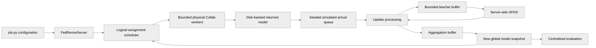

# 5274: [Research] Add FedRevive CollabAPI research example

{'state': 'OPEN', 'createdAt': '2026-09-08T13:45:36Z', 'updatedAt': '2026-09-12T06:44:43Z', 'headRefOid': '17ddccd949c1c1a88087717cc06805725f021811', 'baseRefOid': '49968b2ede43dab779ab8f53e22688f1e8c2f0b8', 'closedAt': None, 'mergedAt': None}

## Body
## What this PR does

Adds a self-contained FedRevive research contribution implemented with the NVIDIA FLARE Collab API for CIFAR-10.

- Provides one workflow for FedAvg, FedBuff, and FedRevive through configurable concurrency K, aggregation buffer B, and distribution threshold O.
- Implements server-side data-free knowledge distillation with a bounded teacher buffer.
- Exposes class-proportion source and synthetic-generation interval as independent FedRevive options.
- Supports the shifted delay schedule from the paper as a deterministic, pluggable configuration.
- Uses disk-backed returned models and reference-counted global snapshots plus bounded physical workers to reproduce arbitrary seeded arrival sequences without exhausting host memory.
- Documents setup, data preparation, execution, centralized evaluation, expected results, and resource controls.
- Includes FLARE-only CIFAR-10 curves for the default and shifted delay schedules.

Paper: https://arxiv.org/abs/2511.00655

## Results included in the example

The README includes two single-seed figures generated only from this CollabAPI implementation:

1. FedAvg, FedBuff, and FedRevive over 200 simulated-time units under the default delay schedule.
2. FedBuff and FedRevive over 100 simulated-time units under the shifted delay schedule.

| Schedule | Method | Final accuracy | Best accuracy |
|---|---|---:|---:|
| Default | FedAvg | 0.4022 | 0.4056 |
| Default | FedBuff | 0.6111 | 0.6659 |
| Default | FedRevive | 0.7612 | 0.7712 |
| Shifted | FedBuff | 0.3019 | 0.4886 |
| Shifted | FedRevive | 0.7917 | 0.8325 |

## FedRevive experiment controls

The two dimensions are configured directly rather than represented by named presets:

- --class-proportion-source {true-histogram,estimated}
- --generation-interval N

The README demonstrates true-histogram with interval 1 and estimated with interval 10. Other combinations remain valid because the options are independent.

## Development-time validation

The paper authors have an internal reference implementation that is not open-sourced. It was used only for development-time curve alignment and is not included, referenced, or required by the research example.

Under the shifted schedule, the internal comparison produced a smoothed RMSE of 0.0604 for FedBuff and 0.0172 for FedRevive. The example itself reports only its FLARE results.

## Validation

- Python compilation for all research/fedrevive modules
- Black check
- isort check
- flake8 check
- NVFlare license-header check
- CLI parsing for both independent experiment options
- Mapping check for true/estimated class proportions and generation intervals 1/10
- Full CIFAR-10 Collab runs for FedAvg, FedBuff, and FedRevive
- Shifted-delay Collab runs for FedBuff and FedRevive

The repository-level ./runtest.sh -s wrapper could not complete in this workspace because it attempts to install tooling into an externally managed, read-only Python environment. Its applicable scoped style and license checks were run directly and passed.

## timeline-comments 5586323571 by codecov-commenter; https://github.com/NVIDIA/NVFlare/pull/5274#issuecomment-5586323571; ; 
## [Codecov](https://app.codecov.io/gh/NVIDIA/NVFlare/pull/5274?dropdown=coverage&src=pr&el=h1&utm_medium=referral&utm_source=github&utm_content=comment&utm_campaign=pr+comments&utm_term=NVIDIA) Report
:x: Patch coverage is `83.33333%` with `1 line` in your changes missing coverage. Please review.
:white_check_mark: Project coverage is 67.26%. Comparing base ([`49968b2`](https://app.codecov.io/gh/NVIDIA/NVFlare/commit/49968b2ede43dab779ab8f53e22688f1e8c2f0b8?dropdown=coverage&el=desc&utm_medium=referral&utm_source=github&utm_content=comment&utm_campaign=pr+comments&utm_term=NVIDIA)) to head ([`17ddccd`](https://app.codecov.io/gh/NVIDIA/NVFlare/commit/17ddccd949c1c1a88087717cc06805725f021811?dropdown=coverage&el=desc&utm_medium=referral&utm_source=github&utm_content=comment&utm_campaign=pr+comments&utm_term=NVIDIA)).
:warning: Report is 15 commits behind head on main.

| [Files with missing lines](https://app.codecov.io/gh/NVIDIA/NVFlare/pull/5274?dropdown=coverage&src=pr&el=tree&utm_medium=referral&utm_source=github&utm_content=comment&utm_campaign=pr+comments&utm_term=NVIDIA) | Patch % | Lines |
|---|---|---|
| [...re/app\_common/utils/tensor\_disk\_offload\_context.py](https://app.codecov.io/gh/NVIDIA/NVFlare/pull/5274?src=pr&el=tree&filepath=nvflare%2Fapp_common%2Futils%2Ftensor_disk_offload_context.py&utm_medium=referral&utm_source=github&utm_content=comment&utm_campaign=pr+comments&utm_term=NVIDIA#diff-bnZmbGFyZS9hcHBfY29tbW9uL3V0aWxzL3RlbnNvcl9kaXNrX29mZmxvYWRfY29udGV4dC5weQ==) | 75.00% | [1 Missing :warning: ](https://app.codecov.io/gh/NVIDIA/NVFlare/pull/5274?src=pr&el=tree&utm_medium=referral&utm_source=github&utm_content=comment&utm_campaign=pr+comments&utm_term=NVIDIA) |

<details><summary>Additional details and impacted files</summary>


```diff
@@            Coverage Diff             @@
##             main    #5274      +/-   ##
==========================================
+ Coverage   66.58%   67.26%   +0.67%     
==========================================
  Files        1018     1021       +3     
  Lines      105456   106127     +671     
==========================================
+ Hits        70222    71387    +1165     
+ Misses      35234    34740     -494     
```

| [Flag](https://app.codecov.io/gh/NVIDIA/NVFlare/pull/5274/flags?src=pr&el=flags&utm_medium=referral&utm_source=github&utm_content=comment&utm_campaign=pr+comments&utm_term=NVIDIA) | Coverage Δ | |
|---|---|---|
| [unit-tests](https://app.codecov.io/gh/NVIDIA/NVFlare/pull/5274/flags?src=pr&el=flag&utm_medium=referral&utm_source=github&utm_content=comment&utm_campaign=pr+comments&utm_term=NVIDIA) | `67.26% <83.33%> (+0.67%)` | :arrow_up: |

Flags with carried forward coverage won't be shown. [Click here](https://docs.codecov.io/docs/carryforward-flags?utm_medium=referral&utm_source=github&utm_content=comment&utm_campaign=pr+comments&utm_term=NVIDIA#carryforward-flags-in-the-pull-request-comment) to find out more.
</details>

[:umbrella: View full report in Codecov by Harness](https://app.codecov.io/gh/NVIDIA/NVFlare/pull/5274?dropdown=coverage&src=pr&el=continue&utm_medium=referral&utm_source=github&utm_content=comment&utm_campaign=pr+comments&utm_term=NVIDIA).   
:loudspeaker: Have feedback on the report? [Share it here](https://about.codecov.io/codecov-pr-comment-feedback/?utm_medium=referral&utm_source=github&utm_content=comment&utm_campaign=pr+comments&utm_term=NVIDIA).
<details><summary> :rocket: New features to boost your workflow: </summary>

- :snowflake: [Test Analytics](https://docs.codecov.com/docs/test-analytics): Detect flaky tests, report on failures, and find test suite problems.
- :package: [JS Bundle Analysis](https://docs.codecov.com/docs/javascript-bundle-analysis): Save yourself from yourself by tracking and limiting bundle sizes in JS merges.
</details>


## timeline-comments 5602882002 by greptile-apps[bot]; https://github.com/NVIDIA/NVFlare/pull/5274#issuecomment-5602882002; ; 
<!-- greptile_summary -->

<h2><a href="https://app.greptile.com/api/retrigger?id=62110199"><picture><source media="(prefers-color-scheme: dark)" srcset="https://greptile-static-assets.s3.amazonaws.com/badges/RetriggerDark.svg?v=1"><source media="(prefers-color-scheme: light)" srcset="https://greptile-static-assets.s3.amazonaws.com/badges/Retrigger.svg?v=1"></picture></a>Confidence Score: 5/5</h2>

The PR appears safe to merge; the only new concern is a non-blocking misleading console summary for the resolved FedRevive defaults.

<h2>Findings</h2>

1. &nbsp;**Defaults Print as None** <a href="https://github.com/NVIDIA/NVFlare/pull/5274#discussion_r3995408759">▶</a>

<h3>Summary</h3>

- Implements FedAvg, FedBuff, and FedRevive scheduling, aggregation, DFKD, client training, data preparation, and centralized evaluation.
- Adds disk-backed returned models, reference-counted global snapshots, and a bounded physical worker pool.
- Changes the default FedRevive configuration to estimated class proportions with synthesis every ten model versions.
- Documents default and shifted delay schedules, resource controls, experiment commands, and measured results.
- Adds unit coverage for tensor offload-directory selection and explicit lazy-reference cleanup.

<h3>Diagram</h3>



<sub>Reviews (5) · Last reviewed commit: ["Refine FedRevive paper fidelity"](https://github.com/nvidia/nvflare/commit/17ddccd949c1c1a88087717cc06805725f021811)</sub>


## reviews 5143184508 by copilot-pull-request-reviewer[bot]; https://github.com/NVIDIA/NVFlare/pull/5274#pullrequestreview-5143184508; COMMENTED; 
### 🟡 Changes recommended

There are a few concrete correctness/composability issues (notably an Adam optimizer epsilon of 0 and some runtime/version assumptions) that should be addressed before merging.

*Once you've addressed the issues Copilot identified, you can request another Copilot review.*

<details>
<summary>Pull request overview</summary>

Adds a new self-contained `research/fedrevive` CollabAPI-based research example that reproduces the FedRevive CIFAR-10 experiment (and also supports FedAvg/FedBuff) with deterministic simulated-time scheduling plus explicit host resource controls.

**Changes:**
- Introduces a unified online server workflow that schedules logical clients deterministically while using a bounded physical Collab worker pool, including disk-backed snapshot/offload mechanisms to bound memory.
- Adds a CIFAR-10 client implementation, data preparation utilities, FedRevive/FedBuff/FedAvg update logic, and server-side DFKD (FedRevive) components.
- Documents setup, experiment controls, execution steps, evaluation protocol, and expected single-seed curves.
</details>

<details>
<summary>File summaries</summary>

| File | Description |
| ---- | ----------- |
| research/fedrevive/trace_resources.py | Adds a utility to sample systemd/cgroup + process RSS/thread counts to observe simulator resource usage. |
| research/fedrevive/server.py | Implements the CollabAPI server workflow and deterministic simulated-time scheduler shared by FedAvg/FedBuff/FedRevive. |
| research/fedrevive/requirements.txt | Declares Python dependencies for running the example. |
| research/fedrevive/README.md | Provides end-to-end documentation: scope, controls, scheduling model, setup, runs, evaluation, and reported curves. |
| research/fedrevive/prepare_data.py | CLI entry point for preparing CIFAR-10 splits/manifests used by the experiments. |
| research/fedrevive/model.py | Defines the CIFAR-10 ResNet-18 variant and model state helpers used by client/server/DFKD. |
| research/fedrevive/job.py | Implements the runnable Collab recipe/CLI wiring, validation, and environment setup for simulation. |
| research/fedrevive/fedrevive.py | Encapsulates method configs and shared aggregation/update processing (FedAvg/FedBuff/FedRevive). |
| research/fedrevive/dfkd.py | Implements server-side data-free KD components (generator, synthetic pool, proxy estimation, revive loop). |
| research/fedrevive/data.py | Implements CIFAR-10 transforms plus data partitioning + runtime-profile manifest generation/loading. |
| research/fedrevive/client.py | Implements the CollabAPI published training method with physical worker reuse and memory trimming. |
</details>

<details>
<summary>Review details</summary>

- **Files reviewed:** 11/13 changed files
- **Comments generated:** 3
- **Review effort level:** Lite
</details>

---

💡 <a href="/NVIDIA/NVFlare/new/main?filename=.github/skills/code-review/SKILL.md" class="Link--inTextBlock" target="_blank" rel="noopener noreferrer">Add a `code-review` agent skill</a> or configure MCP servers for context-aware, tailored reviews. <a href="https://docs.github.com/copilot/how-tos/use-copilot-agents/request-a-code-review/use-code-review?tool=webui#mcp-servers-and-agent-skills" class="Link--inTextBlock" target="_blank" rel="noopener noreferrer">Learn more in the docs.</a>


## reviews 5143620486 by ZiyueXu77; https://github.com/NVIDIA/NVFlare/pull/5274#pullrequestreview-5143620486; COMMENTED; 


## reviews 5143621660 by ZiyueXu77; https://github.com/NVIDIA/NVFlare/pull/5274#pullrequestreview-5143621660; COMMENTED; 


## reviews 5143623000 by ZiyueXu77; https://github.com/NVIDIA/NVFlare/pull/5274#pullrequestreview-5143623000; COMMENTED; 


## reviews 5155157752 by greptile-apps[bot]; https://github.com/NVIDIA/NVFlare/pull/5274#pullrequestreview-5155157752; COMMENTED; 


## reviews 5155892644 by ZiyueXu77; https://github.com/NVIDIA/NVFlare/pull/5274#pullrequestreview-5155892644; COMMENTED; 


## reviews 5155896288 by ZiyueXu77; https://github.com/NVIDIA/NVFlare/pull/5274#pullrequestreview-5155896288; COMMENTED; 


## reviews 5156029257 by ZiyueXu77; https://github.com/NVIDIA/NVFlare/pull/5274#pullrequestreview-5156029257; COMMENTED; 


## reviews 5156042925 by greptile-apps[bot]; https://github.com/NVIDIA/NVFlare/pull/5274#pullrequestreview-5156042925; COMMENTED; 


## reviews 5159911108 by holgerroth; https://github.com/NVIDIA/NVFlare/pull/5274#pullrequestreview-5159911108; COMMENTED; 
Thanks for the contribution. I went through the new example with the Collab runtime, `LazyTensorDict`, and the disk-offload helper side by side. Style, license headers, and compilation are all clean. Inline comments below cover the issues I would want addressed before merge: the failure-watcher blocking, the dead cleanup path, the uncounted dropped assignments, the `max_time` gap on uploads, the `--max-parallel` semantics, the TensorBoard step, the `tempfile.tempdir` swap, and the missing NVFlare pin / license notes.

Two smaller observations not worth their own thread: with `--buffer-size` above 1, synthesis runs once per eligible arrival rather than once per version (`should_generate` is a pure function of the version), and the DFKD boundaries use `>=` at version 50 and 100 for the freeze/adversarial gates but `>` at 100 for KD.


## reviews 5160495763 by ZiyueXu77; https://github.com/NVIDIA/NVFlare/pull/5274#pullrequestreview-5160495763; COMMENTED; 


## reviews 5160495880 by ZiyueXu77; https://github.com/NVIDIA/NVFlare/pull/5274#pullrequestreview-5160495880; COMMENTED; 


## reviews 5160495970 by ZiyueXu77; https://github.com/NVIDIA/NVFlare/pull/5274#pullrequestreview-5160495970; COMMENTED; 


## reviews 5160496071 by ZiyueXu77; https://github.com/NVIDIA/NVFlare/pull/5274#pullrequestreview-5160496071; COMMENTED; 


## reviews 5160496149 by ZiyueXu77; https://github.com/NVIDIA/NVFlare/pull/5274#pullrequestreview-5160496149; COMMENTED; 


## reviews 5160496242 by ZiyueXu77; https://github.com/NVIDIA/NVFlare/pull/5274#pullrequestreview-5160496242; COMMENTED; 


## reviews 5160496324 by ZiyueXu77; https://github.com/NVIDIA/NVFlare/pull/5274#pullrequestreview-5160496324; COMMENTED; 


## reviews 5160496414 by ZiyueXu77; https://github.com/NVIDIA/NVFlare/pull/5274#pullrequestreview-5160496414; COMMENTED; 


## reviews 5160498187 by ZiyueXu77; https://github.com/NVIDIA/NVFlare/pull/5274#pullrequestreview-5160498187; COMMENTED; 


## reviews 5160498314 by ZiyueXu77; https://github.com/NVIDIA/NVFlare/pull/5274#pullrequestreview-5160498314; COMMENTED; 


## reviews 5160754285 by holgerroth; https://github.com/NVIDIA/NVFlare/pull/5274#pullrequestreview-5160754285; COMMENTED; 
One more README suggestion, inline below.


## reviews 5169034846 by holgerroth; https://github.com/NVIDIA/NVFlare/pull/5274#pullrequestreview-5169034846; COMMENTED; 
I did a focused pass mapping the DFKD implementation against the paper (arXiv 2511.00655, Section 2.2, Appendix B, Appendix I). Most of it lines up: Eq. 3 blending and staleness definition, the c=8 teacher buffer and per-class teacher weights, the two-upload Gaussian-probe proxy with T_probe=0.8, the target and adversarial synthesis terms and their weights, the Reptile-style meta-update, best-of-K_synth pool insertion, the class-weighted multi-teacher KD loss with T=1 and K_KD=10, and the published learning rates and batch sizes.

The four inline comments below are the items I consider material to whether the README figures can be called a reproduction: target sampling, the unpublished warmup gates, defaults versus the paper's main setting, and the missing normalization layers. Smaller conventions (unsquared feature-loss norm, kornia augmentation of synthetic images, the loss-clipping heuristic, unpublished constants like the beta horizon of 75 and the 16k pool) follow common DFKD practice and I have not flagged them individually.

One principle for resolving these: the default code path should keep producing the figures shown in the README. Where the paper is followed differently, document the deviation rather than silently changing defaults, or regenerate the figures alongside the change.


## reviews 5185617885 by ZiyueXu77; https://github.com/NVIDIA/NVFlare/pull/5274#pullrequestreview-5185617885; COMMENTED; 


## reviews 5185617929 by ZiyueXu77; https://github.com/NVIDIA/NVFlare/pull/5274#pullrequestreview-5185617929; COMMENTED; 


## reviews 5185617960 by ZiyueXu77; https://github.com/NVIDIA/NVFlare/pull/5274#pullrequestreview-5185617960; COMMENTED; 


## reviews 5185621467 by greptile-apps[bot]; https://github.com/NVIDIA/NVFlare/pull/5274#pullrequestreview-5185621467; COMMENTED; 


## inline-comments 3959106678 by Copilot; https://github.com/NVIDIA/NVFlare/pull/5274#discussion_r3959106678; ; research/fedrevive/dfkd.py
`torch.optim.Adam(..., eps=0)` can lead to division-by-zero (e.g., when a parameter has zero gradient), producing NaNs/Infs during meta-optimizer updates. Use the default epsilon or a small positive value instead.


## inline-comments 3959106751 by Copilot; https://github.com/NVIDIA/NVFlare/pull/5274#discussion_r3959106751; ; research/fedrevive/requirements.txt
This example relies on PyTorch features like `torch.load(..., weights_only=True, mmap=True)` (see server.py), which require a sufficiently new torch/torchvision. Without minimum versions here, installs in constrained environments can resolve to older wheels and fail at runtime. Consider adding explicit minimum versions (similar to other research examples).


## inline-comments 3959106807 by Copilot; https://github.com/NVIDIA/NVFlare/pull/5274#discussion_r3959106807; ; research/fedrevive/job.py
This loop unconditionally overwrites existing thread-pool environment variables. That can surprise users who intentionally set these (e.g., in a job launcher or container) and makes the script harder to compose. Consider only setting defaults when they are not already defined.


## inline-comments 3959471834 by ZiyueXu77; https://github.com/NVIDIA/NVFlare/pull/5274#discussion_r3959471834; ; research/fedrevive/dfkd.py
Fixed in 61b59131. Removed eps=0 so Adam uses its default positive epsilon, avoiding division-by-zero and non-finite meta-optimizer updates.


## inline-comments 3959472857 by ZiyueXu77; https://github.com/NVIDIA/NVFlare/pull/5274#discussion_r3959472857; ; research/fedrevive/requirements.txt
Fixed in 61b59131. The example now requires torch>=2.1.0, where torch.load mmap support is available, and the corresponding torchvision>=0.16.0 minimum. The other requirements remain because each is used directly by the example.


## inline-comments 3959474010 by ZiyueXu77; https://github.com/NVIDIA/NVFlare/pull/5274#discussion_r3959474010; ; research/fedrevive/job.py
Fixed in 61b59131. These variables now use setdefault: the resource-safe value of 1 remains the default, while explicit launcher or container settings are preserved.


## inline-comments 3969124307 by greptile-apps[bot]; https://github.com/NVIDIA/NVFlare/pull/5274#discussion_r3969124307; ; research/fedrevive/server.py
<a href="#"></a> **Failed assignments corrupt cohorts**

When a FedAvg assignment fails, the server reopens its slot but leaves the successful updates from that cohort in the buffer. A replacement cohort is then dispatched against the current model version; after the buffer advances the model, its remaining results can mix with the next version and trigger `FedAvg buffer contains updates from different global versions`, aborting the run. Failed synchronous assignments need cohort recovery or retry instead of being silently skipped.


## inline-comments 3969124315 by greptile-apps[bot]; https://github.com/NVIDIA/NVFlare/pull/5274#discussion_r3969124315; ; research/fedrevive/dfkd.py
<a href="#"></a> **Warmup attenuates client updates**

During model versions 50 through 100, `revive()` reloads the student from the global model but does not train it, so it returns a zero distilled delta. The server still blends that delta into every stale arrival, reducing the ordinary update to `(1-beta) * client_delta` and potentially discarding it entirely during the synthesis warmup. A distilled update should only be supplied after student KD has run.


## inline-comments 3969732568 by ZiyueXu77; https://github.com/NVIDIA/NVFlare/pull/5274#discussion_r3969732568; ; research/fedrevive/server.py
Thanks. This is a valid failure-path concern, but retrying or reconstructing a partial synchronous cohort is outside the scope of this research example. The paper-aligned experiments assume successful client calls, and the existing base-version guard prevents a mixed cohort from being applied. We are keeping the example focused rather than adding production recovery machinery.


## inline-comments 3969735451 by ZiyueXu77; https://github.com/NVIDIA/NVFlare/pull/5274#discussion_r3969735451; ; research/fedrevive/dfkd.py
Thanks, fixed in 57f5cd0d. `revive()` now returns no distilled update during synthesis-only warmup, and only returns a model delta after at least one KD optimizer step. Synthesis still proceeds during warmup, while `process_update()` leaves the ordinary client delta unchanged until KD has actually run.


## inline-comments 3969848479 by ZiyueXu77; https://github.com/NVIDIA/NVFlare/pull/5274#discussion_r3969848479; ; research/fedrevive/server.py
Follow-up: added a minimal fail-fast check in 789d84c9. If a FedAvg assignment fails or returns no result, the workflow now raises a clear incomplete-cohort error immediately instead of allowing buffered successes to mix with a later cohort. This intentionally adds no retry or cohort-recovery mechanism.


## inline-comments 3969860380 by greptile-apps[bot]; https://github.com/NVIDIA/NVFlare/pull/5274#discussion_r3969860380; ; research/fedrevive/server.py
Thanks for the follow-up. This addresses the concern: `_process_outcome` now fails immediately for a FedAvg assignment failure or missing result, before another cohort can be dispatched or the partial buffer can be applied. The existing `finally` cleanup also releases the failed assignment’s snapshot, and abort cleanup discards any buffered successes. Given the intentional no-retry scope, I have no further concern here.


## inline-comments 3973061845 by holgerroth; https://github.com/NVIDIA/NVFlare/pull/5274#discussion_r3973061845; ; research/fedrevive/server.py
**Failure reporting is delayed until the whole group call finishes.** `for _ in results: pass` iterates the `ResultQueue`, whose `__next__` skips the failure marker and blocks on `q.get()` until `num_whole_items_received >= limit`. So when site-1 fails immediately (e.g. `FileNotFoundError` for a missing shard) but site-2 in the same group call is still training or hung, site-1's `_ClientOutcome(error=...)` is only queued after site-2 returns (up to `call_timeout`, default 3600 s). Meanwhile site-1 stays in `_physical_jobs` and is never returned to `_available_physical`, and the FedAvg "cohort incomplete" error is delayed the same way.

`results.failures` is populated incrementally (`group_call_context.py` `append_failure`), so the watcher can poll it (or check it inside the loop) and emit the error outcome as soon as an entry appears.


## inline-comments 3973061853 by holgerroth; https://github.com/NVIDIA/NVFlare/pull/5274#discussion_r3973061853; ; research/fedrevive/server.py
**This branch is never taken, so the explicit cleanup is dead code** (same at the `finally` in `_process_outcome`). `TensorDecomposer` is registered per `torch.Tensor`, and `ViaDownloaderDecomposer.recompose` returns `items.make_lazy_ref(item_id)` per tensor while the `LazyTensorDict` itself stays in `fobs_ctx`. The decoded reply is therefore `(dict[str, _LazyRef], metrics, metadata)` and `isinstance(result[0], LazyTensorDict)` is always False. `_materialize_result` below already assumes `_LazyRef` values, so the two paths are inconsistent.

Consequence: temp dirs are only removed by `_TempDirRef.__del__` once every ref is collected, so any lingering reference (exception traceback, `fobs_ctx`) keeps per-client `nvflare_tensors_*` dirs alive until the final rmtree. The README's "deletes its files immediately" / "cleaned through `_release_outcome_result()`" overstates what happens. Suggest releasing via the shared `_temp_ref` of any `_LazyRef` value, or adding a public `release()` to `_LazyRef` in `lazy_tensor_dict.py`.


## inline-comments 3973061861 by holgerroth; https://github.com/NVIDIA/NVFlare/pull/5274#discussion_r3973061861; ; research/fedrevive/server.py
**Failed assignments are silently dropped under FedBuff/FedRevive and never counted.** `_record_physical_outcome` already re-added the failing physical site to `_available_physical` before the error is inspected, so a site with a broken `data_root` or persistent CUDA OOM is re-dispatched indefinitely. Each failure still consumed its simulated download/train/upload events, so the arrival stream the benchmark is supposed to reproduce is thinned, yet `results.json` and `accuracy_history.json` carry no failure count and the README does not mention this tolerance. A run with half its arrivals lost is indistinguishable from a healthy one.

Minimal fix: count failed assignments (ideally per physical site), log the total and write it to `results.json`, and optionally abort past a threshold.


## inline-comments 3973061869 by holgerroth; https://github.com/NVIDIA/NVFlare/pull/5274#discussion_r3973061869; ; research/fedrevive/server.py
**The upload branch does not enforce `max_time`.** The download (L788) and train (L806) branches return `None` once `_simulated_time >= max_time`, but here the upload is popped, the clock is advanced, and the outcome is returned, so `execute()` aggregates a new global version past the budget. Example: an upload accepted at t=198 with budget 200 leaves another upload at t=205 at the heap top; the loop re-enters (198 < 200), aggregates at t=205, and `results.json` reports `simulated_time=205` with the final eval on that over-budget version. The dispatch guard at L554 uses the same check, so the asymmetry looks unintended. Add the same guard here.


## inline-comments 3973061880 by holgerroth; https://github.com/NVIDIA/NVFlare/pull/5274#discussion_r3973061880; ; research/fedrevive/job.py
**`--max-parallel` does not do what the help text and README (L112-113) say.** Collab's `parallel` is scoped to one group call: `Group` creates a fresh `ResultWaiter` per call and `wait_for_call_permission` counts only that waiter. So:
- `--num-clients 4 --max-parallel 2` with all pending assignments on one snapshot issues one group call to 4 sites with `parallel=2`; sites 3-4 are already marked busy in `_physical_jobs` but their RPCs wait for 1-2 to return, halving utilization.
- Pending work spanning two snapshots issues two calls with independent budgets, so 4 RPCs are in flight, exceeding the advertised cap.
- Values above `--num-clients` are inert, so this `ValueError` is unnecessary and makes `--num-clients 1` fail with the default.

The effective bound on in-flight RPCs is simply the physical-site count. Suggest dropping the option (pass `parallel=0`) and the README claim.


## inline-comments 3973061887 by holgerroth; https://github.com/NVIDIA/NVFlare/pull/5274#discussion_r3973061887; ; research/fedrevive/server.py
**Float `global_step`.** `FileWriter.add_event` does `event.step = int(step)`, so every evaluation inside one simulated-time unit lands on the same integer step. With eval every 10 versions that is ~3 points per step for FedBuff, ~6 for FedRevive, and ~50 for the shifted-schedule FedRevive run, which renders as a vertical saw-tooth rather than a curve (`accuracy_history.json` is unaffected). Use `self._model_version` as the step and, if you want the time axis, pass `walltime=self._simulated_time` or log a second scalar.


## inline-comments 3973061898 by holgerroth; https://github.com/NVIDIA/NVFlare/pull/5274#discussion_r3973061898; ; research/fedrevive/server.py
**Process-global `tempfile.tempdir` swap.** This is restored in `finally`, but the call-watcher threads (L533) and the `SummaryWriter` (L326) already exist at this point, so any `tempfile.*` call on another thread during the window lands under the run dir, and the trick silently stops working if the helper stops using `mkdtemp`. The underlying need (a small tmpfs `/tmp`) is shared by `fedavg.py`, `scatter_and_gather.py` and `scaffold.py`, which call the same helper. A cleaner fix is an optional `root_dir` argument on `setup_tensor_disk_offload` in `nvflare/app_common/utils/tensor_disk_offload_context.py`, passed as `dir=` to `mkdtemp`. Happy to see that as a small core change alongside this PR.


## inline-comments 3973061903 by holgerroth; https://github.com/NVIDIA/NVFlare/pull/5274#discussion_r3973061903; ; research/fedrevive/requirements.txt
**Missing NVFlare pin and license notes.** `research/CONTRIBUTING.md` asks for "Requirements and the NVFlare version used", "License notes", and to "call out any third-party code, models, datasets, or assets", and `AGENTS.md` says the requirements pin is sufficient and not to add install-from-source caveats. Currently there is no `nvflare` entry here, the README (L248-252) says to use a `main` checkout with `pip install -e ../..`, has no License section, and does not mention CIFAR-10 or kornia terms. Every imported module (`nvflare.collab`, `LazyTensorDict`, the disk-offload context, ...) exists on the 2.9 line, so `nvflare[PT]~=2.9.0rc` like the sibling projects would work. Please also add a FedRevive row to the `research/README.md` index table.


## inline-comments 3973061909 by holgerroth; https://github.com/NVIDIA/NVFlare/pull/5274#discussion_r3973061909; ; research/fedrevive/server.py
Nit: `collab.get_prop(ContextKey.RESULT, ...)` inside the single `@collab.main` can never return anything but `initial_model`. The runtime sets `ContextKey.RESULT` only after the main returns (`lifecycle.py`: `result = main_func(**kwargs); server_ctx.set_prop(ContextKey.RESULT, result)`), and `job.py` provides no other writer. If warm-start is intended, load from an explicit app prop or file; otherwise drop the line so readers do not expect it to work.


## inline-comments 3973536130 by ZiyueXu77; https://github.com/NVIDIA/NVFlare/pull/5274#discussion_r3973536130; ; research/fedrevive/server.py
Fixed in 5a6dbfad. The bounded watcher now polls the ResultQueue incremental failure state under its update lock and emits each site failure once, without waiting for the remaining group members. Success callbacks and simulated acceptance ordering are unchanged.


## inline-comments 3973536231 by ZiyueXu77; https://github.com/NVIDIA/NVFlare/pull/5274#discussion_r3973536231; ; research/fedrevive/server.py
Fixed in 5a6dbfad. Added an explicit release method to the lazy tensor reference and made the server release either a LazyTensorDict or the decoded dict of lazy references. Consumed and discarded replies now unlink their shared temporary directory immediately; a focused unit test covers the shared-reference cleanup.


## inline-comments 3973536316 by ZiyueXu77; https://github.com/NVIDIA/NVFlare/pull/5274#discussion_r3973536316; ; research/fedrevive/server.py
Fixed narrowly in 5a6dbfad. Any failed or missing assignment now aborts FedAvg, FedBuff, and FedRevive with the assignment ID and error. This prevents a degraded run from silently changing the benchmark arrival stream without adding retries, thresholds, or recovery policy to the research example.


## inline-comments 3973536432 by ZiyueXu77; https://github.com/NVIDIA/NVFlare/pull/5274#discussion_r3973536432; ; research/fedrevive/server.py
Fixed in 5a6dbfad. The upload branch now applies the same max-time guard as download and train before returning an update for aggregation. The outcome is retained for normal shutdown cleanup, and a focused scheduler smoke test covers the t=205 versus budget=200 case.


## inline-comments 3973536503 by ZiyueXu77; https://github.com/NVIDIA/NVFlare/pull/5274#discussion_r3973536503; ; research/fedrevive/job.py
Fixed in 5a6dbfad. Removed --max-parallel and its validation/documentation, and now pass parallel=0. The physical Collab site count is documented as the actual bound on concurrent RPCs.


## inline-comments 3973536596 by ZiyueXu77; https://github.com/NVIDIA/NVFlare/pull/5274#discussion_r3973536596; ; research/fedrevive/server.py
Fixed in 5a6dbfad. TensorBoard now uses model_version as the integer global step and records simulated_time as walltime, avoiding collapsed points while preserving both coordinates.


## inline-comments 3973536675 by ZiyueXu77; https://github.com/NVIDIA/NVFlare/pull/5274#discussion_r3973536675; ; research/fedrevive/server.py
Fixed in 5a6dbfad. setup_tensor_disk_offload now accepts an optional root_dir and passes it directly to mkdtemp. The FedRevive server supplies its run directory and no longer mutates process-global tempfile state. A focused unit test verifies the requested parent directory.


## inline-comments 3973536752 by ZiyueXu77; https://github.com/NVIDIA/NVFlare/pull/5274#discussion_r3973536752; ; research/fedrevive/requirements.txt
Fixed in 5a6dbfad. Added the NVFlare PT requirement, removed the editable-install command, documented dependency/data license terms, and added FedRevive to the research index. The pin is intentionally nvflare[PT]~=2.10.0rc rather than 2.9 because this contribution targets main and now uses the new root_dir argument added to the disk-offload helper in this PR.


## inline-comments 3973538547 by ZiyueXu77; https://github.com/NVIDIA/NVFlare/pull/5274#discussion_r3973538547; ; research/fedrevive/requirements.txt
Fixed in 5a6dbfad. Added the NVFlare PT requirement, removed the editable-install command, documented dependency and data license terms, and added FedRevive to the research index. The pin is intentionally nvflare[PT]~=2.10.0rc rather than 2.9 because this contribution targets main and now uses the new root_dir argument added to the disk-offload helper in this PR.


## inline-comments 3973538664 by ZiyueXu77; https://github.com/NVIDIA/NVFlare/pull/5274#discussion_r3973538664; ; research/fedrevive/server.py
Fixed in 5a6dbfad. Removed the ineffective ContextKey.RESULT lookup and initialize the global model directly from the seeded initial model.


## inline-comments 3973793439 by holgerroth; https://github.com/NVIDIA/NVFlare/pull/5274#discussion_r3973793439; ; research/fedrevive/README.md
**Suggestion: state explicitly that the simulated-time scheduler is a paper-reproduction harness, not the recommended way to run FedRevive in FLARE.**

`server.py` carries a discrete-event simulator (simulated clock, event heap, logical-to-physical worker mapping, reference-counted disk snapshots, a watcher pool for Collab result queues). That is what makes the seeded delay schedules from the paper replayable, and it is valuable for that purpose. But `research/` examples tend to get copied as templates, and a user who wants FedRevive on their own clients does not need any of it: in a real deployment the physical clients are the clients, staleness comes from actual arrival order, and the whole algorithm reduces to `process_update` plus the reviver.

Could you add a short paragraph here in **Scope** (and a sentence at the top of **Unified scheduling and aggregation**) along the lines of:

> The scheduler in `server.py` replays the paper's seeded delay schedules on a small pool of physical sites so that results are reproducible regardless of host speed. It is a reproduction harness for this study, not the recommended pattern for deploying FedRevive. For real asynchronous training, start from the `examples/advanced/collab/pt_async_cifar10` example and reuse `fedrevive.py` (`process_update`, `TeacherBuffer`, `blend_updates`) and `dfkd.py` directly.

That keeps the algorithm files as the reusable part and makes the boundary explicit for readers. We are considering a product-side FedRevive component on top of the existing FedBuff pieces as a follow-up, so having the README already draw this line will make that migration cleaner.


## inline-comments 3980690094 by holgerroth; https://github.com/NVIDIA/NVFlare/pull/5274#discussion_r3980690094; ; research/fedrevive/dfkd.py
**Synthesis targets are sampled from the mean teacher proxy; the paper says uniform.** Section 2.2 step (2): target labels are drawn "uniformly at random over classes". Here `targets = torch.multinomial(combined_distribution, ...)` draws them from the average of the buffered teachers' class proportions, which skews the synthetic pool toward whatever classes the current eight teachers hold. Appendix B does mention "client-conditioned synthesis targets", so the paper is not fully consistent with itself, but the main-text definition is the explicit one. Could you confirm with the authors which variant produced the paper's curves, and either switch to uniform or state the deviation in the README?


## inline-comments 3980690101 by holgerroth; https://github.com/NVIDIA/NVFlare/pull/5274#discussion_r3980690101; ; research/fedrevive/dfkd.py
**`warmup_versions=100` and `freeze_versions=50` introduce a two-stage warmup that the paper does not describe.** With these gates DFKD does nothing before version 50, synthesizes but returns no distilled update between 50 and 100 (so FedRevive is plain asynchronous FedAvg with B=1 there), and only starts blending the KD delta after version 100. Nothing in Sections 2 to 3 or Appendix I mentions a warmup. If this was needed to match the reference curves, please say so in the README next to the version-50 and version-100 statements and give the source; otherwise readers will attribute the early part of the curve to FedRevive when it is not running.


## inline-comments 3980690108 by holgerroth; https://github.com/NVIDIA/NVFlare/pull/5274#discussion_r3980690108; ; research/fedrevive/job.py
**Defaults differ from the paper's main setting; keep them tied to the shown figures, but say so.** The defaults (true label histograms, `--generation-interval 1`) match the headline results in Figure 1/2, which is the right consistency to preserve. But the paper's main results use the server-side proxy and T_gen = 10 ("2 generator steps every 10 server updates", Appendix I; K_KD = T_gen = 10, Section 3.1), and ground-truth proportions appear only in the Appendix B ablation. Right now the paper-faithful configuration is the secondary "estimated, interval 10" run in Figure 3 (0.7462 vs 0.7612). Please state in the README, next to the Results table, that the default configuration deviates from the paper in these two respects and that the estimated/interval-10 run is the one comparable to the paper. If the defaults are changed instead, the figures need regenerating so code and README stay in sync.


## inline-comments 3980690118 by holgerroth; https://github.com/NVIDIA/NVFlare/pull/5274#discussion_r3980690118; ; research/fedrevive/model.py
**This network has no normalization layers, while the paper describes a ResNet-18 whose feature loss uses "BatchNorm statistics" (Appendix I).** `StatTracker` records running mean and variance but returns `x` unchanged, and `reset_tracker_stats_in_state` zeros those buffers on every global version, so the model is a ResNet-18 with the BN layers removed. That may well be what the authors' reference implementation does (BN in FL is a known problem) and the README does say "with feature-statistic trackers", but a reader who sees "ResNet-18" will assume standard BN. Please state explicitly that no normalization is applied and, if possible, confirm with the authors that this matches their setup, since it changes both the optimization behaviour and what the feature-matching loss is matching against.


## inline-comments 3995405392 by ZiyueXu77; https://github.com/NVIDIA/NVFlare/pull/5274#discussion_r3995405392; ; research/fedrevive/dfkd.py
Confirmed that the curve-producing implementation samples synthesis targets from the mean buffered-teacher proxy. I retained that behavior and documented explicitly that it differs from the uniform-target statement in Section 2.2, while teacher-specific proportions remain separate inputs to multi-teacher KD sampling.


## inline-comments 3995405443 by ZiyueXu77; https://github.com/NVIDIA/NVFlare/pull/5274#discussion_r3995405443; ; research/fedrevive/job.py
Changed the FedRevive defaults to the paper-main estimated class-proportion proxy and generation interval 10, while FedAvg and FedBuff retain their neutral true-histogram/interval-1 values. Figures 1 and 2 and their result tables were regenerated from this default; Figure 3 now presents true histogram with every-version synthesis as the ablation.


## inline-comments 3995405471 by ZiyueXu77; https://github.com/NVIDIA/NVFlare/pull/5274#discussion_r3995405471; ; research/fedrevive/model.py
Confirmed that the curve-producing network uses non-normalizing StatTracker modules. The configuration table and model description now say explicitly that activations are returned unchanged and that the recorded channel statistics are used only by the DFKD feature loss.


## inline-comments 3995408759 by greptile-apps[bot]; https://github.com/NVIDIA/NVFlare/pull/5274#discussion_r3995408759; ; research/fedrevive/job.py
<a href="#"></a> **Defaults Print as None**

A default FedRevive run uses `estimated` class proportions and a generation interval of `10`, but this summary prints the unresolved parser values as `None`. This makes the reported experiment configuration misleading and harder to verify; print the resolved recipe values instead.

Note: If this suggestion doesn't match your team's coding style, reply to this and let me know. I'll remember it for next time!


## Files
nvflare/app_common/utils/tensor_disk_offload_context.py
nvflare/app_opt/pt/lazy_tensor_dict.py
research/README.md
research/fedrevive/README.md
research/fedrevive/client.py
research/fedrevive/data.py
research/fedrevive/dfkd.py
research/fedrevive/fedrevive.py
research/fedrevive/figs/figure_1.png
research/fedrevive/figs/figure_2.png
research/fedrevive/figs/figure_3.png
research/fedrevive/job.py
research/fedrevive/model.py
research/fedrevive/prepare_data.py
research/fedrevive/requirements.txt
research/fedrevive/server.py
research/fedrevive/trace_resources.py
tests/unit_test/app_common/utils/tensor_disk_offload_context_test.py
tests/unit_test/app_opt/pt/test_lazy_tensor_dict.py