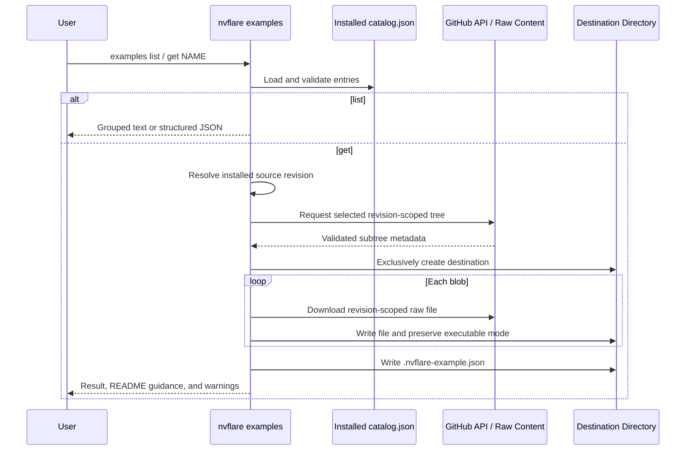

# 5288: Add GitHub-backed example catalog and list command

{'state': 'OPEN', 'createdAt': '2026-09-13T02:02:21Z', 'updatedAt': '2026-09-14T02:08:39Z', 'headRefOid': '737593f8f1ba9f51bdde087fb411e923e3ff2c7f', 'baseRefOid': '53ba7ee567468ea7971dad4faccef13c6cb35dc2', 'closedAt': None, 'mergedAt': None}

## Body
Users currently need an NVFlare repository checkout and knowledge of its nested source paths to start an example. This PR adds `nvflare examples`, which discovers and downloads examples from the public NVIDIA/NVFlare GitHub repository by short name.

The command downloads the example from the exact source revision recorded in the installed NVFlare distribution. A nightly package built from `main` retrieves examples from that build commit, while an NVFlare 2.9.0 installation retrieves examples from the commit recorded in its 2.9.0 package. This keeps example source aligned with the APIs available in the installed version.

## User workflow

List the available short names and their repository paths, grouped by the category stored in the catalog:

```bash
nvflare examples list
```

Representative output (25 of 79 entries):

```text
ADVANCED
  SHORT NAME                    SOURCE PATH
  amplify                       examples/advanced/amplify
  bionemo                       examples/advanced/bionemo
  cifar10-pt-sim                examples/advanced/cifar10/pt/cifar10-sim
  collab-pt                     examples/advanced/collab/pt_cifar10
  finance                       examples/advanced/finance
  gnn                           examples/advanced/gnn
  monitoring                    examples/advanced/monitoring
  xgboost                       examples/advanced/xgboost

AGENT SKILLS
  SHORT NAME                    SOURCE PATH
  skill-fedstats-image          examples/hello-world/agent-skills/fedstats-image
  skill-fedstats-tabular        examples/hello-world/agent-skills/fedstats-tabular
  skill-huggingface-conversion  examples/hello-world/agent-skills/huggingface-conversion
  skill-lightning-conversion    examples/hello-world/agent-skills/lightning-conversion
  skill-pytorch-conversion      examples/hello-world/agent-skills/pytorch-conversion

DEPLOYMENT
  SHORT NAME                    SOURCE PATH
  devops-aws-eks                examples/devops/aws/eks
  devops-azure-aks              examples/devops/azure/aks
  devops-gcp-gke                examples/devops/gcp/gke
  devops-multicloud             examples/devops/multicloud
  docker-runtime                examples/docker

HELLO WORLD
  SHORT NAME                    SOURCE PATH
  hello-collab                  examples/hello-world/hello-collab
  hello-flower                  examples/hello-world/hello-flower
  hello-huggingface             examples/hello-world/hello-huggingface
  hello-jax                     examples/hello-world/hello-jax
  hello-lightning               examples/hello-world/hello-lightning
  hello-numpy                   examples/hello-world/hello-numpy
  hello-pt                      examples/hello-world/hello-pt
```

Download one example into a new directory:

```bash
nvflare examples get hello-pt
```

The short name does not need to match the source directory name. For example, `collab-pt` maps to `examples/advanced/collab/pt_cifar10`. Use `--dest` to choose another destination:

```bash
nvflare examples get hello-numpy --dest ./numpy-demo
```

The catalog contains 79 non-tutorial examples grouped as Hello World, Agent Skills, Advanced, and Deployment. Tutorials are excluded for a later restructure. Each entry contains a category and `source_path` under its short name. Adding another existing example requires only editing that entry in `catalog.json`; no Python code change or per-file list is required.

## Dependencies and example instructions

Users install the optional dependency group required by the example on the same NVFlare distribution already in use. For PyTorch support:

```bash
# Stable installation
python -m pip install "nvflare[PT]"

# Nightly installation
python -m pip install "nvflare-nightly[PT]"

# Editable source installation, run from the NVFlare checkout
python -m pip install -e ".[PT]"
```

Other examples may require groups such as `HE`, `SKLEARN`, or `TRACKING`. After downloading, users follow the example README for its remaining dependencies, data download, preparation, and run commands. These steps vary by example and therefore are not duplicated in the catalog.

Hello PyTorch remains a short complete workflow:

```bash
python -m pip install "nvflare[PT]"
nvflare examples get hello-pt
cd hello-pt
pip install -r requirements.txt
python job.py
```

The downloader preserves the maintained source tree. It does not fabricate a root `requirements.txt` or rewrite root or nested dependency files. If a `requirements.txt` or `pyproject.toml` names `nvflare` or `nvflare-nightly`, completion output identifies every affected file and tells the user to preserve the installed NVFlare distribution while installing the remaining dependencies. A missing root README is reported as a warning without discarding a successful download.

## Destination and provenance

The default destination is the selected short name in the current directory. Its parent must already exist. The command never merges with or overwrites an existing file, directory, or symbolic link. If a file transfer does not complete, the partial destination remains visible and the error tells the user to remove it before retrying.

Each downloaded example contains `.nvflare-example.json`, which records:

- repository and exact Git revision
- example short name and canonical source path
- canonical source URL
- installed NVFlare version

## Automation and CLI contract

`list` and `get` follow the common NVFlare CLI contract. Human-readable list output uses category headings and sorts names within each group. Agents and scripts receive `name`, `category`, and `source_path` for every entry through JSON output and can also use schema discovery:

```bash
nvflare examples list --format json
nvflare examples get hello-pt --dest ./automation-example --format json

nvflare examples --schema
nvflare examples list --schema
nvflare examples get --schema
```

Failures return a nonzero exit status, a structured error code, and a recovery hint. The command uses the shared `--connect-timeout` option. Catalog loading is isolated to `nvflare examples`, so a damaged catalog cannot prevent unrelated commands such as `nvflare --help`, `nvflare simulator`, or `nvflare poc` from starting. Invalid individual catalog entries are skipped and reported while valid entries remain usable.

## Implementation

`get` makes one path-scoped recursive GitHub tree request for the selected catalog directory, validates the returned file paths before creating the destination, and downloads only that subtree from revision-specific raw URLs. Executable file modes are preserved. The premerge wheel job validates every installed catalog path and README against the GitHub tree.

## Validation

- 106 targeted example, CLI-schema, and setup tests passed on macOS/Python 3.13.
- Full project style checks passed: Black, isort, flake8, and agent-skill lint.
- Documentation HTML build passed with 117 existing warnings.
- All 79 catalog paths and root README files were checked; no catalog path is under `examples/tutorials`.
- A live `hello-collab` retrieval downloaded only its selected subtree and retained dependency files byte-for-byte.
- The premerge wheel job validates the installed catalog against the repository tree without relying on a source checkout.

## LOC

Git diff counts against the PR merge base on `main`, including comments and blank lines:

| Area | Files | Added LOC | Removed LOC |
| --- | ---: | ---: | ---: |
| CLI, catalog, and packaging | 7 | 764 | 0 |
| Tests | 3 | 706 | 0 |
| Documentation | 7 | 141 | 31 |
| Example dependency guidance | 14 | 14 | 36 |
| CI validation | 1 | 29 | 0 |
| **Total** | **32** | **1,654** | **67** |

The CLI, catalog, and packaging area is primarily catalog data and the downloader implementation:

| File or responsibility | Added LOC | Why it is needed |
| --- | ---: | --- |
| `nvflare/tool/examples/catalog.json` | 318 | Data-only definitions for 79 short names, categories, and repository paths. New examples are added here without Python changes. |
| `nvflare/tool/examples/examples_cli.py` | 352 | `list` and `get` parsing, revision-matched GitHub retrieval, destination handling, provenance, dependency warnings, human/JSON output, and structured errors. |
| `nvflare/tool/examples/catalog.py` | 72 | Lazy catalog loading and per-entry validation so malformed entries do not break unrelated CLI commands or valid examples. |
| CLI and package wiring (`__init__.py`, `nvflare/cli.py`, `MANIFEST.in`, `setup.py`) | 22 | Registers the commands and includes `catalog.json` in source and wheel distributions. |
| **Total** | **764** | |

Targets NVFlare 2.10.


## timeline-comments 5650125816 by greptile-apps[bot]; https://github.com/NVIDIA/NVFlare/pull/5288#issuecomment-5650125816; ; 
<!-- greptile_summary -->

<h2><a href="https://app.greptile.com/api/retrigger?id=63533928"><picture><source media="(prefers-color-scheme: dark)" srcset="https://greptile-static-assets.s3.amazonaws.com/badges/RetriggerDark.svg?v=1"><source media="(prefers-color-scheme: light)" srcset="https://greptile-static-assets.s3.amazonaws.com/badges/Retrigger.svg?v=1"></picture></a>Confidence Score: 5/5</h2>

The PR appears safe to merge; no new changes or outstanding correctness findings remain since the previous review.

<h3>Summary</h3>

- Adds validated catalog loading with per-entry fault isolation.
- Implements revision-scoped GitHub retrieval, destination protection, provenance metadata, dependency warnings, and structured CLI output.
- Packages the catalog and validates its paths and README files during premerge.
- Updates example dependencies and documentation for the new retrieval workflow.

<h3>Diagram</h3>



<sub>Reviews (34) · Last reviewed commit: ["Keep public example downloads unauthenti..."](https://github.com/nvidia/nvflare/commit/737593f8f1ba9f51bdde087fb411e923e3ff2c7f)</sub>


## timeline-comments 5650241672 by chesterxgchen; https://github.com/NVIDIA/NVFlare/pull/5288#issuecomment-5650241672; ; 
Addressed the remaining review findings in [590d8b8e8](https://github.com/NVIDIA/NVFlare/commit/590d8b8e8813e1ec2e06742abadf11d4f971a902):

- Cache overrides no longer evaluate `Path.home()` unnecessarily; cache construction and destination-resolution failures return `EXAMPLE_IO_ERROR` with a recovery hint.
- Guarded the macOS rename symbol and added a no-replace Linux syscall fallback for x86-64/AArch64 when libc lacks `renameat2`. Unsupported kernel/filesystem operations still fail without overwriting the destination.
- Normalized collision keys again after case folding. The reported `ΐ.txt` / `Ϊ́.txt` pair is now rejected before downloading payloads; the behavioral regression failed before this fix.
- Split tests by source, store, and CLI module. The source-URL parsing finding is obsolete because `--source` was removed earlier.
- Retained cache content hashing intentionally: the new same-size/restored-mtime corruption test demonstrates why metadata checks are insufficient. Cache hits avoid catalog and payload downloads.

Validation: 177 passed on macOS (one Linux-only skip), 178 passed in Linux AArch64, including real syscall fallback delivery and no-overwrite checks. Full style/license checks and the documentation build passed. The PR description now includes the final LOC table.


## timeline-comments 5650309452 by chesterxgchen; https://github.com/NVIDIA/NVFlare/pull/5288#issuecomment-5650309452; ; 
Fixed the native fallback test architecture guard in 4951e2379. It now runs only on Linux x86_64 or aarch64 with 64-bit pointers, matching the direct-syscall implementation. Verified skip decisions for ppc64le, s390x, riscv64, and 32-bit runtimes. Validation: 57 store tests passed in Linux AArch64, 56 passed with one native-test skip on macOS, and the full project style check passed. The PR LOC table has been refreshed.


## timeline-comments 5650459310 by codecov-commenter; https://github.com/NVIDIA/NVFlare/pull/5288#issuecomment-5650459310; ; 
## [Codecov](https://app.codecov.io/gh/NVIDIA/NVFlare/pull/5288?dropdown=coverage&src=pr&el=h1&utm_medium=referral&utm_source=github&utm_content=comment&utm_campaign=pr+comments&utm_term=NVIDIA) Report
:x: Patch coverage is `94.87179%` with `12 lines` in your changes missing coverage. Please review.
:white_check_mark: Project coverage is 67.31%. Comparing base ([`53ba7ee`](https://app.codecov.io/gh/NVIDIA/NVFlare/commit/53ba7ee567468ea7971dad4faccef13c6cb35dc2?dropdown=coverage&el=desc&utm_medium=referral&utm_source=github&utm_content=comment&utm_campaign=pr+comments&utm_term=NVIDIA)) to head ([`737593f`](https://app.codecov.io/gh/NVIDIA/NVFlare/commit/737593f8f1ba9f51bdde087fb411e923e3ff2c7f?dropdown=coverage&el=desc&utm_medium=referral&utm_source=github&utm_content=comment&utm_campaign=pr+comments&utm_term=NVIDIA)).

| [Files with missing lines](https://app.codecov.io/gh/NVIDIA/NVFlare/pull/5288?dropdown=coverage&src=pr&el=tree&utm_medium=referral&utm_source=github&utm_content=comment&utm_campaign=pr+comments&utm_term=NVIDIA) | Patch % | Lines |
|---|---|---|
| [nvflare/tool/examples/examples\_cli.py](https://app.codecov.io/gh/NVIDIA/NVFlare/pull/5288?src=pr&el=tree&filepath=nvflare%2Ftool%2Fexamples%2Fexamples_cli.py&utm_medium=referral&utm_source=github&utm_content=comment&utm_campaign=pr+comments&utm_term=NVIDIA#diff-bnZmbGFyZS90b29sL2V4YW1wbGVzL2V4YW1wbGVzX2NsaS5weQ==) | 93.47% | [12 Missing :warning: ](https://app.codecov.io/gh/NVIDIA/NVFlare/pull/5288?src=pr&el=tree&utm_medium=referral&utm_source=github&utm_content=comment&utm_campaign=pr+comments&utm_term=NVIDIA) |

<details><summary>Additional details and impacted files</summary>


```diff
@@            Coverage Diff             @@
##             main    #5288      +/-   ##
==========================================
+ Coverage   67.26%   67.31%   +0.05%     
==========================================
  Files        1021     1023       +2     
  Lines      106125   106359     +234     
==========================================
+ Hits        71380    71594     +214     
- Misses      34745    34765      +20     
```

| [Flag](https://app.codecov.io/gh/NVIDIA/NVFlare/pull/5288/flags?src=pr&el=flags&utm_medium=referral&utm_source=github&utm_content=comment&utm_campaign=pr+comments&utm_term=NVIDIA) | Coverage Δ | |
|---|---|---|
| [unit-tests](https://app.codecov.io/gh/NVIDIA/NVFlare/pull/5288/flags?src=pr&el=flag&utm_medium=referral&utm_source=github&utm_content=comment&utm_campaign=pr+comments&utm_term=NVIDIA) | `67.31% <94.87%> (+0.05%)` | :arrow_up: |

Flags with carried forward coverage won't be shown. [Click here](https://docs.codecov.io/docs/carryforward-flags?utm_medium=referral&utm_source=github&utm_content=comment&utm_campaign=pr+comments&utm_term=NVIDIA#carryforward-flags-in-the-pull-request-comment) to find out more.
</details>

[:umbrella: View full report in Codecov by Harness](https://app.codecov.io/gh/NVIDIA/NVFlare/pull/5288?dropdown=coverage&src=pr&el=continue&utm_medium=referral&utm_source=github&utm_content=comment&utm_campaign=pr+comments&utm_term=NVIDIA).   
:loudspeaker: Have feedback on the report? [Share it here](https://about.codecov.io/codecov-pr-comment-feedback/?utm_medium=referral&utm_source=github&utm_content=comment&utm_campaign=pr+comments&utm_term=NVIDIA).
<details><summary> :rocket: New features to boost your workflow: </summary>

- :snowflake: [Test Analytics](https://docs.codecov.com/docs/test-analytics): Detect flaky tests, report on failures, and find test suite problems.
- :package: [JS Bundle Analysis](https://docs.codecov.com/docs/javascript-bundle-analysis): Save yourself from yourself by tracking and limiting bundle sizes in JS merges.
</details>


## timeline-comments 5650541364 by chesterxgchen; https://github.com/NVIDIA/NVFlare/pull/5288#issuecomment-5650541364; ; 
Addressed the download-bound and cache-error findings in [f4988300b](https://github.com/NVIDIA/NVFlare/commit/f4988300bd7e930214ed818d329079097cbcbfbd):

- Each file's declared Git size now limits its response stream; invalid declared sizes are rejected before downloading. The oversized-response regression stops after the declared size plus one byte for the small-file case. A rejected file aborts retrieval.
- Added a five-minute total CLI deadline. It interrupts blocked header/body reads, including trickling responses, returns `EXAMPLE_TIMEOUT`, cleans staging files, and releases the cache lock. It does not depend on receiving another complete chunk.
- Cache traversal now surfaces unreadable-directory errors, and cache reads preserve permission/other I/O errors instead of treating them as corruption and deleting the entry.
- Cache repair preserves `EXAMPLE_VERSION_INCOMPATIBLE` and `EXAMPLE_VERSION_UNKNOWN`, including their recovery hints.

Disposition of the two simplification suggestions:

- The architecture restriction applies only when libc lacks `renameat2`. Other Linux architectures can use the libc wrapper. Retained the documented x86_64/AArch64 fallback scope; native tests are already gated to supported 64-bit ABIs.
- Kept the single `Path.resolve().is_relative_to()` containment expression. The existing helpers are private to other commands and have differing semantics; a shared cross-command path refactor is outside this downloader change.

Validation: 185 passed plus one Linux-only skip on macOS; 186 passed in Linux AArch64. Eight new regressions reproduced the reported functional gaps before the fixes. A real loopback HTTP server trickling headers and body bytes was interrupted with `EXAMPLE_TIMEOUT` in about 0.13 seconds using a 0.12-second test deadline; cleanup and lock release were verified. Full project style and documentation checks passed. The PR description and LOC table are updated.


## timeline-comments 5650671409 by chesterxgchen; https://github.com/NVIDIA/NVFlare/pull/5288#issuecomment-5650671409; ; 
Fixed both publication-deadline and manifest-recovery findings in [dfe16b8d5](https://github.com/NVIDIA/NVFlare/commit/dfe16b8d59ef8629a70e16a81d69e12741a2b18f):

- Final destination publication is a commit point. Just before the atomic rename, the CLI discards pending alarms, disarms the timer, and checks the elapsed deadline. If time has expired, it returns `EXAMPLE_TIMEOUT` without publishing; once this check passes, a late alarm cannot turn successful publication into a timeout. Downloading, cache preparation, and staging remain timed.
- Cache manifests are checked with `lstat()` and must be regular files. A directory manifest is now treated as corruption and repaired automatically. Genuine permission and device I/O errors continue to propagate without deleting the cache entry.

All four new regression cases failed on the previous commit and pass now: alarms immediately before/after the rename, expiry just before publication, and directory-manifest recovery. Validation: 189 tests passed on macOS (one Linux-only skip), 190 on Linux AArch64; full style and documentation checks passed. The live trickling HTTP test still returns `EXAMPLE_TIMEOUT` during preparation with staging cleanup and lock release. Updated the PR description and LOC table.


## timeline-comments 5650762137 by chesterxgchen; https://github.com/NVIDIA/NVFlare/pull/5288#issuecomment-5650762137; ; 
Follow-up review changes are in [ebbf28a71](https://github.com/NVIDIA/NVFlare/commit/ebbf28a71a5c22eecc06eea50daaf0ca44ba7cef):

- Moved cache-containment validation into the existing destination check. Explicit `--dest` paths inside the cache, including relative paths and symlink aliases, are rejected before resolving a ref or downloading content. Validation is repeated before staging.
- Reject unsupported platforms before calling `ctypes.CDLL(None)`, preserving the intended clean error.
- Added an explicit FIFO-manifest regression, with a guard that fails if the FIFO is read. The `lstat()` fix already shipped in dfe16b8d5; both directory and FIFO manifests self-repair, while genuine permission errors remain errors.

The other suggestions did not warrant implementation changes:

- Retained path-by-path lookup to avoid coupling example retrieval to the size of the entire repository. The measured recursive response at dfe16b8d5 contains 7,008 entries and 1,885,376 bytes, close to the command's 2 MiB metadata cap. Cache hits already avoid tree/content downloads.
- Retained the documented, ABI-guarded Linux fallback. Its native Linux AArch64 regression executes the actual kernel syscall with the libc wrapper hidden; unsupported architectures/pointer widths are not dispatched through that fallback.
- The reserved-name comparison is already correct: `PROVENANCE_FILE` is fixed lowercase ASCII. Verified that `.nvflare-example.json`, `.NVFLARE-EXAMPLE.JSON`, and the Unicode case-fold variant `.nvflare-example.jſon` are all rejected.

Validation: 195 tests passed on macOS (one Linux-only skip), 196 on Linux AArch64; full style and documentation checks passed. Updated the PR description and LOC table.


## timeline-comments 5650889684 by chesterxgchen; https://github.com/NVIDIA/NVFlare/pull/5288#issuecomment-5650889684; ; 
Fixed both containment findings in `fb2128867`.

- Destination ancestors are compared with the cache using filesystem identity, so alternate-case aliases on case-insensitive macOS volumes cannot bypass containment checks.
- An absent destination containing the configured cache is rejected before network access. Validation also repeats after cache initialization and before GitHub reference resolution, covering alternate-case aliases of previously absent paths.

The new regressions reproduced both failures before the fix. Validation: 199 targeted tests passed on macOS (2 platform/filesystem skips), and 198 passed on Linux AArch64 (3 filesystem skips). Linux also verifies that distinct case-sensitive directories remain usable and delivered files survive cache clearing. Full project style checks and the documentation build passed; the latter retains existing warnings. Updated the PR description and LOC table: 17 files, +2,329 / -0 lines against the merge base.


## timeline-comments 5651426900 by chesterxgchen; https://github.com/NVIDIA/NVFlare/pull/5288#issuecomment-5651426900; ; 
Simplified the PR in `ff7f96e62` after reviewing the implementation cost for a single example.

The command now copies `hello-pt` bundled with the installed NVFlare distribution. It works offline and retains only `get`, `--dest`, structured output, schema discovery, provenance, existing-destination protection, and incomplete-copy cleanup. The GitHub downloader, catalog, cache/refresh/clear commands, integrity and Unicode machinery, native rename syscalls, signal deadline, extra dependencies, and scheduled network workflow are removed.

The PR is reduced from 2,329 added lines across 17 files to 460 lines across 8 files, about an 80% reduction. The LOC table and PR description have been rewritten for the final design.

Validation: 84 tests passed on macOS and the same 84 passed in Linux AArch64. Direct wheel and source-distribution-to-wheel builds both include all seven canonical `hello-pt` files; the installed command ran outside the checkout without network access and produced byte-identical copies. Full style checks and the documentation build passed.


## timeline-comments 5651520471 by chesterxgchen; https://github.com/NVIDIA/NVFlare/pull/5288#issuecomment-5651520471; ; 
Addressed the actionable review findings in `055d9ed11`:

- Packaging now copies an explicit allowlist of the seven maintained `hello-pt` files. Untracked generated data, caches, notebook checkpoints, and local credentials cannot enter a build.
- Example files and provenance are prepared in a temporary sibling directory. The requested destination appears only after staging completes and is rechecked immediately before the final rename.
- Human-readable `cd` and run commands use `shlex.quote()` and `shlex.join()`.
- The existing premerge wheel-build job now installs the built wheel outside the checkout, runs `nvflare examples get hello-pt`, and compares the delivered files with the canonical source.

The `filelock` report is not a regression in this PR: `main` does not declare `filelock`. The earlier downloader implementation added it for its cache, and the simplification returned `setup.cfg` to the base branch. `SNPAuthorizer`'s direct import may be a separate pre-existing dependency issue, but adding an unrelated runtime dependency is outside this examples change.

Validation: 86 tests passed on macOS and Linux AArch64; direct wheel and source-distribution-to-wheel builds each contained exactly the seven allowlisted files; the installed command ran outside the checkout and produced byte-identical output. Full style and documentation checks passed. The PR description and LOC table are updated to 9 files, +508/−0 lines.


## timeline-comments 5651637018 by chesterxgchen; https://github.com/NVIDIA/NVFlare/pull/5288#issuecomment-5651637018; ; 
Addressed Review #480 in `fbe448e6e` by removing the native publication layer instead of adding another syscall fallback. The command now reserves the destination with standard exclusive `mkdir()`, then copies only the seven allowlisted files. A raced path is never overwritten; Python-level failures and Ctrl-C remove incomplete output. The documentation explicitly states that a hard OS or process stop can leave an incomplete directory that must be removed before retrying.

This removes `ctypes`, `renameat2`, `renamex_np`, libc-version requirements, architecture-specific fallback pressure, and all publication platform branches. Windows remains outside NVFlare’s documented supported operating systems.

Validation: 230 targeted tests passed; a freshly built and installed wheel delivered exactly the canonical seven files despite pip-generated `__pycache__`; full style/license checks and the documentation HTML build passed. The GitHub wheel job is green. The LOC table is updated to 9 files and 547 added lines.


## timeline-comments 5651689148 by chesterxgchen; https://github.com/NVIDIA/NVFlare/pull/5288#issuecomment-5651689148; ; 
Review #481 is handled in `6e42091d3` with a deliberately simple failure contract.

- The incomplete-output case is retained as a documented tradeoff. Exclusive `mkdir()` prevents overwriting any raced path; if the seven-file local copy does not finish, the CLI tells the user to remove the incomplete directory before retrying. Adding native atomic publication or an auto-trusted ownership marker would recreate the complexity this redesign removed.
- Removed automatic `shutil.rmtree()` cleanup. The command no longer risks deleting entries added by another process or an unrelated directory substituted at the path. Failed and interrupted copies remain available for inspection and explicit removal.

Validation: 230 targeted tests passed, including destination reservation and failed-copy behavior. Full style/license checks and the documentation HTML build passed. The PR description and LOC table are updated to 9 files and 542 added lines.


## timeline-comments 5651741083 by chesterxgchen; https://github.com/NVIDIA/NVFlare/pull/5288#issuecomment-5651741083; ; 
Final simplification is in `ad2572268`:

- Replaced the custom destination creation and per-file copier with filtered `shutil.copytree(..., dirs_exist_ok=False)`. Existing destinations still return `EXAMPLE_DESTINATION_EXISTS`, and there is no native rename or cleanup machinery.
- Moved the seven maintained filenames to one shared definition used by setup packaging, runtime delivery, and tests.
- Changed canonical-source assertions to read only that allowlist, so unrelated `__pycache__` content cannot break the test. Delivered output is still checked for unexpected files.
- Removed the installed-package fallback into `parents[3]`; an installation must contain its bundled package data.
- Changed the CLI overview wording from “download” to “copy.”

Review #482’s incomplete-destination behavior remains an intentional, documented tradeoff. A failed seven-file local copy leaves its destination for inspection and explicit removal; adding atomic publication or a trusted recovery marker would restore the complexity this change removes. Automation can remove its known `--dest` before retrying.

Validation: 229 targeted tests passed. Direct-wheel installation and sdist-to-wheel packaging both succeeded; the installed command copied exactly the seven canonical files while excluding pip-generated bytecode. Full style/license checks and the documentation build passed. LOC is now 10 files, +517/−5.


## timeline-comments 5651809057 by chesterxgchen; https://github.com/NVIDIA/NVFlare/pull/5288#issuecomment-5651809057; ; 
Reviews #483 and #484 are handled at 8034d4c46.

- Restored editable-install support with a narrow source-tree fallback. Wheel installs still use bundled package data first; when setup.py has removed generated data from an editable checkout, the command uses the maintained canonical example in that checkout.
- Removed the unit-test fixture that masked source lookup. The existing premerge installation job now verifies both a wheel install and a real editable install by running the command outside the checkout and comparing the delivered files with the canonical source.
- Review #484 repeats the partial-destination behavior already considered in Reviews #481–#483. It remains the explicit failure contract: the schema marks the operation non-idempotent with no retry token, the CLI tells callers to remove an incomplete destination, and the guide documents the same recovery. A private staging directory alone does not provide safe no-replace publication; completing that design requires the platform-specific atomic machinery or trusted ownership protocol intentionally removed from this seven-file local copy.

Validation: 230 targeted tests passed, including the unmocked checkout lookup. A local editable install with generated package data absent delivered the exact seven canonical files outside the checkout. The premerge wheel/editable installation job, Greptile, style, license, CodeQL, and nine of ten unit-test matrix jobs pass; the final unit job is still running. The PR description and LOC table are updated.


## timeline-comments 5654337784 by chesterxgchen; https://github.com/NVIDIA/NVFlare/pull/5288#issuecomment-5654337784; ; 
The catalog expansion and CLI-list work are complete in `1bce4b0fe`.

- `nvflare examples list` now shows 79 short-name/source-path mappings and supports `--format json` and `--schema`.
- Catalog entries contain only `source_path`; adding an existing example requires only editing `catalog.json`.
- Tutorials are intentionally excluded for a later restructure.
- `examples get` downloads only the selected directory from the installation’s pinned GitHub revision, creates an empty root `requirements.txt` when needed, and points to the README for preparation and run steps.
- Example trees are no longer copied into the wheel or generated in the source checkout. CI build and download work uses the runner temporary directory.

Validation: 88 targeted tests passed; Black, isort, flake8, and agent-skill lint passed; docs built with existing warnings; all 79 paths and README files were checked against GitHub; live `hello-pt` retrieval matched tracked source; and the installed wheel exposed all 79 mappings without bundled example data. The PR title, description, and 32-file `+1,198/-67` LOC table are current.


## timeline-comments 5654364571 by chesterxgchen; https://github.com/NVIDIA/NVFlare/pull/5288#issuecomment-5654364571; ; 
Review #488 disposition:

- Fixed the installed-distribution conflict in `f4e295085`. After retrieval, the CLI removes root requirement entries whose distribution name is `nvflare`, preserves all example-specific dependencies, and records the adjustment in provenance. The rule is generic, so adding an example remains a `catalog.json`-only operation. A live `hello-collab` download removed `nvflare[PT]~=2.9.0rc` and produced the expected empty requirements file.
- Kept the requested catalog paths for the CIFAR-10 and Collab entries. The command’s boundary is retrieval of the configured source directory plus dependency setup; individual examples may retain README workflows that assume a repository checkout. Validating or restructuring those example workflows is explicitly outside this PR.
- Retained the documented incomplete-destination contract. The command reserves a new destination and never overwrites it; a failed transfer remains visible and must be removed before retry. Atomic no-replace publication would restore the platform-specific machinery intentionally removed during simplification.

Validation: 89 targeted tests passed, full style checks passed, and the documentation build passed with 117 existing warnings. The PR description and LOC table are updated.


## timeline-comments 5657075654 by chesterxgchen; https://github.com/NVIDIA/NVFlare/pull/5288#issuecomment-5657075654; ; 
Addressed the actionable findings in `3c1416acf`:

- Catalog loading now happens inside the `examples` handler. A missing or malformed catalog returns `EXAMPLE_CATALOG_INVALID` for that command without breaking the rest of `nvflare`; invalid individual entries are skipped and reported while valid entries remain usable.
- Root NVFlare pins are rewritten instead of removed, preserving extras such as `nvflare[HE]` and therefore the HE dependency set.
- Retrieval no longer fabricates an empty root `requirements.txt` or advertises a universal requirements command. Completion output points to the example README for its actual dependency, preparation, and run steps.
- The GitHub tree request is scoped to `{revision}:{source_path}`, so one retrieval enumerates only the selected subtree rather than the full repository.
- The 79-value argparse `choices` list is removed. Help/schema use `NAME`, and unknown names consistently return `EXAMPLE_UNKNOWN` with a pointer to `nvflare examples list`.

Validation passed: 95 targeted tests, the full project style check, the documentation HTML build, and a live path-scoped `hello-collab` retrieval. The PR description and LOC table have also been updated.

The previously documented partial-destination behavior remains unchanged: a failed or interrupted download is left for inspection and must be removed before retrying. Catalog entries whose upstream READMEs assume a wider checkout remain outside this PR's restructuring scope.


## timeline-comments 5657119124 by chesterxgchen; https://github.com/NVIDIA/NVFlare/pull/5288#issuecomment-5657119124; ; 
Addressed in `9e07c02ec` by removing requirements rewriting from the downloader.

The CLI does not run pip, so it no longer tries to resolve stable versus nightly versus editable NVFlare installations or modify only a subset of requirement files. Root and nested requirements now remain byte-for-byte as maintained in the selected GitHub subtree, which removes the inconsistent root-only behavior.

The guide now documents how to install an optional group on the NVFlare distribution already in use:

- `nvflare[EXTRA]` for stable installations
- `nvflare-nightly[EXTRA]` for nightly installations
- `-e ".[EXTRA]"` for editable source installations

It also directs users to the example README for remaining dependencies and cautions them to retain the current NVFlare installation if an older requirements file names another distribution or version.

Validation passed: 94 targeted tests, full project style checks, and the documentation HTML build with the existing 117 warnings. The PR description and LOC table are updated.


## timeline-comments 5657166956 by chesterxgchen; https://github.com/NVIDIA/NVFlare/pull/5288#issuecomment-5657166956; ; 
Addressed both findings in `b5ff72371` without modifying downloaded dependency files.

After retrieval, the CLI recursively inspects every root and nested `requirements.txt`. If any file names `nvflare` or `nvflare-nightly`, it emits `EXAMPLE_NVFLARE_REQUIREMENT` with all affected relative paths and this actionable guidance: keep the installed NVFlare distribution, install required extras on that same distribution, and install the remaining dependencies without reinstalling NVFlare. Human output displays the warning before the next steps, and JSON output includes the same structured warning for agents and automation.

Downloads remain byte-for-byte faithful to the revision recorded in the installed package. The guide restores the warning and documents stable, nightly, and editable commands for installing extras on the matching distribution.

Validation passed: 95 targeted tests, full project style checks, and the documentation HTML build with the existing 117 warnings. A behavioral test covers a nested `nvflare-nightly[HE]` requirement and verifies the file is not changed. The PR description and LOC table are updated.


## timeline-comments 5657178409 by chesterxgchen; https://github.com/NVIDIA/NVFlare/pull/5288#issuecomment-5657178409; ; 
Fixed in `9bf69cb39`.

Warning detection now identifies the leading distribution name independently of the remaining pip specifier syntax. It accepts PEP-normalized nightly spellings using `-`, `_`, or `.`, catches parenthesized specifiers and backslash-continued requirements, and does not confuse packages such as `nvflare-helper` with the NVFlare distribution.

Behavioral coverage now includes:

- `nvflare[PT] (>=2.10)`
- a continued `nvflare_nightly[HE] \\` requirement
- the `nvflare-helper` negative case

The 96-test targeted suite and full project style checks pass. The PR description and LOC table are updated.


## timeline-comments 5657298811 by chesterxgchen; https://github.com/NVIDIA/NVFlare/pull/5288#issuecomment-5657298811; ; 
Handled the latest review in `26a009c30`:

- A 404 from the path-scoped tree request now returns `EXAMPLE_SOURCE_NOT_FOUND` rather than `EXAMPLE_NETWORK_ERROR`.
- Download error hints explicitly tell callers to remove the incomplete destination before retrying. The partial directory remains intentionally visible; no automatic recursive cleanup was added.
- Dependency warnings now inspect root and nested `requirements.txt` and `pyproject.toml` files, covering the Flower package metadata.
- Simplified the trusted GitHub download path by removing truncation, declared-size, file-count, byte-budget, per-chunk overrun, and exact-length checks. Local path-component validation remains at the filesystem boundary.
- A missing root README now produces `EXAMPLE_README_MISSING` in human and JSON warnings while preserving a successful download.
- Catalog parsing now retains JSON object pairs long enough to detect duplicate short names. Both duplicate definitions are skipped while unrelated valid entries remain available.
- Removed the unused `torchvision` addition from Hello Hugging Face.
- Corrected the guide: catalog data drives `list` and `get` lookup, while help and schema expose a generic `NAME` argument.

Validation passed: 98 targeted tests, full project style checks, and the documentation HTML build with the existing 117 warnings. The PR description and LOC table are updated.


## timeline-comments 5657384948 by chesterxgchen; https://github.com/NVIDIA/NVFlare/pull/5288#issuecomment-5657384948; ; 
Handled in `47d7db699`:

- `EXAMPLE_SOURCE_NOT_FOUND` now says GitHub lacks the installation's source revision or catalog path. Its hint specifically tells editable-install users to push the local commit or check out a revision available on GitHub; official-install users are directed to reinstall.
- The path-scoped tree request and metadata parsing now complete before the destination is created. A missing revision/path, connection failure, or malformed tree response leaves no empty directory behind. Cleanup guidance is added only when raw file transfer could have started.
- Missing or non-list `tree` metadata now returns the structured `EXAMPLE_CONTENT_INVALID` envelope instead of leaking `KeyError`.
- Production catalog loading is back to plain `json.loads` and ordinary dictionary access. The shipped-catalog test performs the duplicate-short-name assertion with `object_pairs_hook`, keeping that maintenance check out of runtime code.
- Replaced the remaining bundled-copy wording with explicit GitHub download wording.

Validation passed: 98 targeted tests, full project style checks, and the documentation HTML build with the existing 117 warnings. The PR description and LOC table are updated.


## timeline-comments 5657430096 by chesterxgchen; https://github.com/NVIDIA/NVFlare/pull/5288#issuecomment-5657430096; ; 
Handled both Review #496 findings in `f8bbc993a` with narrowly scoped structural checks.

- The path-scoped tree response is fully validated before the destination is created. Truncated or empty trees, non-list tree data, malformed entries, missing/non-string `type` or `path` fields, invalid relative paths, and trees containing no downloadable files now return the structured `EXAMPLE_CONTENT_INVALID` error. No partial or empty destination is created for these metadata failures.
- Catalog JSON now uses a small duplicate-key hook. Duplicate top-level short names and duplicate fields inside an entry are rejected instead of being silently collapsed by the default decoder.

The downloader remains intentionally simple: this does not restore declared-size checks, hashing, file/byte caps, or per-chunk validation.

Validation: 106 targeted example, CLI-schema, and setup tests passed. The new behavioral cases cover truncated, empty, and malformed tree responses before destination creation, plus duplicate top-level and nested catalog keys. Full project style checks passed: Black, isort, flake8, and agent-skill lint. The PR description and LOC table are updated to 32 files, +1,527 / -67 lines against the merge base.


## timeline-comments 5657486823 by chesterxgchen; https://github.com/NVIDIA/NVFlare/pull/5288#issuecomment-5657486823; ; 
Handled the four remaining low-severity cleanup findings in `857bfb0cf`:

- Replaced the bare `raise TypeError` control flow with one explicit metadata-validation branch. JSON decoding and missing-key failures still converge on `EXAMPLE_CONTENT_INVALID`.
- Access the documented `requests.Response.status_code` attribute directly.
- Removed the unreachable `INVALID_ARGS` branch from the `ExampleError` handler; argument errors already exit through their direct `output_error_message(..., exit_code=4)` paths.
- Changed the last bundled-copy wording to “download” in the schema-discovery documentation.

Validation: 106 targeted example, CLI-schema, and setup tests passed. Full project style checks passed: Black, isort, flake8, and agent-skill lint. The PR description and LOC table are updated to 32 files, +1,549 / -67 lines against the merge base.


## timeline-comments 5657516679 by chesterxgchen; https://github.com/NVIDIA/NVFlare/pull/5288#issuecomment-5657516679; ; 
Simplified the catalog duplicate handling in `2344e3830` while retaining both required behaviors.

The positional-pair representation, separate duplicate-scan helper, repeated scans, and `dict(entry_pairs)` conversion are gone. The JSON hook now builds a normal dictionary subclass and records duplicate keys as it decodes. `load_catalog()` is back to ordinary `.items()` iteration and dictionary access.

- Duplicate top-level short names still reject the ambiguous catalog.
- A duplicate field inside one malformed entry still skips and reports only that entry, preserving access to valid examples.

This removes seven production lines from the previous implementation. The existing behavioral regressions cover both cases. Validation: 106 targeted tests and the full Black, isort, flake8, and agent-skill style checks passed. The PR description and LOC table are updated to 32 files, +1,542 / -67 lines.


## timeline-comments 5657627070 by chesterxgchen; https://github.com/NVIDIA/NVFlare/pull/5288#issuecomment-5657627070; ; 
Added catalog-driven grouping in `32f50cd63`.

- Every catalog entry now declares a required `category` alongside `source_path`.
- Human `nvflare examples list` output is grouped by category and sorted by short name within each group.
- JSON list output includes `name`, `category`, and `source_path`, sorted by category and name for stable agent and automation consumption.
- Categories are data, not inferred by runtime code. Adding an existing example still requires only a `catalog.json` edit.
- The initial 79 entries are grouped into Advanced (53), Hello World (15), Deployment (6), and Agent Skills (5). Tutorials remain excluded.

Validation: 108 targeted example, CLI-schema, and setup tests passed. Full Black, isort, flake8, and agent-skill checks passed. The documentation build succeeded with 117 existing warnings, with all generated output under `/private/tmp`. The PR description, user guide, and LOC table are updated to 32 files, +1,659 / -67 lines.


## timeline-comments 5657666824 by chesterxgchen; https://github.com/NVIDIA/NVFlare/pull/5288#issuecomment-5657666824; ; 
Superseded the `GH_TOKEN` follow-up in `737593f8f` after revisiting the feature scope.

NVFlare is a public repository, so `nvflare examples get` is again an anonymous public download with no token parsing or authorization-header behavior. This removes both token findings completely: there is no secret to leak and no invalid credential that can replace a working anonymous request.

The failed wheel job came from repeated CI runs exhausting a shared anonymous quota. CI already has an authenticated `gh api` tree request, so its installed-wheel check now validates all catalog paths and root READMEs through that existing call instead of making a second anonymous CLI network request. Product code remains independent of CI credentials.

Validation: 108 targeted tests, full Black/isort/flake8/agent-skill checks, and the documentation build pass. The category feature remains unchanged. The PR description and LOC table are updated to 32 files, +1,654 / -67 lines.


## timeline-comments 5658020064 by chesterxgchen; https://github.com/NVIDIA/NVFlare/pull/5288#issuecomment-5658020064; ; 
@greptileai


## reviews 5189030023 by greptile-apps[bot]; https://github.com/NVIDIA/NVFlare/pull/5288#pullrequestreview-5189030023; COMMENTED; 


## reviews 5189060372 by chesterxgchen; https://github.com/NVIDIA/NVFlare/pull/5288#pullrequestreview-5189060372; COMMENTED; 


## reviews 5189542029 by greptile-apps[bot]; https://github.com/NVIDIA/NVFlare/pull/5288#pullrequestreview-5189542029; COMMENTED; 


## reviews 5189763199 by chesterxgchen; https://github.com/NVIDIA/NVFlare/pull/5288#pullrequestreview-5189763199; COMMENTED; 


## reviews 5189768710 by greptile-apps[bot]; https://github.com/NVIDIA/NVFlare/pull/5288#pullrequestreview-5189768710; COMMENTED; 


## reviews 5189798929 by chesterxgchen; https://github.com/NVIDIA/NVFlare/pull/5288#pullrequestreview-5189798929; COMMENTED; 


## reviews 5189802344 by greptile-apps[bot]; https://github.com/NVIDIA/NVFlare/pull/5288#pullrequestreview-5189802344; COMMENTED; 


## reviews 5189809714 by chesterxgchen; https://github.com/NVIDIA/NVFlare/pull/5288#pullrequestreview-5189809714; COMMENTED; 


## reviews 5189810667 by greptile-apps[bot]; https://github.com/NVIDIA/NVFlare/pull/5288#pullrequestreview-5189810667; COMMENTED; 


## reviews 5189820897 by chesterxgchen; https://github.com/NVIDIA/NVFlare/pull/5288#pullrequestreview-5189820897; COMMENTED; 


## reviews 5189823478 by greptile-apps[bot]; https://github.com/NVIDIA/NVFlare/pull/5288#pullrequestreview-5189823478; COMMENTED; 


## reviews 5189826589 by chesterxgchen; https://github.com/NVIDIA/NVFlare/pull/5288#pullrequestreview-5189826589; COMMENTED; 


## reviews 5189828052 by greptile-apps[bot]; https://github.com/NVIDIA/NVFlare/pull/5288#pullrequestreview-5189828052; COMMENTED; 


## reviews 5189884534 by greptile-apps[bot]; https://github.com/NVIDIA/NVFlare/pull/5288#pullrequestreview-5189884534; COMMENTED; 


## reviews 5189909438 by chesterxgchen; https://github.com/NVIDIA/NVFlare/pull/5288#pullrequestreview-5189909438; COMMENTED; 


## reviews 5191005305 by greptile-apps[bot]; https://github.com/NVIDIA/NVFlare/pull/5288#pullrequestreview-5191005305; COMMENTED; 


## reviews 5191055590 by greptile-apps[bot]; https://github.com/NVIDIA/NVFlare/pull/5288#pullrequestreview-5191055590; COMMENTED; 


## reviews 5191258753 by greptile-apps[bot]; https://github.com/NVIDIA/NVFlare/pull/5288#pullrequestreview-5191258753; COMMENTED; 


## reviews 5191259325 by chesterxgchen; https://github.com/NVIDIA/NVFlare/pull/5288#pullrequestreview-5191259325; COMMENTED; 


## reviews 5191259368 by chesterxgchen; https://github.com/NVIDIA/NVFlare/pull/5288#pullrequestreview-5191259368; COMMENTED; 


## reviews 5191260637 by chesterxgchen; https://github.com/NVIDIA/NVFlare/pull/5288#pullrequestreview-5191260637; COMMENTED; 


## reviews 5191261187 by greptile-apps[bot]; https://github.com/NVIDIA/NVFlare/pull/5288#pullrequestreview-5191261187; COMMENTED; 


## reviews 5191262653 by greptile-apps[bot]; https://github.com/NVIDIA/NVFlare/pull/5288#pullrequestreview-5191262653; COMMENTED; 


## reviews 5192751534 by greptile-apps[bot]; https://github.com/NVIDIA/NVFlare/pull/5288#pullrequestreview-5192751534; COMMENTED; 


## reviews 5192817175 by chesterxgchen; https://github.com/NVIDIA/NVFlare/pull/5288#pullrequestreview-5192817175; COMMENTED; 


## reviews 5192850211 by greptile-apps[bot]; https://github.com/NVIDIA/NVFlare/pull/5288#pullrequestreview-5192850211; COMMENTED; 


## reviews 5192858265 by chesterxgchen; https://github.com/NVIDIA/NVFlare/pull/5288#pullrequestreview-5192858265; COMMENTED; 


## reviews 5192860153 by greptile-apps[bot]; https://github.com/NVIDIA/NVFlare/pull/5288#pullrequestreview-5192860153; COMMENTED; 


## reviews 5192907204 by greptile-apps[bot]; https://github.com/NVIDIA/NVFlare/pull/5288#pullrequestreview-5192907204; COMMENTED; 


## reviews 5192940996 by greptile-apps[bot]; https://github.com/NVIDIA/NVFlare/pull/5288#pullrequestreview-5192940996; COMMENTED; 


## reviews 5192977291 by chesterxgchen; https://github.com/NVIDIA/NVFlare/pull/5288#pullrequestreview-5192977291; COMMENTED; 


## reviews 5193125369 by greptile-apps[bot]; https://github.com/NVIDIA/NVFlare/pull/5288#pullrequestreview-5193125369; COMMENTED; 


## reviews 5193251588 by chesterxgchen; https://github.com/NVIDIA/NVFlare/pull/5288#pullrequestreview-5193251588; COMMENTED; 


## reviews 5193251686 by chesterxgchen; https://github.com/NVIDIA/NVFlare/pull/5288#pullrequestreview-5193251686; COMMENTED; 


## reviews 5193253180 by greptile-apps[bot]; https://github.com/NVIDIA/NVFlare/pull/5288#pullrequestreview-5193253180; COMMENTED; 


## inline-comments 3998349555 by greptile-apps[bot]; https://github.com/NVIDIA/NVFlare/pull/5288#discussion_r3998349555; ; .github/workflows/example-download.yml
<a href="#"></a> <a href="#"></a> **Mutable workflow dependencies**

This workflow references `actions/checkout`, `actions/setup-python`, and `actions/upload-artifact` through mutable major-version tags. If one of these tags is repointed, the replacement code will run in scheduled or manually dispatched validation jobs with the workflow token and access to generated evidence. Pin all three actions to full commit SHAs, as already done for `setup-uv` on line 43.

**How this was verified:** The workflow directly executes three `actions/*` dependencies referenced by mutable tags, while only `setup-uv` is bound to an immutable commit.

Note: If this suggestion doesn't match your team's coding style, reply to this and let me know. I'll remember it for next time!


## inline-comments 3998375501 by chesterxgchen; https://github.com/NVIDIA/NVFlare/pull/5288#discussion_r3998375501; ; .github/workflows/example-download.yml
Fixed in [0e99f18](https://github.com/NVIDIA/NVFlare/commit/0e99f18ba803301086f0fb82c2a77b053af72b4c). Pinned `actions/checkout` (v4), `actions/setup-python` (v6), and `actions/upload-artifact` (v4) to full commit SHAs verified against their official repositories. All four action references in this workflow are now immutable. Workflow YAML validation, 159 targeted tests, and the full project style check passed.


## inline-comments 3998731380 by greptile-apps[bot]; https://github.com/NVIDIA/NVFlare/pull/5288#discussion_r3998731380; ; nvflare/tool/examples/examples_cli.py
<a href="#"></a> **Unquoted destination command**

A valid `--dest` path may contain spaces or shell metacharacters, but the suggested `cd` command prints the absolute path without shell quoting. Copying that command can fail for an ordinary path such as `my examples`, target the wrong arguments, or interpret metacharacters as shell syntax. Quote the directory when rendering this next step.

```suggestion
            print_human(f"  cd {shlex.quote(result['directory'])}")
```


## inline-comments 3998888939 by chesterxgchen; https://github.com/NVIDIA/NVFlare/pull/5288#discussion_r3998888939; ; nvflare/tool/examples/examples_cli.py
Fixed in `055d9ed11`. The human-readable next step now uses `shlex.quote()` for the destination and `shlex.join()` for the command. Added a regression with a destination containing both spaces and a single quote. The focused examples tests, full 86-test CLI/setup set, Linux validation, and project style checks pass.


## inline-comments 3998890690 by greptile-apps[bot]; https://github.com/NVIDIA/NVFlare/pull/5288#discussion_r3998890690; ; nvflare/tool/examples/examples_cli.py
<a href="#"></a> **Destination Race Overwrites Directory**

If another process creates an empty destination after the check on lines 93–94 but before this rename, POSIX systems allow the rename to replace that directory without an error. The command then reports success instead of `EXAMPLE_DESTINATION_EXISTS`, violating its no-overwrite guarantee and removing the concurrently created destination.


## inline-comments 3998908556 by chesterxgchen; https://github.com/NVIDIA/NVFlare/pull/5288#discussion_r3998908556; ; nvflare/tool/examples/examples_cli.py
Fixed in `d11f6080f`. Final publication now uses `renameat2(RENAME_NOREPLACE)` on Linux and `renamex_np(RENAME_EXCL)` on macOS, so the existence check and rename are one no-overwrite filesystem operation. The regression creates an empty destination inside the publish call, after the preliminary check, and verifies the command returns `EXAMPLE_DESTINATION_EXISTS` while leaving both the raced directory and staged source intact. The native behavior also passed in Linux AArch64. The same commit restricts runtime delivery to the explicit seven-file allowlist, preventing pip-generated `__pycache__` files from entering copied examples.


## inline-comments 3998910625 by greptile-apps[bot]; https://github.com/NVIDIA/NVFlare/pull/5288#discussion_r3998910625; ; nvflare/tool/examples/examples_cli.py
<a href="#"></a> **Platform-specific publishing failure**

On Windows, `_rename_noreplace` always raises `ENOTSUP`, so `nvflare examples get hello-pt` fails with `EXAMPLE_IO_ERROR` even though the package, CLI, and documentation expose the command without a platform restriction. On Linux and macOS, the command also fails if the required `renameat2` or `renamex_np` libc symbol is unavailable. This makes copying the bundled example depend on platform-specific libc support rather than the documented destination behavior.


## inline-comments 3998915343 by chesterxgchen; https://github.com/NVIDIA/NVFlare/pull/5288#discussion_r3998915343; ; nvflare/tool/examples/examples_cli.py
Windows is outside NVFlare’s supported operating-system contract: `docs/installation.rst` lists Linux and OSX, and `setup.cfg` publishes only the `Operating System :: POSIX :: Linux` classifier. We therefore should not add a Windows publication branch to this command. On the supported targets, the no-replace behavior is exercised directly: Linux AArch64 passed `renameat2(RENAME_NOREPLACE)`, and the macOS test passed `renamex_np(RENAME_EXCL)`, including an empty destination created after the preliminary check. If a nonstandard or obsolete libc does not expose the required primitive, the command fails closed with the existing structured `EXAMPLE_IO_ERROR` rather than silently weakening the documented no-overwrite guarantee. No code change is needed for an unsupported Windows runtime.


## inline-comments 3998916079 by greptile-apps[bot]; https://github.com/NVIDIA/NVFlare/pull/5288#discussion_r3998916079; ; nvflare/tool/examples/examples_cli.py
That context resolves the concern. Since NVFlare’s supported OS contract is Linux and macOS, and both supported implementations exercise the required atomic no-replace primitive, failing closed when that primitive is unavailable is the correct behavior rather than adding a Windows fallback or a non-atomic alternative. I’m withdrawing this finding; no code change is needed.


## inline-comments 3998925191 by chesterxgchen; https://github.com/NVIDIA/NVFlare/pull/5288#discussion_r3998925191; ; nvflare/tool/examples/examples_cli.py
Updated in `fbe448e6e`. Windows remains outside NVFlare’s supported OS scope, but the libc concern showed that native no-replace publication was disproportionate for this command. The implementation now uses standard `mkdir()` as the atomic destination reservation and copies the seven allowlisted files directly. This preserves the no-overwrite behavior on Linux and OSX without `ctypes`, libc symbol requirements, syscall-number fallbacks, or platform branches. Python-level failures and Ctrl-C remove incomplete output; the guide now states that a hard process or OS stop can leave a directory that must be removed before retrying. The focused 230-test suite, installed-wheel canonical-file comparison, full style/license check, and documentation build pass.


## inline-comments 3998927967 by greptile-apps[bot]; https://github.com/NVIDIA/NVFlare/pull/5288#discussion_r3998927967; ; nvflare/tool/examples/examples_cli.py
<a href="#"></a> <a href="#"></a> **Destination Path Replacement Race**

If another process can modify the destination's parent directory, it can rename the newly created directory and replace it with a symlink or unrelated directory before copying finishes. The copy, provenance write, and cleanup then resolve the replacement path instead of the directory created by this command. This can write files outside the requested destination, truncate an existing `.nvflare-example.json`, or delete an unrelated replacement directory after a copy failure. Bind these operations and cleanup to the directory this invocation created rather than resolving the mutable path again.

**How this was verified:** All writes and cleanup resolve `destination` after creation without retaining or validating the created directory's identity, so replacing its parent-directory entry redirects those operations.


## inline-comments 3998930871 by chesterxgchen; https://github.com/NVIDIA/NVFlare/pull/5288#discussion_r3998930871; ; nvflare/tool/examples/examples_cli.py
This requires a local process that can rename or delete entries in the user-selected destination parent while the command is running. Such a process already controls that filesystem namespace: in a normal user-owned directory it runs under the same trust principal, while a sticky shared directory such as `/tmp` prevents another user from replacing the directory created by this invocation. It is not reachable from the example name or bundled content and does not cross an NVFlare privilege boundary. `shutil.rmtree()` also refuses to follow a replacement symlink, so the claimed symlink-target deletion does not occur. Protecting against a hostile same-privilege process would require descriptor-relative creation, writes, provenance handling, and cleanup, recreating the platform/filesystem machinery this simplification intentionally removed. For this seven-file local copy, that complexity is not warranted; no code change.


## inline-comments 3998932002 by greptile-apps[bot]; https://github.com/NVIDIA/NVFlare/pull/5288#discussion_r3998932002; ; nvflare/tool/examples/examples_cli.py
You’re right that `shutil.rmtree()` refuses a replacement symlink, so the specific symlink-target deletion scenario does not apply. A replacement with an ordinary directory could still redirect writes or cause cleanup to remove that replacement, but that remains a same-principal namespace race rather than a privilege-boundary issue. Given the descriptor-relative implementation cost and the local, seven-file use case, I agree this is not actionable here and requires no code change.


## inline-comments 3998980174 by greptile-apps[bot]; https://github.com/NVIDIA/NVFlare/pull/5288#discussion_r3998980174; ; nvflare/tool/examples/examples_cli.py
<a href="#"></a> **Editable Installs Lose Examples**

After an editable installation, `setup.py` removes the generated `nvflare/tool/examples/data` directory while the package continues to load from the source tree. Because `_example_source` now checks only that removed package-data location, `nvflare examples get hello-pt` raises `EXAMPLE_IO_ERROR` instead of copying the maintained checkout example. The examples tests replace `_example_source` with the canonical path, so they do not cover this failure. Preserve the checkout fallback or otherwise keep the bundled files available to editable installs.


## inline-comments 3999001038 by chesterxgchen; https://github.com/NVIDIA/NVFlare/pull/5288#discussion_r3999001038; ; nvflare/tool/examples/examples_cli.py
Fixed in 8034d4c46. Package data remains the first choice for wheel installations. When that generated directory is absent, source lookup now accepts the canonical example only from an NVFlare source tree identified by its setup.py. The unit suite no longer replaces source lookup with a fixture, and the premerge installation check now reinstalls NVFlare editable, runs the CLI outside the checkout, and compares all delivered files with the canonical example. Locally, an editable install with the generated data removed delivered the exact seven files; 230 targeted tests and the full style check pass.


## inline-comments 3999865460 by greptile-apps[bot]; https://github.com/NVIDIA/NVFlare/pull/5288#discussion_r3999865460; ; nvflare/tool/examples/__init__.py
<a href="#"></a> **Mismatched Python Environment**

The new Hello PyTorch setup step prints bare `pip`, but the next step runs `python job.py`. If `pip` and `python` resolve to different environments, the dependencies are installed for the wrong interpreter and the quickstart can fail with import errors. Use `python -m pip`, as the maintained Hello PyTorch README and the other catalog entries already do.

```suggestion
        "setup_commands": (("python", "-m", "pip", "install", "-r", "requirements.txt"),),
```


## inline-comments 3999919685 by greptile-apps[bot]; https://github.com/NVIDIA/NVFlare/pull/5288#discussion_r3999919685; ; nvflare/tool/examples/catalog.json
<a href="#"></a> **Broken Collab Run Command**

The new `collab-pt` entry copies `pt_cifar10` as the destination root and then recommends `python -m fedavg.job`. However, modules under `fedavg` import `..loader` and `..model`, so loading `fedavg` as a top-level package fails with an “attempted relative import beyond top-level package” error. The maintained README instead runs `collab.pt_cifar10.fedavg.job` from a directory that preserves the required parent package hierarchy.


## inline-comments 4000067308 by greptile-apps[bot]; https://github.com/NVIDIA/NVFlare/pull/5288#discussion_r4000067308; ; nvflare/tool/examples/examples_cli.py
<a href="#"></a> **Offline Retrieval Was Removed**

The retrieval path changed from copying bundled or editable source to always calling `_download_example`. Every `examples get` request now uses both the GitHub API and `raw.githubusercontent.com`, while the package includes only the catalog and provides no local fallback. In an air-gapped or GitHub-restricted environment, the command therefore returns `EXAMPLE_NETWORK_ERROR` instead of retrieving the release-matched example, contrary to the PR's stated offline behavior.


## inline-comments 4000067482 by chesterxgchen; https://github.com/NVIDIA/NVFlare/pull/5288#discussion_r4000067482; ; nvflare/tool/examples/catalog.json
Resolved in 1bce4b0fe. Catalog entries now contain only source_path; prepare and run commands are no longer generated. collab-pt still maps to examples/advanced/collab/pt_cifar10, and completion output directs users and agents to that example’s README for its package-aware invocation.


## inline-comments 4000067520 by chesterxgchen; https://github.com/NVIDIA/NVFlare/pull/5288#discussion_r4000067520; ; nvflare/tool/examples/__init__.py
The command remains `pip install -r requirements.txt` to match the agreed user-facing flow in this PR. NVFlare is installed first in the active environment, and the catalog no longer carries per-example setup metadata that could diverge from the documentation.


## inline-comments 4000068222 by chesterxgchen; https://github.com/NVIDIA/NVFlare/pull/5288#discussion_r4000068222; ; nvflare/tool/examples/examples_cli.py
The GitHub retrieval is intentional in 1bce4b0fe. The stale offline/bundled wording has been removed from the PR title and description; the updated contract says the command downloads the catalog path from the exact source revision recorded in the installed distribution. Network failures return EXAMPLE_NETWORK_ERROR with a recovery hint.


## inline-comments 4000068575 by greptile-apps[bot]; https://github.com/NVIDIA/NVFlare/pull/5288#discussion_r4000068575; ; nvflare/tool/examples/__init__.py
Understood. Since the bare `pip` command is intentional and kept consistent with the documented user-facing flow, I withdraw this comment. No change is needed here.


## inline-comments 4000069180 by greptile-apps[bot]; https://github.com/NVIDIA/NVFlare/pull/5288#discussion_r4000069180; ; nvflare/tool/examples/examples_cli.py
Understood. With the offline/bundled behavior removed from the contract and GitHub retrieval intentionally required, this concern no longer applies. The explicit `EXAMPLE_NETWORK_ERROR` handling and retry guidance are consistent with the updated design, so I’m withdrawing the comment.


## inline-comments 4001297949 by greptile-apps[bot]; https://github.com/NVIDIA/NVFlare/pull/5288#discussion_r4001297949; ; nvflare/tool/examples/examples_cli.py
<a href="#"></a> **Unpinned Dependency Replaces NVFlare**

Converting a pinned requirement such as `nvflare[PT]~=2.9.0rc` into bare `nvflare[PT]` still instructs pip to install the `nvflare` distribution. When this CLI was installed as `nvflare-nightly` or from an editable checkout, following the downloaded README's requirements command can install the release distribution alongside or over that environment. Remove the NVFlare requirement entirely rather than only removing its version constraint.

```suggestion
        if match:
            changed = True
```

Note: If this suggestion doesn't match your team's coding style, reply to this and let me know. I'll remember it for next time!


## inline-comments 4001366311 by chesterxgchen; https://github.com/NVIDIA/NVFlare/pull/5288#discussion_r4001366311; ; nvflare/tool/examples/examples_cli.py
Superseded by the final approach in `9e07c02ec`, `b5ff72371`, and `9bf69cb39`. The downloader no longer rewrites or removes any requirement. It preserves the revision-matched files byte-for-byte, recursively detects root and nested requirements that name `nvflare` or `nvflare-nightly`, and emits an actionable warning in both human and JSON output to retain the installed distribution and add extras to that same distribution. Detection covers normalized nightly names, parenthesized specifiers, and continued lines without matching similarly named packages such as `nvflare-helper`.


## inline-comments 4001398012 by greptile-apps[bot]; https://github.com/NVIDIA/NVFlare/pull/5288#discussion_r4001398012; ; nvflare/tool/examples/examples_cli.py
<a href="#"></a> **Incomplete Downloads Report Success**

If GitHub returns a truncated tree or a raw file response ends early, this loop no longer checks the tree's `truncated` flag or verifies downloaded content against the declared sizes. It then writes provenance and reports success even though the example is incomplete. Malformed tree metadata can also reach the generic `INTERNAL_ERROR` path instead of producing a structured content error, and removing the file and byte limits permits unbounded downloads.


## inline-comments 4001406023 by chesterxgchen; https://github.com/NVIDIA/NVFlare/pull/5288#discussion_r4001406023; ; nvflare/tool/examples/examples_cli.py
This validation was intentionally removed in `26a009c30` after review of the command’s trust boundary and complexity. The tree request is path-scoped to one catalog entry, and both its metadata and raw blobs come from GitHub over HTTPS at the same immutable NVIDIA commit recorded in the installed wheel. A transport that ends before its declared HTTP content length is surfaced by Requests/urllib3 as a request failure and receives the incomplete-destination recovery hint. A successful response with different Git object metadata would require the trusted host to serve inconsistent content for one immutable commit. Current catalog paths are also far below GitHub’s recursive-tree truncation threshold. Restoring truncation, declared-size, file-count, byte-budget, per-chunk overrun, and exact-length checks would recreate the disproportionate validation layer this simplification deliberately removed. Local path-component validation remains because it protects the filesystem write boundary. No code change.


## inline-comments 4001407557 by greptile-apps[bot]; https://github.com/NVIDIA/NVFlare/pull/5288#discussion_r4001407557; ; nvflare/tool/examples/examples_cli.py
That context addresses the concern. Given the path-scoped request, immutable revision, Requests/urllib3 handling of premature content-length termination, and the current catalog size, I agree that restoring broad truncation, size, and budget validation would add disproportionate complexity. The remaining path-component validation protects the relevant filesystem boundary. I withdraw the finding; no code change is needed.


## inline-comments 4001437659 by greptile-apps[bot]; https://github.com/NVIDIA/NVFlare/pull/5288#discussion_r4001437659; ; nvflare/tool/examples/catalog.py
<a href="#"></a> **Duplicate Names Silently Collapse**

Loading the catalog with ordinary `json.loads` collapses duplicate short-name keys before validation. A malformed catalog therefore silently selects the last duplicate instead of skipping and reporting that name through `catalog_errors`, so `get` can retrieve an unintended source path without warning.


## inline-comments 4001437660 by greptile-apps[bot]; https://github.com/NVIDIA/NVFlare/pull/5288#discussion_r4001437660; ; nvflare/tool/examples/examples_cli.py
<a href="#"></a> **Malformed Entries Lose Structured Errors**

The metadata check verifies only that `tree` is a list. Individual entries are then accessed through `item["type"]`, `entry["path"]`, and `relative.split()` outside that check, so a malformed entry becomes a generic `INTERNAL_ERROR` without a recovery hint instead of the intended `EXAMPLE_CONTENT_INVALID` response.


## inline-comments 4001454016 by greptile-apps[bot]; https://github.com/NVIDIA/NVFlare/pull/5288#discussion_r4001454016; ; nvflare/tool/examples/catalog.py
<a href="#"></a> **Nested Duplicates Invalidate Catalog**

Applying `_unique_object` to every decoded object means a duplicate `source_path` field inside one malformed entry raises `ValueError` before entry validation. Both `examples list` and `examples get` then fail with `EXAMPLE_CATALOG_INVALID`, so valid names are unavailable instead of only the malformed entry being skipped and reported.


## inline-comments 4001471336 by chesterxgchen; https://github.com/NVIDIA/NVFlare/pull/5288#discussion_r4001471336; ; nvflare/tool/examples/catalog.py
Fixed in `07588e140`. Catalog parsing still preserves JSON object pairs, but duplicate handling now follows the existing fault-isolation contract:

- A duplicate top-level short name rejects the catalog because the requested identity is ambiguous.
- A duplicate field inside one entry records an error for that short name and skips only that entry. Other valid names remain available to both `examples list` and `examples get`.

The regression combines one valid entry with a second entry containing duplicate `source_path` fields and verifies that the valid entry still loads. The 106-test targeted suite and full project style checks pass. The PR description and LOC table are updated.


## inline-comments 4001587432 by greptile-apps[bot]; https://github.com/NVIDIA/NVFlare/pull/5288#discussion_r4001587432; ; nvflare/tool/examples/examples_cli.py
<a href="#"></a> **Authentication Support Removed**

The GitHub tree request no longer sends the supplied `GH_TOKEN`, so repeated automated downloads always use GitHub’s shared anonymous API quota. Once that quota is exhausted, the request raises an HTTP error that becomes `EXAMPLE_NETWORK_ERROR`, even for callers that provided credentials. Preserve token authentication for the API request while continuing to omit it from raw-file requests.


## inline-comments 4001587435 by greptile-apps[bot]; https://github.com/NVIDIA/NVFlare/pull/5288#discussion_r4001587435; ; .github/workflows/premerge.yml
<a href="#"></a> **Live Download Check Removed**

The wheel premerge step now runs only `examples list` and a separate `gh api` catalog check. It no longer runs the installed wheel’s `examples get` command, so regressions in packaged revision metadata, tree-request construction, raw-file retrieval, executable modes, or destination output can merge without being caught by this check. Retain one installed-wheel `examples get` smoke test.

Note: If this suggestion doesn't match your team's coding style, reply to this and let me know. I'll remember it for next time!


## inline-comments 4001708515 by chesterxgchen; https://github.com/NVIDIA/NVFlare/pull/5288#discussion_r4001708515; ; nvflare/tool/examples/examples_cli.py
This is intentional. `nvflare examples get` downloads from the public NVIDIA/NVFlare repository and does not document or support `GH_TOKEN`. Restoring implicit credential handling would add secret-processing behavior outside this feature's scope and previously introduced both token-leak and invalid-token regressions. CI rate limits are handled in the workflow with its existing authenticated `gh api` call; the product command remains an anonymous public download.


## inline-comments 4001708602 by chesterxgchen; https://github.com/NVIDIA/NVFlare/pull/5288#discussion_r4001708602; ; .github/workflows/premerge.yml
This removal is deliberate. The installed-wheel live download repeatedly exhausted GitHub's shared anonymous API quota and made premerge validation flaky. The wheel job still installs the built wheel, executes `nvflare examples list --format json`, and validates all 79 catalog paths and root READMEs against the real revision through the workflow's authenticated `gh api` request. The downloader unit tests cover revision-scoped tree construction, raw-file retrieval, executable modes, destination output, and failure handling. This keeps product code free of CI credential behavior while retaining deterministic coverage.


## inline-comments 4001710029 by greptile-apps[bot]; https://github.com/NVIDIA/NVFlare/pull/5288#discussion_r4001710029; ; nvflare/tool/examples/examples_cli.py
That context changes the assessment. Since `GH_TOKEN` is intentionally unsupported and the command is specified to perform anonymous downloads from the public repository, requiring or implicitly consuming credentials is not a defect here. The CI workflow’s authenticated `gh api` usage is separate from the product command’s contract. No code change is needed; consider this comment resolved.


## Files
.github/workflows/premerge.yml
MANIFEST.in
docs/hello-world/hello-flower/index.rst
docs/hello-world/hello-huggingface/index.rst
docs/hello-world/hello-jax/index.rst
docs/hello-world/hello-lightning/index.rst
docs/hello-world/hello-pt/index.rst
docs/user_guide/nvflare_cli/examples_command.rst
docs/user_guide/nvflare_cli/nvflare_cli.rst
examples/hello-world/hello-flower/README.md
examples/hello-world/hello-flower/flwr-pt-tb/pyproject.toml
examples/hello-world/hello-flower/flwr-pt/pyproject.toml
examples/hello-world/hello-flower/requirements.txt
examples/hello-world/hello-huggingface/README.md
examples/hello-world/hello-huggingface/requirements.txt
examples/hello-world/hello-jax/README.md
examples/hello-world/hello-jax/requirements.txt
examples/hello-world/hello-lightning/README.md
examples/hello-world/hello-lightning/requirements.txt
examples/hello-world/hello-numpy/requirements.txt
examples/hello-world/hello-pt/README.md
examples/hello-world/hello-pt/requirements.txt
examples/hello-world/hello-tf/requirements.txt
nvflare/cli.py
nvflare/tool/examples/__init__.py
nvflare/tool/examples/catalog.json
nvflare/tool/examples/catalog.py
nvflare/tool/examples/examples_cli.py
setup.py
tests/unit_test/tool/examples/__init__.py
tests/unit_test/tool/examples/catalog_test.py
tests/unit_test/tool/examples/examples_cli_test.py